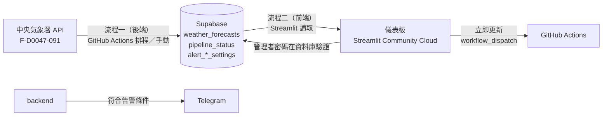
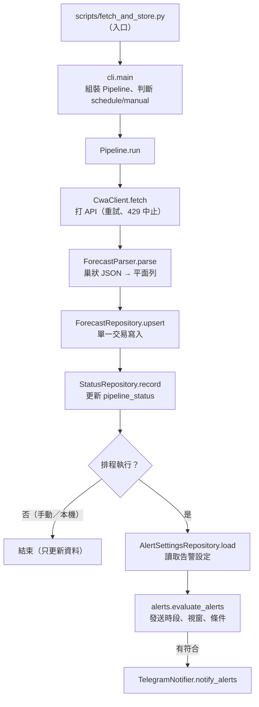
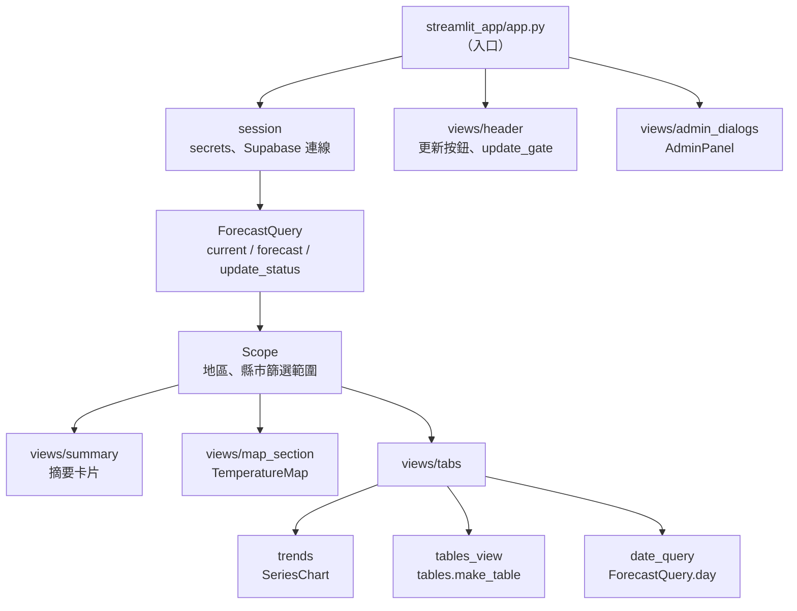

# 程式架構說明

這份文件說明**每個檔案的功能**、資料怎麼流動，以及「想改某個功能該看哪個檔案」。
需求與規格請看 [SPECIFICATION.md](SPECIFICATION.md)，安裝與操作請看 [README.md](README.md)。
完整的向量圖見 [architecture_diagram.svg](architecture_diagram.svg)（系統總體架構）與 [sequence_diagram.svg](sequence_diagram.svg)（核心資料流程時序圖）。

## 1. 整體架構

系統分成兩條互不直接呼叫的流程，中間以 Supabase（PostgreSQL）作為交會點：



| 流程 | 程式位置 | 執行環境 | 權限 |
| :--- | :--- | :--- | :--- |
| 流程一：後端 | `src/tw_forecast/backend/` | GitHub Actions（每 3 小時排程或手動） | Supabase `service_role` 金鑰，可寫入 |
| 流程二：前端 | `src/tw_forecast/frontend/` | Streamlit Community Cloud | Supabase `anon` 金鑰，只能讀（權限由 RLS 控制） |

## 2. 目錄與分層

```text
forecast/
├── src/tw_forecast/     正式程式碼（一個套件，前後端共用 config.py）
├── scripts/             流程一入口（Actions 執行）
├── streamlit_app/       流程二入口（Streamlit Cloud 的 Main file）
├── tests/               自動測試（pytest，不連網、不連資料庫）
├── checks/              需要真實連線的手動檢查
├── tools/               維運小工具
├── sql/                 Supabase 建表與 RLS 腳本
└── samples/             氣象署回應範例（本機產生，不進版控）
```

**依賴方向**：入口 → views → 各功能模組 → `config.py`，不可反向。後端與前端**互不匯入**，只共用 `config.py`。

**設計原則**
- **相依由外部注入**：`Pipeline`、`CwaClient`、`TelegramNotifier`、`WorkflowDispatcher` 的網路與資料庫物件都能在建構時替換，所以測試不必連網。
- **純函式與類別分工**：沒有狀態、沒有相依的計算（時槽、告警判斷、格式化、氣溫級距）保持函式；有狀態或有外部相依的才做成類別。
- **不依賴 Streamlit 的模組可直接單元測試**：`frontend` 裡只有 `session.py`、`style.py`、`admin_ui.py`、`views/` 會匯入 Streamlit。
- **失敗時不誤發、不外洩**：讀不到告警設定就不發送（fail closed）；所有寫入資料庫或顯示的錯誤訊息都先遮蔽金鑰與密碼。

## 3. 後端（流程一）

### 資料流



### 檔案說明

| 檔案 | 主要內容 | 功能 |
| :--- | :--- | :--- |
| `scripts/fetch_and_store.py` | `main` | 入口；把 `src/` 加入匯入路徑後呼叫 `cli.main` |
| `backend/cli.py` | `main`、`build_pipeline`、`trigger_type` | 解析參數（`--dry-run`、`--from-sample`）、由環境變數組裝 Pipeline、判斷執行來源、失敗時記錄並退出 |
| `backend/pipeline.py` | `Pipeline` | 串起整個流程：取得 → 解析 → 寫入 → 記錄狀態 → 告警判斷 → 推播；所有相依由外部注入 |
| `backend/cwa_client.py` | `CwaClient` | 呼叫氣象署 API；失敗最多重試 3 次，429（超量）與缺金鑰直接中止 |
| `backend/parser.py` | `ForecastParser`、`ElementSpec` | 把巢狀 JSON 攤平成資料表列；補時區、缺值轉 `None` |
| `backend/slots.py` | `current_slot` | 算出「最近一個已過去的排程時槽」，不受 GitHub 排程延遲影響 |
| `backend/alerts.py` | `CityRule`、`AlertSettings`、`parse_settings`、`evaluate_alerts` | 告警規則（純函式）：驗證設定、計算判斷視窗、判斷條件是否命中 |
| `backend/notifier.py` | `TelegramNotifier`、`build_alert_text` | 組告警訊息（跳脫、筆數與字數上限）並送出；HTML 被拒時改用純文字重送；錯誤訊息不含 token |
| `backend/repository.py` | `ForecastRepository`、`StatusRepository`、`AlertSettingsRepository`、`create_supabase_client` | 後端對資料庫的讀寫：寫入預報、記錄執行狀態、讀取告警設定 |
| `backend/security.py` | `mask_secrets` | 把環境變數中的金鑰換成 `***` |
| `backend/errors.py` | `AbortRun`、`NotifyError` | 流程例外類型 |
| `config.py` | 常數 | 時區、資料集、排程時槽、資料表名稱、發送時段、需遮蔽的環境變數 |

## 4. 前端（流程二）

### 資料流



### 資料存取與邏輯（不依賴 Streamlit，可直接單元測試）

| 檔案 | 主要內容 | 功能 |
| :--- | :--- | :--- |
| `frontend/repository.py` | `ForecastQuery`、`now_taipei` | 唯讀查詢：目前時段、未來預報、更新狀態、可選日期、指定日期；只取最新批次；不快取 |
| `frontend/scope.py` | `Scope`、`add_region` | 地區與縣市的篩選範圍：顯示層級、範圍內縣市、依範圍篩資料、圖表用的多系列長表 |
| `frontend/tables.py` | `make_table`、`next_periods` | 明細表格與「後續時段」的資料整理 |
| `frontend/charts.py` | `SeriesChart` | 趨勢折線圖（monotone 曲線、圖例點選強調、門檻線、「現在」虛線）；單一縣市的三條溫度線合併 |
| `frontend/map_view.py` | `TemperatureMap` | Folium 地圖：溫度標記、提示框、圖例、被選縣市放大、雙指手勢 |
| `frontend/temperature.py` | `band_index`、`colored`、`display_temp` | 氣溫級距與顏色，地圖、表格、摘要共用 |
| `frontend/regions.py` | `REGIONS`、`region_of`、`cities_in` | 縣市 → 地區（北／中／南／東／離島）對照表 |
| `frontend/formatting.py` | `weather_icon`、`is_night`、`format_*` | 天氣圖示與日夜判斷、時間與數值的顯示文字 |
| `frontend/update_gate.py` | `Gate`、`evaluate`、`DispatchLog` | 「立即更新」是否可按：距上次成功滿 20 分鐘，且觸發後 5 分鐘內資料庫尚無新紀錄時鎖定 |
| `frontend/github_dispatch.py` | `WorkflowDispatcher` | 呼叫 GitHub API 觸發後端 workflow |
| `frontend/admin.py` | `AlertSettingsService`、`validate`、`build_payload` | 告警設定的資料層：經資料庫函式讀寫、儲存前驗證、錯誤訊息遮蔽密碼 |

### Streamlit 相關

| 檔案 | 主要內容 | 功能 |
| :--- | :--- | :--- |
| `streamlit_app/app.py` | `main` | 入口；只負責依序串接各區塊，不含商業邏輯 |
| `frontend/session.py` | `get_client`、`secret`、`dispatch_log` | 讀取 secrets、建立並快取 Supabase 連線、所有連線共用的觸發記錄 |
| `frontend/style.py` | `inject`、`card` | 玻璃擬態 CSS（淺色／深色）與摘要卡片 HTML |
| `frontend/admin_ui.py` | `AdminPanel` | 告警設定視窗的內容與登入狀態（密碼只存在本次連線的記憶體、閒置 15 分鐘登出） |
| `views/header.py` | `Header` | 標題列三顆按鈕（電腦並排、手機收進選單）與更新流程的提示 |
| `views/filters.py` | `render_filters` | 地區與縣市互斥下拉選單 |
| `views/summary.py` | `render_summary` | 四張摘要卡片 |
| `views/map_section.py` | `render_map` | 地圖區塊 |
| `views/tabs.py` | `render_tabs` | 依範圍決定有哪些分頁並分派 |
| `views/trends.py` | `render_temperature_tab`、`render_rain_tab` | 氣溫趨勢與降雨機率分頁 |
| `views/tables_view.py` | `render_table_tab`、`render_next_tab` | 明細與後續時段分頁 |
| `views/date_query.py` | `render_date_tab` | 日期查詢分頁 |
| `views/admin_dialogs.py` | `open_if_requested` | 告警設定的登入與設定兩個視窗 |

## 5. 測試、檢查與工具

| 位置 | 用途 | 執行 |
| :--- | :--- | :--- |
| `tests/backend/` | 解析、時槽、告警規則、推播、API 客戶端、Pipeline、Repository、CLI | `python -m pytest` |
| `tests/frontend/` | 純函式、篩選範圍與表格、查詢、圖表與地圖、告警設定資料層、GitHub 觸發、整頁煙霧測試 | 同上 |
| `tests/fakes.py` | 假 Supabase、假 API 回應、假預報資料（不依賴 `samples/`） | 供測試匯入 |
| `checks/` | 需要真實連線的手動檢查：`check_cwa_api`、`check_rls`、`check_admin_rpc`、`check_notify` | `python checks/xxx.py` |
| `tools/` | 維運小工具：`make_admin_hash`（產生管理者密碼雜湊）、`get_telegram_chat_id` | `python tools/xxx.py` |

自動測試一律不連網、不連資料庫，也不需要 `.env` 或 `samples/`；整頁煙霧測試用 Streamlit 的 `AppTest` 真的執行 `app.py`，只是把資料庫換成假的、時間固定。

## 6. 想改某個功能，該看哪個檔案

| 想做的事 | 修改位置 |
| :--- | :--- |
| 調整排程時間 | `config.py` 的 `SLOT_ANCHOR`／`SLOT_INTERVAL`，**並同步** `.github/workflows/weather_worker.yml` 的 cron |
| 新增一個氣象要素（如風速） | `backend/parser.py` 的 `ELEMENTS`、`sql/init_supabase.sql` 加欄位，再到前端顯示 |
| 更改告警條件或判斷視窗 | `backend/alerts.py`；設定欄位另需 `sql/init_supabase.sql` 與 `frontend/admin.py` |
| 更改告警訊息格式 | `backend/notifier.py` 的 `build_alert_text` |
| 更換推播管道 | 新增與 `TelegramNotifier` 同介面的類別（`notify_alerts`），在 `backend/cli.py` 組裝 |
| 調整氣溫級距或顏色 | `frontend/temperature.py`（地圖圖例與表格會一起變） |
| 調整圖表外觀、高度、顏色 | `frontend/charts.py` |
| 調整地圖標記、提示框或手勢 | `frontend/map_view.py` |
| 新增／調整一個頁面分頁 | 在 `views/` 新增畫面函式，於 `views/tabs.py` 掛上 |
| 更改「立即更新」的間隔或鎖定時間 | `frontend/update_gate.py` 的 `MIN_INTERVAL_MINUTES`／`DISPATCH_LOCK_MINUTES` |
| 更改視覺主題或玻璃效果 | `frontend/style.py` 與 `.streamlit/config.toml` |
| 新增縣市分區或改分區方式 | `frontend/regions.py` |
| 更改資料庫查詢（前端） | `frontend/repository.py` |

## 7. 修改時的注意事項

- **改 `src/` 底下的模組後，建議重啟 `streamlit run`**：長時間執行的 Streamlit 可能沿用已匯入的舊模組，多檔案同時修改時容易出現 `ImportError`（雲端則在 Manage app 選 Reboot app）。
- **新增功能時同時補測試**，放在 `tests/backend/` 或 `tests/frontend/`；純函式優先寫單元測試，畫面流程用 `test_app_smoke.py` 的 `AppTest`。
- **不要把金鑰放進程式碼、日誌或錯誤訊息**：金鑰只來自環境變數（後端）或 Streamlit secrets（前端），輸出前先用 `mask_secrets` 或 `translate_error` 遮蔽。
- **前端只能用 `anon` 金鑰**，任何需要寫入的動作都要透過資料庫函式（`SECURITY DEFINER`）並在資料庫驗證權限。
