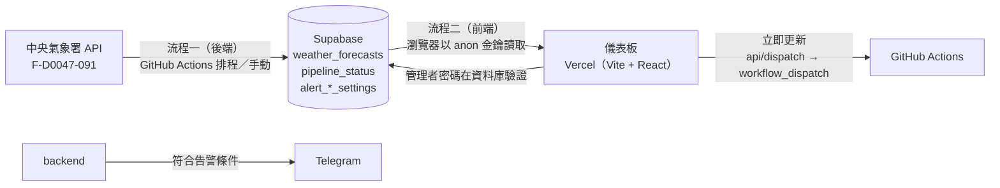
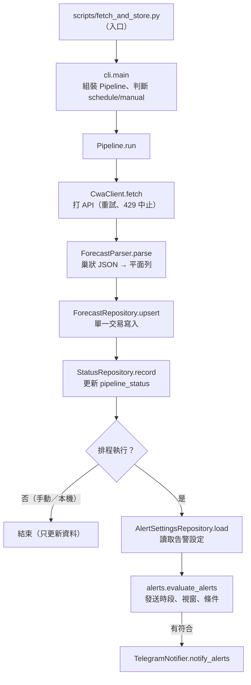
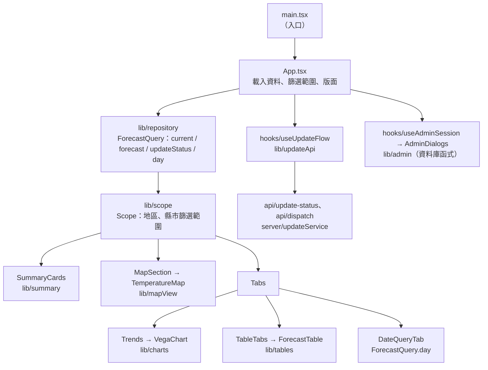

# 程式架構說明

這份文件說明**每個檔案的功能**、資料怎麼流動，以及「想改某個功能該看哪個檔案」。
需求與規格請看 [SPECIFICATION.md](SPECIFICATION.md)，安裝與操作請看 [README.md](README.md)，前端從 Streamlit 改寫到 Vercel 的決定與過程見 [VERCEL_PLAN.md](VERCEL_PLAN.md)。
完整的向量圖見 [architecture_diagram.svg](architecture_diagram.svg)（系統總體架構）與 [sequence_diagram.svg](sequence_diagram.svg)（核心資料流程時序圖）；這兩張圖畫的是 Streamlit 版的前端，前端部分以本文件為準。

## 1. 整體架構

系統分成兩條互不直接呼叫的流程，中間以 Supabase（PostgreSQL）作為交會點：



| 流程 | 程式位置 | 執行環境 | 權限 |
| :--- | :--- | :--- | :--- |
| 流程一：後端 | `src/tw_forecast/backend/` | GitHub Actions（每 3 小時排程或手動） | Supabase `service_role` 金鑰，可寫入 |
| 流程二：前端 | `web/` | Vercel：靜態頁（瀏覽器）＋ `api/` 的 Functions（伺服器端） | 瀏覽器只有 Supabase `anon` 金鑰（權限由 RLS 控制）；GitHub token 只在 Function |

Streamlit 版的儀表板保留在 `streamlit` 分支（Community Cloud 部署，已關閉「立即更新」）；`main` 上不再有 Streamlit 程式。

## 2. 目錄與分層

```text
forecast/
├── src/tw_forecast/     後端程式碼（Python 套件）
├── scripts/             流程一入口（Actions 執行）
├── web/                 流程二：儀表板（TypeScript，Vercel 的 Root Directory；見 §4）
├── tests/               後端自動測試（pytest，不連網、不連資料庫）
├── checks/              需要真實連線的手動檢查
├── tools/               維運小工具
├── sql/                 Supabase 建表與 RLS 腳本
└── samples/             氣象署回應範例（本機產生，不進版控）
```

**依賴方向**：後端是入口 → `backend/` → `config.py`；前端是 `components/` → `hooks/` → `lib/`，不可反向。後端與前端**不共用程式碼**，只透過資料庫交會；兩邊都需要的常數（發送時段、資料表名稱、縣市清單）各自定義，改動時要一起改（見 §7）。

**設計原則**
- **相依由外部注入**：後端的 `Pipeline`、`CwaClient`、`TelegramNotifier`，前端的 `ForecastQuery`、`AlertSettingsService` 與 `api/` 的 `updateService`（`fetch` 可替換）都能在建構或呼叫時換成假的，所以測試不必連網。
- **純函式與類別分工**：沒有狀態、沒有相依的計算（時槽、告警判斷、格式化、氣溫級距、圖表規格）保持函式；有狀態或有外部相依的才做成類別或 React hook。
- **畫面與邏輯分開**：前端的 `lib/` 不依賴 React，可直接單元測試；`components/` 只負責畫面，狀態流程放在 `hooks/`。
- **失敗時不誤發、不外洩**：讀不到告警設定就不發送（fail closed）；讀不到更新狀態就不開放手動更新；所有寫入資料庫或顯示的錯誤訊息都先遮蔽金鑰與密碼。

## 3. 後端（流程一）

### 資料流



### 檔案說明

| 檔案 | 主要內容 | 功能 |
| :--- | :--- | :--- |
| `scripts/fetch_and_store.py` | `main` | 入口；把 `src/` 加入匯入路徑後呼叫 `cli.main` |
| `backend/cli.py` | `main`、`build_pipeline`、`trigger_type` | 解析參數（`--dry-run`、`--from-sample`）、由環境變數組裝 Pipeline、判斷執行來源、失敗時記錄並退出 |
| `backend/pipeline.py` | `Pipeline` | 串起整個流程：取得 → 解析 → 寫入 → 記錄狀態 → 告警判斷 → 推播；所有相依由外部注入 |
| `backend/cwa_client.py` | `CwaClient` | 呼叫氣象署 API；失敗最多重試 3 次，429（超量）與缺金鑰直接中止 |
| `backend/parser.py` | `ForecastParser`、`ElementSpec` | 把巢狀 JSON 攤平成資料表列；補時區、缺值轉 `None` |
| `backend/slots.py` | `current_slot` | 算出「最近一個已過去的排程時槽」，不受 GitHub 排程延遲影響 |
| `backend/alerts.py` | `CityRule`、`AlertSettings`、`parse_settings`、`evaluate_alerts` | 告警規則（純函式）：驗證設定、計算判斷視窗、判斷條件是否命中 |
| `backend/notifier.py` | `TelegramNotifier`、`build_alert_text` | 組告警訊息（跳脫、筆數與字數上限）並送出；HTML 被拒時改用純文字重送；錯誤訊息不含 token |
| `backend/repository.py` | `ForecastRepository`、`StatusRepository`、`AlertSettingsRepository`、`create_supabase_client` | 後端對資料庫的讀寫：寫入預報、記錄執行狀態、讀取告警設定 |
| `backend/security.py` | `mask_secrets` | 把環境變數中的金鑰換成 `***` |
| `backend/errors.py` | `AbortRun`、`NotifyError` | 流程例外類型 |
| `config.py` | 常數 | 時區、資料集、排程時槽、資料表名稱、發送時段、需遮蔽的環境變數 |

### 後端步驟對照（從日誌找到程式）

後端沒有畫面，改用「執行步驟」編號。`pipeline.py` 與 `cli.py` 的註解用同樣的編號（`[步驟 N]`）；Actions 日誌上看到某一行訊息時，可以用下表反查是哪一步、哪個檔案印的。

```text
[1 啟動] → [2 取得 API] → [3 解析] → [4 寫入預報] → [5 記錄狀態] ─┬─(手動)→ 結束
                                                                  └─(排程)→ [6 告警判斷] → [7 推播]
```

| 步驟 | 做什麼 | 程式位置 | 日誌上會看到的訊息 |
| :---: | :--- | :--- | :--- |
| 1 | 載入 `.env`、解析參數、判斷 schedule／manual、組裝 Pipeline | `backend/cli.py` 的 `main`、`build_pipeline` | 缺金鑰時：`缺少 SUPABASE_URL / SUPABASE_KEY` 或 `缺少環境變數 WEATHER_API_KEY` |
| 2 | 打氣象署 API（重試、429 中止） | `backend/cwa_client.py` 的 `CwaClient.fetch` | 失敗時：`[第 N 次嘗試失敗] …`；超量：`CWA API 回應 429 …` |
| 3 | 巢狀 JSON 攤平成資料列 | `backend/parser.py` 的 `ForecastParser.parse` | `解析完成：N 列，M 個縣市` |
| 4 | upsert 到 `weather_forecasts` | `backend/repository.py` 的 `ForecastRepository.upsert` | `已 upsert N 列至 weather_forecasts（來源：schedule／manual）` |
| 5 | 寫入 `pipeline_status` | `backend/repository.py` 的 `StatusRepository.record` | 失敗時：`[警告] 無法更新 pipeline_status …`（不影響主流程） |
| 6 | 讀取告警設定並判斷 | `backend/pipeline.py` 的 `Pipeline._alert`、`backend/alerts.py` | 見下表 |
| 7 | 送出 Telegram 訊息 | `backend/notifier.py` 的 `TelegramNotifier` | `已推播 N 筆告警（涵蓋 …）` |

**步驟 6 可能印出的訊息與原因**（也就是「為什麼沒收到告警」的對照）

| 日誌訊息 | 代表 |
| :--- | :--- |
| `非排程執行（manual），略過告警推播` | 手動或本機執行，只更新資料 |
| `[警告] 無法讀取告警設定，略過推播：…` | 讀不到設定，一律不發送（fail closed） |
| `排程時槽 HH:MM 不在啟用的發送時段（…），略過推播` | 這個時槽不是你啟用的發送時段 |
| `尚未啟用任何縣市，不發送告警` | 所有縣市都是關閉 |
| `無需推播（涵蓋 …，沒有符合條件的時段）` | 有啟用，但預報沒有達到門檻 |
| `未設定 TELEGRAM_BOT_TOKEN / TELEGRAM_CHAT_ID，略過推播` | 條件符合，但缺 Telegram 設定 |

試跑（`--dry-run`）會在步驟 3 之後印出 `[dry-run] …` 並結束，不會執行步驟 4～7。任何步驟拋出例外時，`cli.main` 會把失敗原因（已遮蔽金鑰）寫進 `pipeline_status` 再結束。

## 4. 前端（流程二，`web/`）

Vite + React + TypeScript 的靜態頁，部署在 Vercel（Root Directory 為 `forecast/web`，只有這個資料夾有變動時才建置）。資料在瀏覽器裡直接以 `anon` 金鑰查詢 Supabase，每次載入與按「重新載入資料」時即時查詢、不快取；只有「立即更新」需要伺服器端，由 `api/` 的兩支 Vercel Functions 處理（GitHub token 只在那裡）。以下路徑除非另外註明，都在 `web/src/` 底下。

### 資料流



### 資料存取與邏輯（`lib/`，不依賴 React，可直接單元測試）

| 檔案 | 主要內容 | 功能 |
| :--- | :--- | :--- |
| `lib/supabase.ts`、`lib/config.ts` | `supabase`、`readSupabaseConfig` | 由 `VITE_SUPABASE_URL`／`VITE_SUPABASE_ANON_KEY` 建立整頁共用的連線；沒有設定時為 `null`（畫面顯示「尚未設定」） |
| `lib/repository.ts` | `ForecastQuery`、`latestBatch`、`onlyFullPeriods` | 唯讀查詢：目前時段、未來預報、更新狀態、可選日期、指定日期；只取最新批次；不快取 |
| `lib/time.ts` | `wallTime`、`dateKey`、`formatMDHM` 等 | 台灣時間（固定 UTC+8）的換算與格式化；不依賴瀏覽器或 Vercel 的時區 |
| `lib/scope.ts` | `Scope`、`addRegion`、`withAvg` | 地區與縣市的篩選範圍：顯示層級、範圍內縣市、依範圍篩資料、圖表用的多系列長表 |
| `lib/urlState.ts` | `scopeFromSearch`、`searchFromScope` | 篩選範圍 ↔ 網址參數（`?region=` 或 `?city=`），重新整理或分享網址後保留 |
| `lib/summary.ts` | `summaryCards`、`summaryTitle` | 四張摘要卡片的內容；輪播最上方的範圍名稱（全部地區／被選的地區／被選的縣市） |
| `lib/carousel.ts` | `wrapIndex`、`swipeStep`、`CAROUSEL_INTERVAL_MS` | 摘要輪播的換頁規則：頁碼頭尾相接、手指滑動方向、自動輪播間隔（4 秒） |
| `lib/tables.ts` | `makeTable`、`nextPeriods`、`visibleColumns` | 明細表格與「後續時段」的資料整理 |
| `lib/charts.ts` | `seriesChartSpec`、`CHART_HEIGHT` | 趨勢折線圖的 Vega-Lite 規格（monotone 曲線、圖例點選強調、門檻線、「現在」虛線）；單一縣市的三條溫度線合併並加漸層溫度帶；手機上圖例換行（`legendColumns`） |
| `lib/mapView.ts` | `mapPoints`、`markerHtml`、`tooltipHtml`、`mapViewport` | 地圖的標記、提示框、圖例與視野（被選縣市放大） |
| `lib/temperature.ts` | `BANDS`、`textColor` | 氣溫級距與顏色，地圖、表格、摘要共用 |
| `lib/rain.ts` | `RAIN_ALERT`、`rainColor` | 降雨告警門檻（60%）與降雨色階，趨勢圖與摘要卡片共用 |
| `lib/tempRange.ts` | `RANGE_WIDE`、`rangeColor` | 溫差色階（紫色系：< 6、6～9、≥ 10 °C），溫差卡片的發光邊框 |
| `lib/regions.ts` | `REGIONS`、`CITY_ORDER`、`regionOf` | 縣市 → 地區（北／中／南／東／離島）對照表 |
| `lib/formatting.ts` | `weatherIcon`、`isNight`、`formatRange` 等 | 天氣圖示與日夜判斷、時間與數值的顯示文字 |
| `lib/updateGate.ts` | `evaluate`、`MIN_INTERVAL_MINUTES` | 「立即更新」是否可按：距上次成功滿 20 分鐘，且 GitHub 上沒有未完成的手動 run（瀏覽器與 `api/` 共用） |
| `lib/countdown.ts` | `formatMmss`、`elapsedMinutes` | 間隔倒數的文字：「已過 X 分鐘」與「還需 mm:ss」由同一個剩餘秒數推導，保證同步 |
| `lib/updateApi.ts` | `fetchUpdateStatus`、`requestDispatch` | 呼叫 `api/`；連不上或回應不是 JSON 時一律不放行 |
| `lib/admin.ts` | `AlertSettingsService`、`validate`、`translateError` | 告警設定的資料層：經資料庫函式讀寫、儲存前驗證、錯誤訊息遮蔽密碼 |
| `lib/tooltipAutoHide.ts` | `installTooltipAutoHide` | 捲動或滑動時收起圖表提示框（手機沒有「滑鼠移開」） |
| `lib/theme.ts` | `nextTheme`、`readTheme`、`applyTheme`、`initTheme` | 主題切換（自動／淺色／深色）：記在 localStorage、寫入 `<html data-theme>`、自動時跟著系統；`index.html` 載入前先套用一次 |

### 伺服器端（`web/api/` 與 `server/`，Vercel Functions）

| 檔案 | 主要內容 | 功能 |
| :--- | :--- | :--- |
| `web/api/update-status.ts` | `GET` | 回傳目前可否手動更新、剩餘秒數、是否有更新進行中 |
| `web/api/dispatch.ts` | `POST` | 伺服器端重新判斷一次（不信任瀏覽器），通過才觸發 `weather_worker.yml`（`main`） |
| `server/updateService.ts` | `getUpdateStatus`、`dispatchUpdate`、`maskSecrets` | 上面兩支的邏輯：讀 `pipeline_status`、查 GitHub 未完成的手動 run（建立超過 10 分鐘的不算）、觸發 workflow；任何一步失敗都不放行，訊息遮蔽 token 與金鑰 |

程式註解裡的「對應 Python 的 xxx」「Streamlit 版」指的是 `streamlit` 分支上的檔案，方便對照。

`api/` 以 Node ESM 執行，相對匯入要寫 `.js` 副檔名。本機 `npm run dev` 由 `web/vite.config.ts` 的 `localApi` 外掛提供同樣的 `/api/*`（讀 `web/.env.local`）。

### 畫面（`components/`）與狀態（`hooks/`）

| 檔案 | 功能 |
| :--- | :--- |
| `App.tsx` | 入口元件；載入資料、保存篩選範圍、依序排出各區塊，不含商業邏輯 |
| `hooks/useUpdateFlow.ts` | 「立即更新」的流程：查狀態、間隔倒數結束後自動再查、觸發後倒數 60 秒重新載入並確認是否完成 |
| `hooks/useAdminSession.ts` | 告警設定的登入狀態與視窗流程；密碼只放在頁面記憶體（`useRef`），閒置 15 分鐘登出 |
| `hooks/useDarkMode.ts` | `useThemeMode`、`useDarkMode`、`useNarrow`：目前的主題、實際是否為深色（圖表配色）、手機寬度（圖例換行） |
| `components/ThemeToggle.tsx` | 主題按鈕（電腦版小圖示鈕、手機版在選單內顯示文字） |
| `components/UpdateNotices.tsx` | 立即更新的提示、倒數與完成訊息 |
| `components/Filters.tsx` | 地區與縣市互斥下拉選單 |
| `components/SummaryCards.tsx` | 摘要輪播：四張卡片一次顯示一張（發光邊框、降雨進度條）；每 4 秒自動換頁，滑鼠移上去、鍵盤焦點或觸碰時暫停（滑鼠點擊留下的焦點不算），減少動態效果時照樣換頁但不播動畫；箭頭與圓點疊在卡片內、手機左右滑動 |
| `components/MapSection.tsx`、`TemperatureMap.tsx` | 地圖區塊與 Leaflet 地圖本體（雙指／Ctrl 手勢；第一次顯示時才載入 Leaflet） |
| `components/Tabs.tsx` | 分頁（只渲染目前的分頁） |
| `components/Trends.tsx`、`VegaChart.tsx` | 氣溫趨勢與降雨機率分頁；Vega 圖表（第一次用到時才載入 vega-embed） |
| `components/TableTabs.tsx`、`ForecastTable.tsx` | 明細與後續時段分頁；可排序的表格（溫度依級距上色、降雨進度條） |
| `components/DateQueryTab.tsx` | 日期查詢分頁 |
| `components/AdminDialogs.tsx`、`Modal.tsx` | 告警設定的登入與設定視窗；原生 `<dialog>` |
| `components/Notice.tsx`、`Toast.tsx` | 提示框與右下角的浮動提示 |
| `styles/global.css` | 全部樣式：淺色／深色變數、玻璃擬態、動畫、手機版（≤ 640px） |

### 頁面區塊對照（從畫面找到程式）

`App.tsx` 用同樣的代號（A～H）加了註解。

```text
┌──────────────────────────────────────────────────────────────┐
│ [A] 🌤️ 台灣天氣預報  立即更新│重新載入│告警設定│🌓（手機收進 ☰）│
│ [B] 立即更新的提示／倒數                                        │
│ （資料過期時的警示，整列寬度）                                  │
│ ┌────────────────────┬─────────────────────────────────────┐ │
│ │ [C] 最近排程更新 …  │ [G] 🗺️ 平均氣溫地圖                  │ │
│ │     最近手動更新 …  │                                     │ │
│ │ [E] 預報時段 …      │                                     │ │
│ │     資料更新 …      │                                     │ │
│ │ [D] 地區 ▼          │                                     │ │
│ │     縣市 ▼          │                                     │ │
│ │ [F] 摘要輪播        │                                     │ │
│ │  ‹ ● ○ ○ ○ ›        │                                     │ │
│ └────────────────────┴─────────────────────────────────────┘ │
│    （手機上改為上下排列：篩選 → 輪播 → 地圖）                  │
│ [H] 氣溫趨勢 │ 降雨機率 │ 明細 │ 後續時段 │ 日期查詢  （分頁）  │
│ [彈出] 🔒 登入／⚙️ 告警設定視窗、右下角浮動提示                  │
└──────────────────────────────────────────────────────────────┘
```

| 區塊 | 畫面內容 | 程式位置 |
| :---: | :--- | :--- |
| A | 標題、三顆按鈕與主題按鈕（手機收進「☰ 選單」） | `App.tsx` 的 `<header>`；主題按鈕在 `components/ThemeToggle.tsx` |
| B | 更新提示、間隔倒數、完成訊息 | `components/UpdateNotices.tsx`（狀態在 `hooks/useUpdateFlow.ts`） |
| C | 最近更新時間（左欄最上方，每項一行） | `App.tsx` 的 `statusItems` |
| D | 地區、縣市下拉（互斥），在地圖左側 | `components/Filters.tsx`；兩欄版面在 `App.tsx` 的 `.overview` |
| E | 預報時段與資料更新（左欄，[C] 下方）；過期警示在整列寬度 | `App.tsx` 的 `Dashboard` |
| F | 摘要輪播（地圖左側、篩選下方） | `components/SummaryCards.tsx`（內容在 `lib/summary.ts`，換頁規則在 `lib/carousel.ts`） |
| G | 地圖 | `components/MapSection.tsx`（地圖本體在 `TemperatureMap.tsx`） |
| H | 五個分頁 | `App.tsx` 的 `tabs`；內容在 `Trends.tsx`、`TableTabs.tsx`、`DateQueryTab.tsx` |
| 彈出 | 告警設定視窗 | `components/AdminDialogs.tsx`（狀態在 `hooks/useAdminSession.ts`） |

**版面與樣式在哪裡調**

| 想調的 | 位置 |
| :--- | :--- |
| 顏色、間距、圓角、玻璃效果、手機版（≤ 640px）行為 | `styles/global.css`（`:root` 的變數；深色模式在 `:root[data-theme="dark"]` 覆寫） |
| 圖表顏色（Vega 讀不到 CSS 變數） | `lib/charts.ts` 的 `LIGHT_CHART`／`DARK_CHART`、`PALETTE` |
| 圖表／地圖高度 | `lib/charts.ts` 的 `CHART_HEIGHT`、`components/MapSection.tsx` 的 `MAP_HEIGHT` |
| 表格欄位與格式 | `lib/tables.ts`（欄位與順序）、`components/ForecastTable.tsx`（格式）、`lib/scope.ts` 的 `tableDropColumns`（依範圍隱藏） |

## 5. 測試、檢查與工具

| 位置 | 用途 | 執行 |
| :--- | :--- | :--- |
| `tests/backend/` | 解析、時槽、告警規則、推播、API 客戶端、Pipeline、Repository、CLI | 在 `forecast/` 執行 `python -m pytest` |
| `tests/fakes.py` | 假 Supabase、假 API 回應（不依賴 `samples/`） | 供後端測試匯入 |
| `web/tests/` | 前端純函式、查詢、圖表與地圖、告警設定資料層、`api/` 的伺服器端邏輯、整頁測試（`app.test.tsx`） | 在 `forecast/web/` 執行 `npm test` |
| `web/tests/fakes.ts` | 假 Supabase 查詢、假預報資料 | 供前端測試匯入 |
| `checks/` | 需要真實連線的手動檢查：`check_cwa_api`、`check_rls`、`check_admin_rpc`、`check_notify` | `python checks/xxx.py` |
| `tools/` | 維運小工具：`make_admin_hash`（產生管理者密碼雜湊）、`get_telegram_chat_id` | `python tools/xxx.py` |

自動測試一律不連網、不連資料庫，也不需要 `.env`、`.env.local` 或 `samples/`。前端測試整個以 `America/New_York` 時區執行（`web/tests/setup.ts`），確保程式不依賴執行環境的時區；整頁測試在 jsdom 裡真的渲染 `App`，只把資料庫與 `fetch` 換成假的，圖表與地圖換成只記錄參數的假元件。`npm run build` 會先跑型別檢查與全部測試再打包，Vercel 建置時也一樣。

## 6. 想改某個功能，該看哪個檔案

| 想做的事 | 修改位置 |
| :--- | :--- |
| 調整排程時間 | `config.py` 的 `SLOT_ANCHOR`／`SLOT_INTERVAL`，**並同步** `.github/workflows/weather_worker.yml` 的 cron |
| 新增一個氣象要素（如風速） | `backend/parser.py` 的 `ELEMENTS`、`sql/init_supabase.sql` 加欄位，再到前端 `web/src/lib/repository.ts`（`ForecastRow`）與要顯示的元件 |
| 更改告警條件或判斷視窗 | `backend/alerts.py`；設定欄位另需 `sql/init_supabase.sql` 與前端 `web/src/lib/admin.ts`、`web/src/components/AdminDialogs.tsx` |
| 更改發送時段 | 後端 `config.py` 的 `SEND_SLOTS`、`sql/init_supabase.sql` 的 CHECK，**並同步**前端 `web/src/lib/admin.ts` 的 `SLOTS` |
| 更改告警訊息格式 | `backend/notifier.py` 的 `build_alert_text` |
| 更換推播管道 | 新增與 `TelegramNotifier` 同介面的類別（`notify_alerts`），在 `backend/cli.py` 組裝 |
| 調整氣溫級距或顏色 | `web/src/lib/temperature.ts`（地圖圖例、表格與摘要會一起變） |
| 調整圖表外觀、高度、顏色 | `web/src/lib/charts.ts` |
| 調整地圖標記、提示框或手勢 | `web/src/lib/mapView.ts`、`web/src/components/TemperatureMap.tsx` |
| 新增／調整一個頁面分頁 | 在 `web/src/components/` 新增元件，於 `App.tsx` 的 `tabs` 掛上 |
| 更改「立即更新」的間隔或鎖定 | `web/src/lib/updateGate.ts` 的 `MIN_INTERVAL_MINUTES`、`web/src/server/updateService.ts` 的 `RUN_LOCK_MINUTES` |
| 更改視覺主題或玻璃效果 | `web/src/styles/global.css` |
| 新增縣市分區或改分區方式 | `web/src/lib/regions.ts` |
| 更改資料庫查詢（前端） | `web/src/lib/repository.ts` |

## 7. 修改時的注意事項

- **新增功能時同時補測試**：後端放 `tests/backend/`（pytest）；前端純函式放 `web/tests/` 的單元測試，畫面流程加在 `web/tests/app.test.tsx`。
- **不要把金鑰放進程式碼、日誌或錯誤訊息**：金鑰只來自環境變數（後端與 `api/`）或 `VITE_` 變數（前端，只能是 `anon`）；輸出前先用 `mask_secrets`（後端）、`maskSecrets`（`api/`）或 `translateError`（告警設定）遮蔽。
- **前端只能用 `anon` 金鑰**，任何需要寫入的動作都要透過資料庫函式（`SECURITY DEFINER`）並在資料庫驗證權限。`GH_DISPATCH_TOKEN` 等伺服器端變數**不可**加 `VITE_` 前綴，否則會被打包進瀏覽器。
- **Vercel 環境變數一律選 Config**：選 Secret 的變數在 Function 執行時讀不到；改了變數要 Redeploy 才生效（`VITE_` 變數是建置時打包進去的）。
- **後端與前端各自定義的常數要一起改**：發送時段（`SEND_SLOTS`／`SLOTS`）、資料表名稱、縣市清單。
