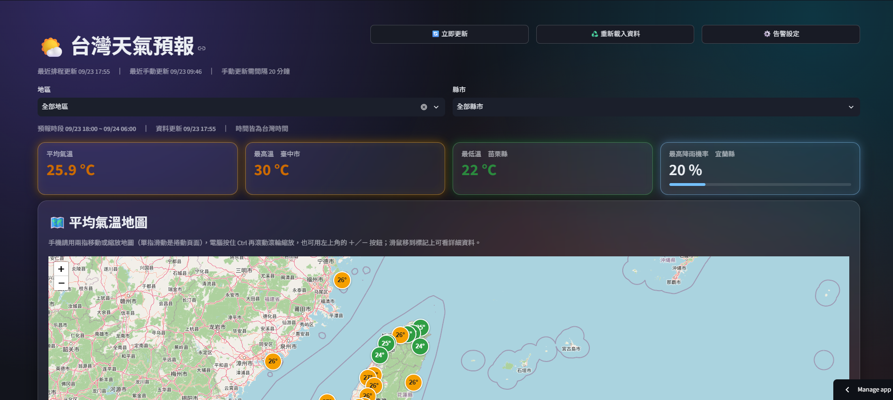
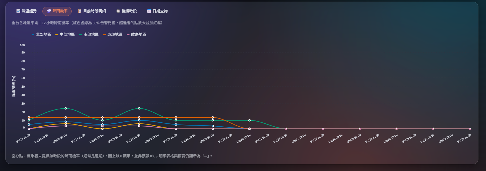
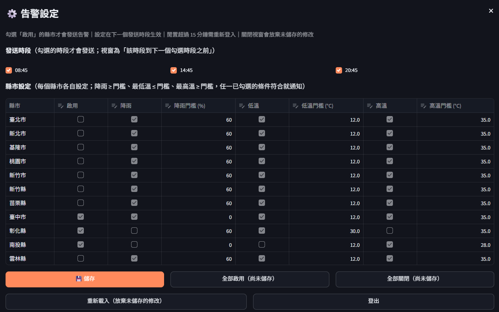
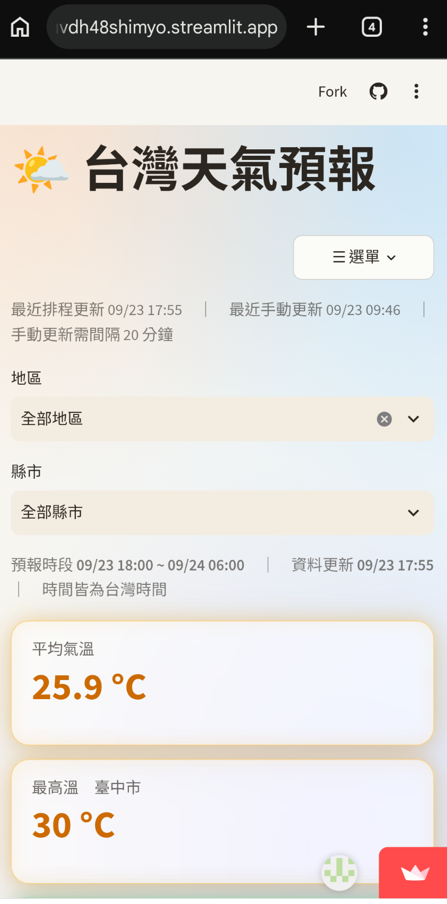
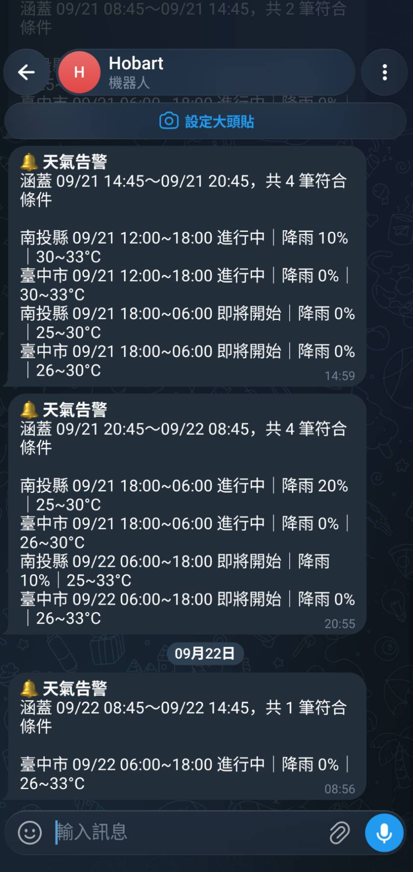

# 台灣天氣預報與自動化通報系統

抓取中央氣象署 `F-D0047-091`（未來 1 週各縣市預報），存入 Supabase，並以 Streamlit 儀表板呈現；符合條件時推播 Telegram 告警到個人手機。完整規格見 [SPECIFICATION.md](SPECIFICATION.md)。

```text
[中央氣象署 API] → [GitHub Actions 每 3 小時] → [Supabase] → [Streamlit 儀表板]
                       fetch_and_store.py                     唯讀查詢 (anon key)
```

## 功能

- **後端**：GitHub Actions 於台灣時間 02:45 起每 3 小時（02:45、05:45、08:45……）自動執行，也可手動觸發；抓取預報、清洗後 upsert 至 Supabase，記錄 `updated_at`，並把最後成功更新時間寫入 `pipeline_status`。
- **前端**：
  - **篩選**：地區／縣市互斥（選其一會清除另一個；選了縣市時地區選單顯示「— 已選縣市 —」，再點「全部地區」即回到全台）。
  - **摘要與地圖**：重點摘要卡片；Folium 地圖（標記顯示溫度，手機雙指才操作地圖、單指滑動捲動頁面，電腦按 Ctrl 才縮放，另有 ＋／－ 按鈕）。溫度數字依級距上色。
  - **趨勢圖**（柔和的曲線折線圖）：全台依地區、地區依縣市各一種顏色，可用單選鈕切換最高／最低／平均溫；**單一縣市則把最高、平均、最低三條線畫在同一張圖**。降雨機率圖標示 60% 門檻，氣象署未提供的時段補 0 並以空心點標示。
  - **表格**：目前時段明細、後續時段（每縣市目前時段之後 2 個時段）、單一縣市的一週預報，以及「日期查詢」（選一天看當天完整 12 小時時段）；天氣圖示區分日夜。
  - **外觀**：玻璃擬態，淺色／深色自動跟隨主題；手機版標題列按鈕收進「☰ 選單」。
  - **「立即更新」**：距上次成功更新（排程或手動，以 `pipeline_status` 為準）滿 20 分鐘才可按；觸發後 60 秒自動重整頁面，且觸發後 5 分鐘內資料庫尚無新的成功紀錄時維持停用（按 F5 或別人開頁面也不會重新開放）；排程不受此限制。
  - **「⚙️ 告警設定」**：標題列按鈕，輸入管理者密碼後在視窗中調整（也可以用 Supabase SQL Editor，見下方「啟用告警」）。只有排程會推播 Telegram，且只在你啟用的發送時段（08:45、14:45、20:45）發送；**預設所有縣市關閉（不發送）**。每個縣市可各自設定降雨／低溫／高溫三個條件的開關與門檻（預設 60％／12°C／35°C）。手動更新只更新資料、不推播。設定存在資料庫，`anon` 讀不到也寫不了。

### 畫面截圖

**儀表板（電腦版、深色主題）**：標題列三顆按鈕、地區／縣市篩選、摘要卡片與平均氣溫地圖。



**降雨機率趨勢圖**：紅色虛線為 60% 門檻；空心點表示氣象署未提供該時段的降雨機率。



**「⚙️ 告警設定」視窗**：勾選發送時段，並逐縣市設定啟用、條件開關與門檻。



**手機版（淺色主題）與 Telegram 告警訊息**：手機版標題列按鈕收進「☰ 選單」；告警訊息列出涵蓋時間與符合條件的時段。

<p align="center">
  
  
</p>

## 目錄結構

`HW1/` 是 repo 根目錄，程式碼與文件放在 `forecast/`；`.github/`、`.gitignore`、`requirements.txt` 只在根目錄各留一份。

```text
HW1/
├── .devcontainer/devcontainer.json        # GitHub Codespaces／Dev Container 開發環境（自動啟動 Streamlit）
├── .github/workflows/weather_worker.yml   # 排程與手動觸發流程一
├── .gitignore
├── CLAUDE.md                              # 給 Claude Code 的專案指示（Streamlit 慣例與本專案開發流程）
├── requirements.txt                       # 須在根目錄，Streamlit Cloud 才偵測得到
├── requirements-dev.txt                   # 開發用（pytest），部署不需要
└── forecast/
    ├── src/tw_forecast/ # 正式程式碼：backend/（流程一）、frontend/（流程二）、config.py
    ├── scripts/         # fetch_and_store.py（流程一入口，Actions 執行）
    ├── tests/           # pytest 單元與整頁測試（不連網、不連資料庫）
    ├── checks/          # 需真實連線的手動檢查：check_cwa_api、check_rls、check_admin_rpc、check_notify
    ├── tools/           # make_admin_hash、get_telegram_chat_id
    ├── sql/             # init_supabase.sql（weather_forecasts、pipeline_status、RLS、updated_at、時區）
    ├── streamlit_app/   # app.py（流程二入口）
    ├── .streamlit/      # secrets.toml.example
    ├── ARCHITECTURE.md  # 每個檔案的功能、資料流與「想改某功能該看哪裡」
    ├── SPECIFICATION.md
    └── README.md
```

## 本機環境建置

以下指令都在 `forecast/` 目錄下執行。

1. 安裝 Python 3.11+，建立虛擬環境並安裝套件：
   ```powershell
   python -m venv .venv
   .venv\Scripts\Activate.ps1
   pip install -r ../requirements.txt
   ```
2. 後端金鑰：複製 `.env.example` 為 `.env`，填入 `WEATHER_API_KEY`、`SUPABASE_URL`、`SUPABASE_KEY`（`service_role`）等值。`.env` 不會被 commit。
3. 驗證氣象署 API 並存下範例回應：
   ```powershell
   python checks/check_cwa_api.py            # 存到 samples/F-D0047-091.json（不會被 commit）
   ```
4. 於 Supabase SQL Editor 執行 `sql/init_supabase.sql` 建表（可重複執行；也會補上 `updated_at` 欄位、觸發器、台灣時區設定，並建立 `pipeline_status` 表）。之後可執行 `python checks/check_rls.py` 驗證 `anon` 可讀不可寫。
5. 設定 Telegram 推播（只推給自己）：
   1. 在 Telegram 搜尋 **@BotFather** → `/newbot` → 取得 token，寫入 `.env` 的 `TELEGRAM_BOT_TOKEN`（**token 不要貼到聊天或 commit**）。
   2. 打開你的機器人，按 **Start**（機器人必須先被你啟動才能傳訊息給你）。
   3. 取得 chat_id：`python tools/get_telegram_chat_id.py`（加 `--write` 可自動寫入 `.env`）。
   4. 確認手機收得到：`python checks/check_notify.py`（加 `--dry-run` 只印出訊息內容）。
6. 啟用告警：建議在儀表板標題列按「⚙️ 告警設定」，勾選縣市的「啟用」、條件開關、門檻與發送時段後儲存（需先完成第 7 步的管理者密碼、第 9 步啟動前端）。也可以在 Supabase SQL Editor 直接執行（範例也在 `sql/init_supabase.sql` 檔尾）：
   ```sql
   UPDATE public.alert_city_settings SET enabled = true WHERE location_name = '臺北市';          -- 啟用臺北市
   UPDATE public.alert_city_settings SET rain_threshold = 0 WHERE location_name = '臺北市';       -- 降雨門檻 0：一定符合，用來測試推播
   UPDATE public.alert_city_settings SET min_temp_enabled = false WHERE location_name = '臺北市'; -- 關閉低溫條件
   UPDATE public.alert_slot_settings SET enabled = false WHERE slot = '14:45';                  -- 不在 14:45 發送
   ```
   兩種方式寫的是同一份設定，都在下一個排程時槽生效。判斷視窗為「本次發送時槽到下一個啟用的發送時槽之前」，含進行中的預報時段（訊息標示進行中／即將開始）。
7. 管理者密碼與設定面板（一次性設定）：
   1. 在 Supabase SQL Editor 執行 `sql/init_supabase.sql`（會建立 `private` schema、密碼表與兩個驗證函式）。
   2. 相容性檢查：`pip install bcrypt`（只在本機使用，不在 `requirements.txt`），執行 `python tools/make_admin_hash.py --selftest`，把印出的 SQL 貼到 SQL Editor 執行，結果應為 `true`。
   3. 產生密碼雜湊：執行 `python tools/make_admin_hash.py`，輸入 12 碼以上、大小寫加數字的隨機密碼（輸入時不顯示、不會存檔），把印出的 `INSERT` SQL 貼到 SQL Editor 執行。**不要把密碼明文貼進 SQL Editor。**
   4. 驗證：`python checks/check_admin_rpc.py`（輸入密碼）；再到儀表板標題列按「⚙️ 告警設定」實際登入（先把輸入法切成英文）。若顯示密碼錯誤，可用 `python tools/make_admin_hash.py --verify`（貼上資料庫裡的 `password_hash`、輸入密碼）在本機分辨是「密碼輸入不一致」還是「雜湊本身有問題」；`getpass` 在某些終端機不支援貼上，請手動輸入密碼。
   5. 忘記密碼：重新執行第 3 步寫入新的雜湊值即可（頁面上沒有改密碼功能）。
8. 試跑流程一（不寫入資料庫、不推播）：
   ```powershell
   python scripts/fetch_and_store.py --dry-run                 # 打 API
   python scripts/fetch_and_store.py --dry-run --from-sample   # 讀 samples/ 離線測試
   python scripts/fetch_and_store.py                           # 正式：寫入 Supabase（本機視為手動，不推播；要測推播可設 GITHUB_EVENT_NAME=schedule）
   ```
9. 前端本機執行：複製 `.streamlit/secrets.toml.example` 為 `.streamlit/secrets.toml`，填入 `SUPABASE_URL` 與 `SUPABASE_ANON_KEY`（**只放 `anon` key，不可放 `service_role`**），再啟動：
   ```powershell
   streamlit run streamlit_app/app.py         # http://localhost:8501
   ```
   要使用「立即更新」按鈕，另需 `GH_REPO`（`owner/repo`）與 `GH_DISPATCH_TOKEN`（僅授權 Actions 讀寫的 fine-grained PAT）。

## 測試

```powershell
pip install -r ../requirements-dev.txt   # 只裝 pytest（開發用，不在 requirements.txt）
python -m pytest                          # 在 forecast/ 執行；不連網、不連資料庫、不需要 .env 或 samples/
```

- `tests/`：自動測試（後端與前端的純邏輯、假資料庫、整頁煙霧測試）。
- `checks/`：需要真實連線的手動檢查（CWA、Supabase RLS、管理者函式、Telegram），不屬於自動測試。

## 部署

**GitHub Actions（後端）**：到 repo 的 Settings → Secrets and variables → Actions 新增 `WEATHER_API_KEY`、`SUPABASE_URL`、`SUPABASE_KEY`；要啟用告警再加 `TELEGRAM_BOT_TOKEN` 與 `TELEGRAM_CHAT_ID`（沒設也能執行，只是略過推播）。Secret 的值直接貼上，**不要加引號**。設好後到 Actions 分頁手動執行一次確認。

**Streamlit Community Cloud（前端）**：
1. 於 [share.streamlit.io](https://share.streamlit.io) 選此 repo、分支 `main`，**Main file path** 填 `forecast/streamlit_app/app.py`。
2. Advanced settings → Secrets 以 TOML 格式貼上 `SUPABASE_URL`、`SUPABASE_ANON_KEY`（要用「立即更新」再加 `GH_REPO`、`GH_DISPATCH_TOKEN`）。
3. 之後 push 到 `main` 會自動重新部署；資料由 GitHub Actions 更新，不必重新部署。

**部署網址**：<https://twforecast-gxbrpkkigluvdh48shimyo.streamlit.app/>

<p align="center"></p>

**GitHub Repo**：<https://github.com/hobartXIII/tw_forecast>

<p align="center"></p>

## 常見問題

| 現象 | 原因與處理 |
| :--- | :--- |
| 啟用了縣市卻收不到告警 | 依序確認：① 已在 Supabase 執行新版 `init_supabase.sql`；② 在「⚙️ 告警設定」中該縣市有勾選「啟用」（即 `enabled = true`）；③ 目前排程時槽在設定視窗勾選的發送時段（08:45／14:45／20:45）；④ 條件有符合（可暫時把降雨門檻設為 0 測試）；⑤ GitHub Secrets 有 `TELEGRAM_BOT_TOKEN`、`TELEGRAM_CHAT_ID`；⑥ 是排程執行而非「立即更新」（手動更新不推播）。日誌會寫明略過的原因。 |
| 「⚙️ 告警設定」登入時顯示「設定功能尚未啟用」 | 資料庫函式不存在：請在 Supabase 執行新版 `sql/init_supabase.sql`。若顯示「密碼錯誤」但確定密碼正確，代表還沒寫入雜湊值（見「本機環境建置」第 7 步的第 3 點）。 |
| 「立即更新」按鈕是灰的 | ① 距上次成功更新不滿 20 分鐘（畫面會顯示還需等幾分鐘）；② 剛觸發過更新，正在等待完成（最多 5 分鐘，畫面顯示「已觸發更新，正在等待完成」）；③ 讀不到 `pipeline_status`（未執行新的 SQL、資料庫連線問題）而一律不放行。排程不受影響。 |
| `ModuleNotFoundError: streamlit_folium` | Streamlit Cloud 找不到 `requirements.txt`。它只找主程式所在目錄與 repo 根目錄，須放在根目錄。 |
| 「尚未設定 SUPABASE_URL / SUPABASE_ANON_KEY」 | 雲端要在 Secrets 設定；本機要建立 `.streamlit/secrets.toml`（不會被 commit）。 |
| 儀表板縣市數是 44 而不是 22 | 資料表裡有新舊兩批時段重疊的資料（氣象署第一個時段會隨時間縮短）。前端只取最新一批，因此需要 workflow 至少成功寫入一次帶 `updated_at` 的資料。 |
| `updated_at` 顯示 UTC | 於 Supabase 執行 `sql/init_supabase.sql`（含 `ALTER DATABASE ... SET timezone`），並用新的連線／SQL 分頁查詢。 |
| `ImportError`（改了程式卻沒生效） | 長時間執行的 Streamlit 可能沿用舊模組，尤其一次改動多個檔案時。本機重啟 `streamlit run`；雲端到 Manage app 選 Reboot app。 |
| Actions 日誌出現「ubuntu-latest 將於 2026-10-19 遷移到 Ubuntu 26」 | 只是 GitHub 的通知，不是錯誤，不影響目前執行。遷移後若排程出現安裝或相容性問題，可先把 workflow 的 `runs-on` 暫時固定成 `ubuntu-24.04`。（先前的「Node.js 20 deprecated」警告已在 v1.12.6 升級 `checkout@v7`、`setup-python@v7` 後消除。） |

## 比較與未來改進

### 目前架構

後端（GitHub Actions 排程抓資料、寫入 Supabase、推播 Telegram）和前端（Streamlit 儀表板）只透過 Supabase 交換資料，彼此不直接呼叫。因此前端換部署平台時，**後端、資料庫與告警推播都不用改**，要改寫的只有 `src/tw_forecast/frontend/` 與 `streamlit_app/`。

### Streamlit Community Cloud 與 Vercel 比較

| 面向 | Streamlit Community Cloud（目前） | Vercel |
| :--- | :--- | :--- |
| 開發語言 | 全部 Python，可沿用 pandas、Altair、folium 與現有測試 | 前端需改寫成 JavaScript／TypeScript（例如 Next.js）；Streamlit 需要常駐的 WebSocket 伺服器，無法部署在 Vercel |
| 開發速度 | 快，元件現成，不用寫 API 與前端狀態管理 | 慢，要自己處理版面、狀態、API 路由 |
| 首次載入 | 一段時間沒有流量會休眠，下一位訪客要等喚醒；每個連線都要建立 WebSocket | 靜態頁面走全球 CDN，載入快，沒有休眠問題 |
| 互動模型 | 每次互動整支腳本重跑，靠 `st.cache_*`、`st.fragment` 優化 | 只更新變動的元件，瀏覽器端互動不需回伺服器 |
| 版面與樣式 | 受限於內建元件；玻璃擬態、頁籤等效果依賴 Streamlit 內部 CSS 選擇器，升級版本可能失效 | 完全自訂，手機版與深色主題可精細控制 |
| 快取 | 伺服器記憶體快取，app 重啟或休眠就清空 | 可用 ISR（定時重建頁面），很適合「每 3 小時才更新一次」的資料 |
| 部署流程 | push 到 `main` 自動部署；無預覽環境 | push 自動部署，另外每個 PR 都有預覽網址 |
| 網域 | 只能用 `*.streamlit.app` | 可綁定自訂網域 |
| 資源限制 | 每個 app 約 2.7 GB 記憶體；私有 app 限 1 個 | Serverless Function 有執行時間與次數限制；免費 Hobby 方案僅限非商業使用 |
| 伺服器狀態 | 有常駐行程，`DispatchLog`、登入狀態可放記憶體 | Function 不保留狀態，這類狀態必須移到資料庫或 cookie |
| 維護成本 | 一種語言、一套測試 | Python（後端）與 TypeScript（前端）兩套語言、兩套測試 |

**結論**：目前是個人使用、小流量的儀表板，Streamlit 開發快、能沿用 Python 程式與測試，仍是合適的選擇。若之後要公開推廣、在意首次載入速度、需要自訂網域或更細緻的手機版介面，再考慮改寫到 Vercel。

### 改寫部署到 Vercel 的建議

1. **框架**：Next.js（App Router）＋ TypeScript，用 `@supabase/supabase-js` 讀資料。`anon` key 放在 `NEXT_PUBLIC_SUPABASE_URL`、`NEXT_PUBLIC_SUPABASE_ANON_KEY`；`GH_REPO`、`GH_DISPATCH_TOKEN` 只設成伺服器端環境變數（不加 `NEXT_PUBLIC_` 前綴）。Supabase 的 RLS 與 RPC 不用改。
2. **資料更新**：預報頁用 ISR 定時重建。更好的做法是在 `fetch_and_store.py` 成功寫入後，呼叫 Vercel 的重新驗證 API（帶密鑰），資料一更新頁面就重建，不必等下一次定時。
3. **「立即更新」**：改成 Route Handler 呼叫 GitHub API。20 分鐘間隔已經是依資料庫 `pipeline_status` 的最後成功時間判斷，可直接沿用。需要調整的是「觸發後 5 分鐘鎖定」：它用的觸發時間（按下按鈕到 workflow 寫入成功紀錄之間的空窗）目前只存在伺服器記憶體（`DispatchLog`），Vercel 的 Function 不保留記憶體，要改存到 Supabase（例如在 `pipeline_status` 加一個 `last_dispatched_at` 欄位，由 Route Handler 透過專用的 RPC 函式寫入，前端仍只用 `anon` key、不放 `service_role`），才能跨 Function 共用，也順便解決目前「app 重啟就清掉觸發紀錄」的問題。
4. **「⚙️ 告警設定」**：密碼只在登入時送到 Route Handler，由伺服器呼叫 Supabase RPC 驗證；成功後發簽章過、`HttpOnly` 的短效 session cookie（15 分鐘閒置逾時），之後的讀寫都由伺服器端帶憑證呼叫 RPC，瀏覽器不保存密碼。長期可以考慮改用 Supabase Auth 取代自建密碼表。
5. **圖表**：目前的 Altair 圖表本質上是 Vega-Lite 規格，可以用 `react-vega` 或 `vega-embed` 沿用相同的圖表定義，不必整個重畫。
6. **地圖**：folium 底層是 Leaflet，可改用 `react-leaflet`。流量變大時，OpenStreetMap 官方圖磚伺服器不適合大量使用，建議改用正式的圖磚服務，並保留「© OpenStreetMap contributors」標示。
7. **共用設定**：溫度級距、降雨色階、地區分組、告警預設門檻目前寫在 Python 裡。改寫時建議抽成一份 JSON，讓後端（Python）與前端（TypeScript）讀同一份，避免兩邊數值不一致。
8. **測試**：純函式改用 Vitest 寫單元測試，畫面流程用 Playwright 取代現在的 `AppTest` 煙霧測試；後端的 `pytest` 保持不變。
9. **遷移步驟**：先在 Vercel 上並行建置新前端，用 PR 預覽網址逐項對照功能；功能完全一致後再切換正式網址，Streamlit 版保留一段時間作為備援。
