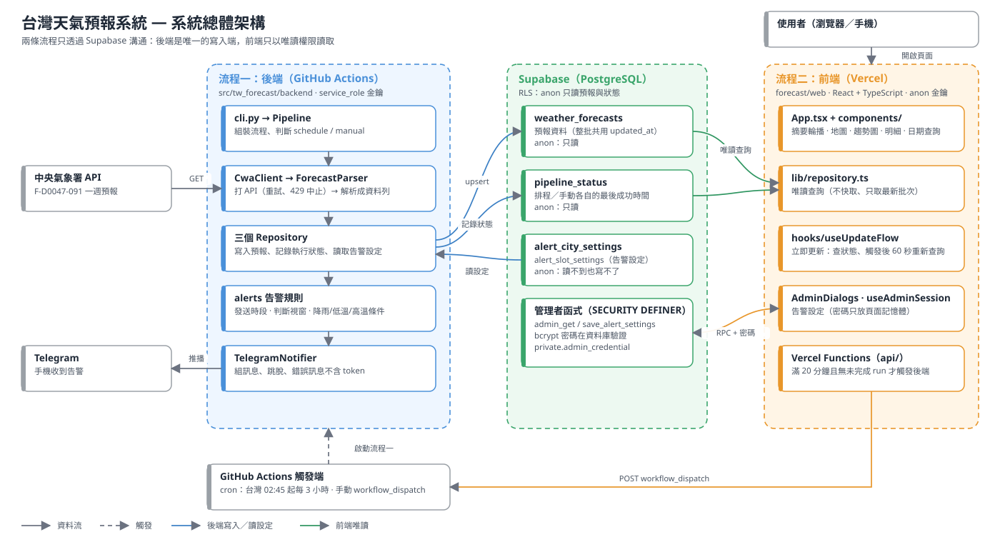
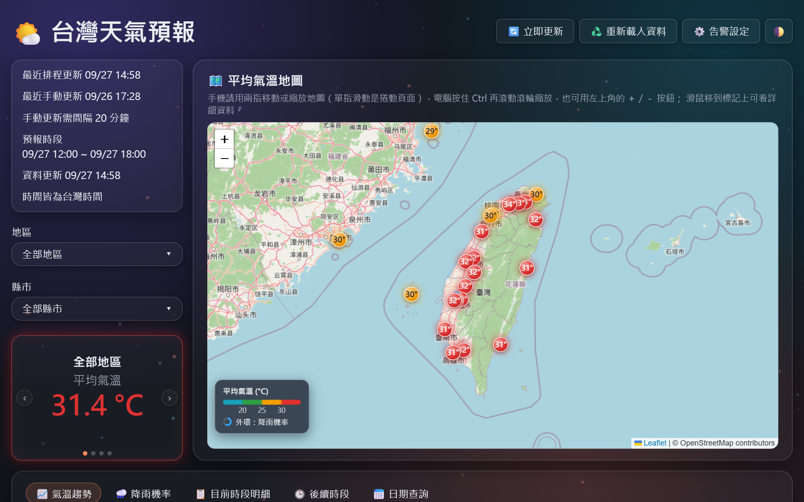
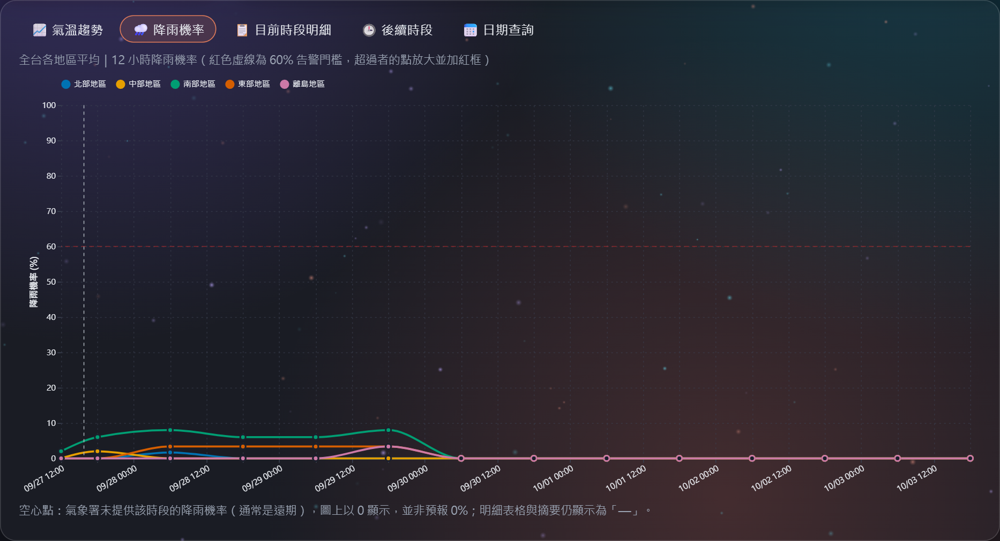
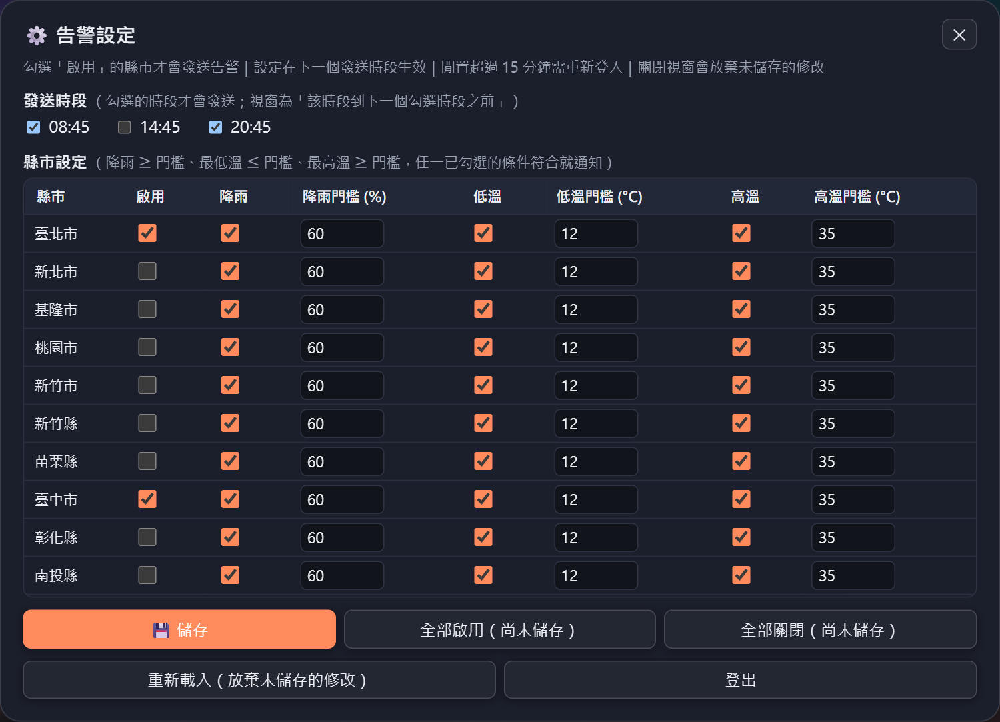
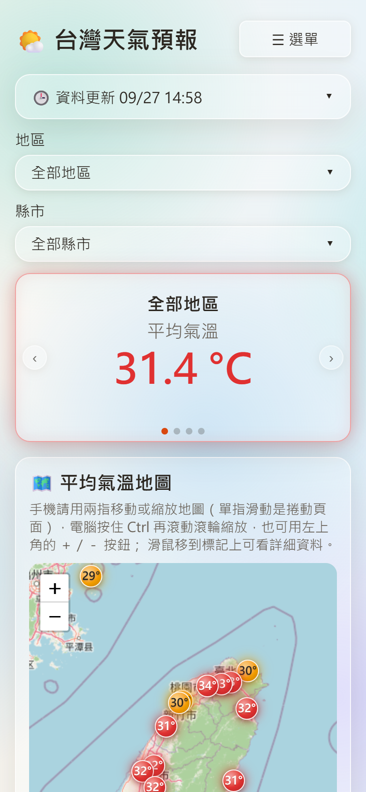
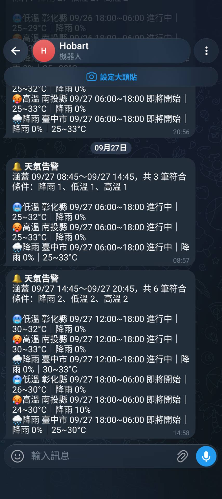

# 台灣天氣預報與自動化通報系統 — 作業報告

| 項目 | 內容 |
| :--- | :--- |
| 作業 | HW1 |
| 作者 | [CHIU,YUNG-CHIA](https://github.com/hobartXIII) |
| 部署網址 | <https://tw-forecast.vercel.app/>（Vercel 版，正式） <https://twforecast-gxbrpkkigluvdh48shimyo.streamlit.app/>（Streamlit 版，`streamlit` 分支，備用；超過 12 小時沒人使用會休眠，按畫面上的按鈕即可喚醒） |
| 原始碼 | <https://github.com/hobartXIII/tw_forecast/tree/main/forecast> |
| 相關文件 | [SPECIFICATION.md](SPECIFICATION.md)（完整規格、版本紀錄、環境建置、部署與常見問題）、[ARCHITECTURE.md](ARCHITECTURE.md)（檔案功能對照、測試指令）、[VERCEL_PLAN.md](VERCEL_PLAN.md)（前端改寫到 Vercel 的規劃與過程） |

<!-- QR code 各放一格、左右加全形空白，彼此隔開才好掃描（GitHub 會過濾 CSS，格子內距也固定，只能用空白撐開） -->
<table align="center">
  <tr>
    <td align="center" valign="top" width="33%">&emsp;&emsp; 正式網址（Vercel）</td>
    <td align="center" valign="top" width="33%">&emsp;&emsp; 備用網址（Streamlit）</td>
    <td align="center" valign="top" width="33%">&emsp;&emsp; GitHub 原始碼</td>
  </tr>
</table>

## 一、目的

### 1.1 背景

本作業利用中央氣象署提供的全台各縣市一週天氣預報資訊API，將取得之氣象資訊整理後透過前端做成易於查看的資訊與圖表，並且能在設定的條件下，主動推播提示資訊到手機。

### 1.2 開發里程

| 階段 | 重點 |
| :--- | :--- |
| 需求釐清 | 釐清要做什麼：從問AI開始(煥哥-從氣象資料到互動式天氣預報應用)、資料來源（氣象署一週預報）、呈現方式（下拉式清單、氣溫與降雨資訊、地圖、趨勢圖）、主動通知的條件，以及全部使用免費服務 |
| 確定架構 | 讀寫分離：GitHub Actions 排程抓資料寫入 Supabase，Streamlit 只讀；撰寫規格書 `SPECIFICATION.md` |
| 實作 Streamlit 版 | 排程每 3 小時、地區／縣市篩選、Telegram 推播、告警設定存資料庫並以管理者密碼保護、玻璃擬態與深淺色、日期查詢、手機版選單 |
| 重構 | 程式碼移到 `src/tw_forecast/`，拆成 OOP 類別與純函式；正式程式、測試（`tests/`）、真實連線檢查（`checks/`）分開；前後輸出逐項比對一致 |
| Streamlit 優化 | 立即更新的鎖定與倒數、視覺強化（卡片色帶、玻璃容器、藥丸頁籤）、手機操作細節、告警訊息標出觸發原因；README 改為作業報告 |
| 改寫至 Vercel | 先寫 `VERCEL_PLAN.md` 規劃，分 7 階段改寫為 Vite + React + TypeScript，「立即更新」改由 Vercel Functions 處理；之後改成兩欄版面、天氣資訊輪播、主題切換、地圖降雨環、背景動態與透明玻璃 |

### 1.3 成果

1. **自動化**：GitHub Actions 每 3 小時自動抓取並寫入 Supabase；需要時可在網頁按「立即更新」，由伺服器端判斷間隔後觸發。
2. **視覺化**：平均氣溫地圖（級距色標記＋降雨環）、摘要輪播、氣溫與降雨趨勢圖，以及目前時段、後續時段、一週預報與日期查詢表格；可在全台、地區、縣市之間切換，電腦與手機皆適用。
3. **主動通知**：管理者在網頁按「⚙️ 告警設定」、以密碼登入後，即可逐縣市設定是否啟用、降雨／低溫／高溫的條件與門檻，並勾選發送時段；排程時符合條件就推播 Telegram，訊息標出觸發原因與筆數。
4. **安全與免費**：前端只持有公開金鑰、由 RLS 限制為唯讀；告警設定需管理者密碼、在資料庫驗證；GitHub Actions、Supabase、Vercel、Telegram 皆為免費方案。
5. **延伸課題**：資料存取由本機 `sqlite3` 改為雲端 Supabase（PostgreSQL）；新增**主動推播**，排程時依各縣市門檻判斷，符合條件就透過 Telegram Bot 把告警送到手機；**畫面美化**（玻璃質感卡片、深淺色主題、依級距上色、背景動態）與 **RWD**（電腦兩欄、手機單欄與收合選單）；先完成 Streamlit 版，再改寫為 Vite + React + TypeScript 部署到 Vercel，並比較兩種做法（見第五節）。

## 二、規劃與設計

### 2.1 系統架構

系統使用讀寫分離架構：GitHub Actions 定時執行 Python **ETL 管線**，將氣象署預報寫入 Supabase 並推播 Telegram 告警；前端為部署於 Vercel 的 **React + TypeScript 單頁應用（SPA）**，以唯讀金鑰查詢 Supabase，「立即更新」經 Vercel Functions 在伺服器端觸發排程。

系統分成兩個流程，彼此只透過 Supabase 資料庫交換資料（讀寫分離）：

- **流程一（後端，擷取入庫）**：GitHub Actions 依排程執行 `fetch_and_store.py`，呼叫氣象署 API、清洗資料後寫入 Supabase；排程執行時依告警設定推播 Telegram。
- **流程二（前端，讀庫呈現）**：儀表板（Vite + React，部署在 Vercel）在瀏覽器以唯讀的 `anon` 金鑰讀取 Supabase，不呼叫氣象署 API，也不持有寫入金鑰；只有「立即更新」經由 Vercel 的伺服器端 Function 觸發 GitHub Actions。

> 各檔案的功能與「想改某功能該看哪裡」見 [ARCHITECTURE.md](ARCHITECTURE.md)；核心流程的時序圖見 [sequence_diagram.svg](sequence_diagram.svg)。

### 2.2 技術選型

| 元件 | 選用 | 理由 |
| :--- | :--- | :--- |
| 資料來源 | 中央氣象署 `F-D0047-091` | 一次回傳全台 22 縣市一週預報，一次呼叫就夠 |
| 排程執行 | GitHub Actions | 免費、不需自備伺服器，金鑰可放 GitHub Secrets |
| 資料庫 | Supabase（PostgreSQL） | 免費雲端資料庫，內建 RLS 權限控管與 RPC 函式 |
| 前端 | Vite + React + TypeScript、Vega-Lite（趨勢圖）、Leaflet（地圖） | 地圖、圖表、篩選都在瀏覽器執行，不需要常駐伺服器；圖表沿用 Streamlit 版 Altair 的 Vega-Lite 定義 |
| 前端部署 | Vercel（Hobby） | 免費，push 到 `main` 自動部署；靜態頁走 CDN、不會休眠；「立即更新」用 Vercel Functions |
| 前端（第一版） | Streamlit + Folium + Altair（`streamlit` 分支，Community Cloud） | 全部用 Python 開發，延續課程內容；改寫後保留作為備用與對照 |
| 推播 | Telegram Bot | 原規劃 Google Chat，但個人 Gmail 帳號無法使用其 webhook／API；也評估過 LINE，但 LINE Notify 已於 2025-03-31 停止服務，改用 Messaging API 必須申請 LINE 官方帳號，不適合個人通知用途；最後選用免費且設定簡單的 Telegram |

### 2.3 資料來源與用量規劃

- 每次執行只呼叫 **1 次** API（單次回應約 669 KB），每天排程 8 次，約 5.4 MB。
- 手動「立即更新」須距上次成功更新滿 20 分鐘，避免連續點擊耗用額度。
- 前端不呼叫氣象署 API，使用人數增加不會增加 API 用量。
- 以上皆遠低於一般會員每日 2 萬次、2 GB 的上限。

### 2.4 資料庫設計

| 資料表 | 用途 | 權限 |
| :--- | :--- | :--- |
| `weather_forecasts` | 各縣市、各時段的預報（溫度、降雨機率、天氣現象），含 `updated_at` | `anon` 只能讀 |
| `pipeline_status` | 排程與手動各自最後一次執行結果與成功時間 | `anon` 只能讀 |
| `alert_city_settings` | 22 縣市各自的告警開關，以及降雨／低溫／高溫門檻（預設 60％／12°C／35°C） | `anon` 讀寫皆不可 |
| `alert_slot_settings` | 發送時段（08:45、14:45、20:45） | `anon` 讀寫皆不可 |
| `private.admin_credential` | 管理者密碼的 bcrypt 雜湊 | 不對 API 開放 |

資料庫時區設為 `Asia/Taipei`；告警設定只能透過需要密碼的 RPC 函式讀寫。

### 2.5 排程與告警設計

- **排程**：台灣時間 02:45 起每 3 小時執行一次（`45 */3 * * *`），也可手動觸發。
- **告警條件**：每個縣市可分別開關三個條件：降雨機率 ≥ 門檻、最低溫 ≤ 門檻、最高溫 ≥ 門檻，任一條件符合就通知。
- **發送時機**：只有排程執行會推播，且只在勾選的發送時段發送；手動更新只更新資料。判斷範圍為「本次發送時段到下一個發送時段之前」，含進行中與即將開始的預報時段。
- **預設關閉**：所有縣市預設不發送，讀不到設定也不發送，避免誤發。

### 2.6 安全設計

- **讀寫分離**：只有後端持有 `service_role` 寫入金鑰；前端只放 `anon` 金鑰，RLS 限制它只能讀預報與狀態。
- **管理者密碼**：只存 bcrypt 雜湊，驗證在資料庫函式內完成；錯誤密碼會延遲回應，無法確定時一律拒絕。
- **金鑰不外流**：所有金鑰存在 GitHub Secrets／Vercel 環境變數／本機 `.env`、`.env.local`，不進 repo；GitHub token 只在 Vercel 的伺服器端 Function，不會送到瀏覽器；錯誤訊息與日誌會遮蔽機密。
- **告警設定的密碼**：登入後只放在頁面的記憶體，不寫入瀏覽器儲存空間；閒置 15 分鐘、登出、重新整理或關閉分頁即清除。

## 三、實際成果

### 3.1 功能總覽

- **自動排程**：每 3 小時自動抓取最新預報，不用開電腦也會持續更新；需要時也能在儀表板上按「立即更新」（距上次成功更新需滿 20 分鐘）。
- **Telegram 推播**：各縣市可自訂降雨、低溫、高溫門檻，只在選定的時段通知，符合條件才發送，訊息標出觸發原因。
- **篩選**：地區與縣市互斥，可在全台、單一地區、單一縣市之間切換，所有圖表跟著變化；選擇會寫進網址（如 `?city=臺中市`），重新整理或分享都會保留。
- **摘要輪播**：平均氣溫、最高／最低溫、溫差、降雨機率四張卡片自動輪播，可按箭頭、圓點或左右滑動切換；選了單一縣市時顯示該縣市的天氣現象（如「🌤️ 晴時多雲」）。
- **地圖**：標記以級距色顯示平均氣溫，外圈的降雨環弧長代表降雨機率；選了縣市時地圖放大到該縣市，滑鼠移上去可看詳細資料。
- **趨勢與報表**：氣溫、降雨機率趨勢圖，搭配目前時段明細、後續時段、一週預報與日期查詢表格。
- **手機友善（RWD）**：電腦為兩欄、手機為單欄；手機版按鈕收進「☰ 選單」、更新資訊收合成一條按鈕，地圖要兩指才能拖動，避免捲動時誤觸。
- **外觀**：透明玻璃風格的卡片與面板；主題可選自動（跟隨系統）／淺色／深色；深色背景有流動的粒子、淺色背景由左往右緩慢流動；溫度依級距上色。
- **告警設定（需登入）**：按「⚙️ 告警設定」輸入管理者密碼後，可勾選發送時段（08:45／14:45／20:45），並逐縣市設定啟用、降雨／低溫／高溫條件與門檻，一鍵全部啟用或關閉；密碼在資料庫驗證、只留在頁面記憶體，閒置 15 分鐘自動登出。一般訪客只能讀取資料。

### 3.2 畫面截圖

**儀表板（電腦版、深色主題）**：標題列按鈕與主題切換；左欄為更新資訊、地區／縣市篩選與摘要輪播，右欄為平均氣溫地圖（標記外圈為降雨環）。

**降雨機率趨勢圖**：紅色虛線為 60% 門檻；空心點表示氣象署未提供該時段的降雨機率。

**「⚙️ 告警設定」視窗**：勾選發送時段，並逐縣市設定啟用、條件開關與門檻（截圖為示意設定）。

**手機版（淺色主題）與 Telegram 告警訊息**：手機版標題列按鈕收進「☰ 選單」，更新資訊收合成一條按鈕；告警訊息列出涵蓋時間與符合條件的時段。

  
  

### 3.3 測試與驗證

- **自動測試**：後端 86 項 pytest、前端 221 項 Vitest 全數通過，涵蓋後端解析與告警判斷、前端純函式、「立即更新」的伺服器端邏輯與整頁渲染；不連網、不連資料庫。
- **真實連線檢查**：`checks/` 內的腳本分別驗證氣象署 API、RLS 權限（13 項全數通過）、管理者函式（錯誤密碼、空值、SQL 注入字串皆被拒絕）與 Telegram 推播。
- **實際運作**：
  - 自動排程已穩定執行（GitHub Actions 的 cron 實際觸發時間約延遲 7～10 分鐘）。
  - 2026-09-21 08:45 的發送時段已實際收到排程推播的告警，完整走過「排程 → 讀取設定 → 條件判斷 → Telegram」。
  - 儀表板已部署到 Vercel（先前的 Streamlit 版部署在 Streamlit Community Cloud），電腦與手機上的主要功能皆經實際操作確認；「立即更新」已在 Vercel 實際觸發，確認倒數、F5 後仍鎖定與完成提示；告警設定已用真實密碼登入並儲存。

## 四、遇到的問題與解決

| 問題 | 原因 | 解決方式 |
| :--- | :--- | :--- |
| 無法用 Google Chat、LINE 推播 | Google Chat：個人 Gmail 帳號不能使用 webhook／API；LINE：LINE Notify 已於 2025-03-31 停止服務，改用 Messaging API 必須申請 LINE 官方帳號，對只推給自己的個人通知來說門檻過高 | 改用 Telegram Bot（向 @BotFather 申請即可取得 token，免費、不需官方帳號） |
| 儀表板出現 44 個縣市（應為 22） | 氣象署第一個時段會隨時間縮短，新舊兩批時段重疊 | 加入 `updated_at`，前端只取最新一批資料 |
| 時間顯示成 UTC | 資料庫預設時區為 UTC | 資料庫時區設為 `Asia/Taipei` |
| 手機上滑動頁面時誤觸地圖 | 單指滑動被地圖攔截 | 地圖改成兩指操作，單指用來捲動頁面 |
| 按「立即更新」後按 F5，按鈕又能按 | 觸發後到 workflow 寫入成功紀錄前，資料庫看起來仍可更新；Vercel 的 Function 又不保留記憶體，無法記住「剛觸發過」 | Streamlit 版先由伺服器記憶體記住觸發時間；Vercel 版改為查 GitHub 上是否有尚未完成的手動 run，F5、新分頁、其他使用者看到同一個狀態，也不必改資料庫 |
| Vercel 的 Function 一直說「尚未設定 GH_DISPATCH_TOKEN」 | 環境變數選了 Secret 類型，Function 執行時讀不到 | 改成 Config 類型並 Redeploy |
| 手機上趨勢圖的圖例最後一項被切掉 | 圖例排成一列，手機寬度放不下 | 手機上圖例每列最多 3 項 |

## 五、比較與未來改進

### 5.1 目前架構

後端（GitHub Actions 排程抓資料、寫入 Supabase、推播 Telegram）和前端只透過 Supabase 交換資料，彼此不直接呼叫。因此前端換部署平台時，**後端、資料庫與告警推播都不用改**。實際改寫到 Vercel 時也是如此：後端程式、GitHub Actions、資料表、RLS 與資料庫函式完全沒有修改，只新增了 `forecast/web/`。

### 5.2 Streamlit Community Cloud 與 Vercel 比較

> 下表是改寫前的評估（節錄主要面向，完整比較與當初的改寫建議見 [VERCEL_PLAN.md](VERCEL_PLAN.md) 附錄）；改寫後的實際經驗整理在表格下方。

| 面向 | Streamlit Community Cloud（改寫前） | Vercel |
| :--- | :--- | :--- |
| 開發語言 | 全部 Python，可沿用 pandas、Altair、folium 與現有測試 | 前端需改寫成 JavaScript／TypeScript（例如 Next.js）；Streamlit 需要常駐的 WebSocket 伺服器，無法部署在 Vercel |
| 開發速度 | 視熟悉度而定：熟 Python 的人上手快，元件現成，不用寫 API 與前端狀態管理；但它特有的「每次互動整支腳本重跑」、`session_state`、快取機制較少人熟悉，資源也較少 | 視熟悉度而定：HTML／React／TypeScript 是主流技能，資料與範例多，熟前端的人反而較快；但要自己處理版面、狀態、API 路由 |
| 首次載入（休眠與喚醒） | 連續 12 小時沒有人造訪就會休眠；下一位訪客會先看到「This app has gone to sleep」畫面，須按「Yes, get this app back up!」並等待重新啟動才能使用（任何訪客都能喚醒）；每個連線都要建立 WebSocket | 頁面是 CDN 上的靜態檔，沒有要喚醒的伺服器，不會休眠，隨時打開都立即顯示；只有「立即更新」用的 Function 久未使用時，第一次呼叫可能稍慢（冷啟動），不影響資料顯示 |
| 互動模型 | 每次互動整支腳本重跑，靠 `st.cache_*`、`st.fragment` 優化 | 只更新變動的元件，瀏覽器端互動不需回伺服器 |
| 版面與樣式 | 受限於內建元件；玻璃擬態、頁籤等效果依賴 Streamlit 內部 CSS 選擇器，升級版本可能失效 | 完全自訂，手機版與深色主題可精細控制 |
| 維護成本 | 一種語言、一套測試 | Python（後端）與 TypeScript（前端）兩套語言、兩套測試 |

> 本作業的 Streamlit 備用網址若顯示休眠畫面，按畫面上的按鈕即可喚醒；正式網址（Vercel）不會有此情況。

**當初的結論**：個人使用、小流量的儀表板，對熟 Python 的開發者來說 Streamlit 開發快、能沿用 Python 程式與測試，是合適的選擇；若要公開推廣、在意首次載入速度或更細緻的手機版介面，再考慮改寫到 Vercel。

**實際改寫後的心得**：
- **比預期順利的**：圖表直接沿用 Vega-Lite 定義；純函式逐一移植並把 pytest 的案例搬成 Vitest，行為容易對照；不需要伺服器渲染，靜態頁加兩支 Function 就夠。
- **變好的**：沒有休眠、首次載入快；互動不再整頁重跑（例如「立即更新」倒數結束後不會關掉開著的視窗）；原生 `<select>`、`<dialog>` 讓手機操作更自然；樣式不再依賴 Streamlit 內部的 CSS 選擇器。

## 六、結論

本專案完成了「自動抓取 → 雲端保存 → 儀表板呈現 → 條件推播」的完整流程，並全部使用免費方案部署在雲端。設計上以讀寫分離為核心：後端是唯一的寫入端，前端只持有唯讀金鑰，告警設定另外用管理者密碼保護，兼顧方便與安全。實作過程中也學到，雲端服務的細節（排程延遲、時區、套件偵測路徑、手機操作）往往要實際部署後才會發現，因此除了自動測試外，實機驗證同樣重要。之後依第五節的評估把前端改寫到 Vercel，後端與資料庫完全沿用，也印證了讀寫分離、以資料庫為交會點的設計，讓前端可以獨立替換。
