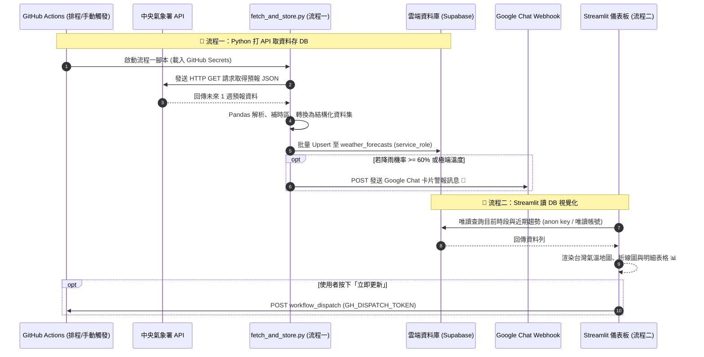

# 台灣天氣預報與自動化通報系統 (Taiwan Weather Forecast System)
# 系統規格書 (System Specification Document)

- **版本**: `v1.2.0`
- **狀態**: `Approved & Updated: Streamlit-only Frontend reading Supabase directly`
- **文件路徑**: `forecast/SPECIFICATION.md`
- **核心流程規範**:
  1. **流程一（後端）**：GitHub Actions 排程執行 Python (`fetch_and_store.py`)，呼叫中央氣象署 API 取資料、後處理並寫入雲端 Supabase；符合條件時推播 Google Chat。
  2. **流程二（前端）**：Streamlit + Folium 儀表板直接連線 Supabase（`supabase-py` 或 `psycopg2`）讀取資料並視覺化，部署於 Streamlit Community Cloud。

---

## 📋 目錄 (Table of Contents)
1. [系統核心兩大流程與願景](#1-系統核心兩大流程與願景)
2. [系統架構圖與資料流程 (Mermaid)](#2-系統架構圖與資料流程-mermaid)
3. [中央氣象署 (CWA) API 介接規格](#3-中央氣象署-cwa-api-介接規格)
4. [安全性與環境變數管理 (Secrets)](#4-安全性與環境變數管理-secrets)
5. [資料庫模型與儲存設計 (Supabase)](#5-資料庫模型與儲存設計-supabase)
6. [流程一實作規格：Python 打 API 取資料存 DB (`fetch_and_store.py`)](#6-流程一實作規格python-打-api-取資料存-db-fetch_and_storepy)
7. [GitHub Actions 自動化排程工作流規格](#7-github-actions-自動化排程工作流規格)
8. [流程二實作規格：Streamlit 讀取 Supabase 視覺化與部署](#8-流程二實作規格streamlit-讀取-supabase-視覺化與部署)
9. [專案目錄與檔案結構藍圖](#9-專案目錄與檔案結構藍圖)
10. [實施里程碑與驗收清單](#10-實施里程碑與驗收清單)

---

## 1. 系統核心兩大流程與願景

### 1.1 核心兩大運作流程 (Core Two-Stage Pipeline)
本系統遵循「**後端擷取入庫**」與「**前端讀庫呈現**」的職責分離設計，兩者只透過雲端 Supabase 資料庫溝通：

```text
┌────────────────────────────────────────────────────────────────────────┐
│ 🌟 流程一：Python 打 API 取資料存 DB (Ingestion & Persistence)           │
│    執行環境：GitHub Actions (排程 / 手動觸發)，密鑰存於 GitHub Secrets     │
│                                                                        │
│ [中央氣象署 CWA API] ──(requests)──> [Pandas 清洗] ──> [Supabase 雲端 DB] │
│                                                                        │
│ * 觸發條件滿足時 (降雨率 >= 60%)：同時推播告警至 [Google Chat Webhook]         │
└────────────────────────────────────────────────────────────────────────┘
                                 │  (僅透過資料庫溝通)
                                 ▼
┌────────────────────────────────────────────────────────────────────────┐
│ 🌟 流程二：Streamlit 讀 DB 視覺化 (Serving & Presentation)               │
│    執行環境：Streamlit Community Cloud                                   │
│                                                                        │
│ [Supabase 雲端 DB] ──(supabase-py / psycopg2 唯讀)──> [Streamlit + Folium] │
│                                                                        │
│ * 互動式儀表板：折線圖 + 明細表格 + Folium 台灣地圖                         │
└────────────────────────────────────────────────────────────────────────┘
```

### 1.2 系統目標與特色
1. **讀寫分離 (Read/Write Separation)**：後端（GitHub Actions）是唯一的寫入端；前端只以唯讀權限讀取資料庫，不呼叫氣象署 API，也不持有後端寫入金鑰。
2. **教學原型探索 (微課程相容)**：相容「煥哥 AI 創新微課程」之 Python、Pandas、Streamlit、Folium 台灣互動地圖實作；資料存取由課程原版的本機 `sqlite3` 改為雲端 Supabase（PostgreSQL）。
3. **雲端自動維運 (Serverless & Free-tier)**：GitHub Actions 依固定排程（或手動觸發）自動執行流程一寫入 Supabase；前端部署於 Streamlit Community Cloud，皆使用免費方案。

---

## 2. 系統架構圖與資料流程 (Mermaid & Visual Diagrams)

### 2.1 系統總體架構圖 (Architecture Diagram)

```mermaid
flowchart TD
    subgraph Stage1["【流程一：Python 打 API 取資料存 DB (GitHub Actions)】"]
        CWA["🌤️ 中央氣象署 API (CWA F-D0047-091 一週預報)"]
        PyIngest["🐍 核心腳本: fetch_and_store.py\n(發送 GET 請求、Pandas 清洗整理)"]
        GChat["🔔 Google Chat Webhook (降雨機率 >= 60% 手機通知)"]

        CWA -->|1. 取得原始 JSON 氣象| PyIngest
        PyIngest -->|2. 觸發降雨/氣溫警戒| GChat
    end

    subgraph DataStorage["【資料持久層 (DB)】"]
        CloudDB[("🗄️ Supabase PostgreSQL (weather_forecasts)")]
    end

    PyIngest -->|3. 結構化資料寫入 / Upsert (service_role)| CloudDB

    subgraph Stage2["【流程二：Streamlit 讀 DB 視覺化 (Streamlit Community Cloud)】"]
        StreamlitApp["📊 Streamlit 互動儀表板\n(折線圖 + 明細表格 + Folium 地圖)"]
        RefreshBtn["🔄 立即更新按鈕\n(觸發 GitHub Actions workflow_dispatch)"]

        CloudDB -->|4. 唯讀查詢 (supabase-py / psycopg2)| StreamlitApp
        StreamlitApp --- RefreshBtn
    end

    RefreshBtn -.->|5. GitHub API 手動觸發| PyIngest
```

#### 🖼️ 系統總體架構圖視覺呈現 (Architecture Visual Diagram)


> 💡 **檢視提示**：
> - 亦可開啟包含切換功能的網頁：[view_architecture.html](view_architecture.html)
> - ⚠️ 上述圖檔為 v1.1.0 版本繪製（含「匯出 JSON」與「Web 前端」），與本版架構不一致，需重新繪製。

---

### 2.2 核心時序圖 (Sequence Diagram)



#### 🖼️ 核心資料流程時序圖視覺呈現 (Sequence Visual Diagram)


> ⚠️ 此圖檔為 v1.1.0 版本繪製，與本版時序不一致，需重新繪製。

---

## 3. 中央氣象署 (CWA) API 介接規格

### 3.1 授權碼取得與端點資訊
- **資料平台**: [中央氣象署開放資料平台 (CWA Open Data Platform)](https://opendata.cwa.gov.tw/)
- **認證機制**: HTTP Header `Authorization: <CWA_API_KEY>` 或 Query 參數 `Authorization=<CWA_API_KEY>`
- **核心資料集（本系統唯一使用）**: **未來 1 週天氣預報 `F-D0047-091`**（12 小時一個時段，約 7 天，全臺各縣市）。
  - 已放棄原先的「今明 36 小時預報 `F-C0032-001`」。

### 3.2 呼叫端點與常用 Query 參數
- **Endpoint**: `https://opendata.cwa.gov.tw/api/v1/rest/datastore/F-D0047-091`
- **HTTP Method**: `GET`
- **完整範例**: `https://opendata.cwa.gov.tw/api/v1/rest/datastore/F-D0047-091?Authorization={WEATHER_API_KEY}&format=JSON`
- **參數說明**:
  - `Authorization`: 氣象署會員授權碼 (必填)
  - `format`: `JSON`
  - `LocationName` / `ElementName`（選填）：可限縮縣市與氣象要素以減少回傳量；預設不加，一次取得全臺全部要素。

### 3.3 回傳 JSON 關鍵欄位解析對應

> ✅ 以下結構已依實際回應（`scripts/check_cwa_api.py` 於 2026-09-20 存下的 `samples/F-D0047-091.json`，約 669 KB）驗證。

```text
success: true
records.Locations[]                     ← 1 筆 (LocationsName "台灣"，Dataid "D0047-091")
 └── Location[]                         ← 22 個縣市
      ├── LocationName: 縣市名稱 (如 "臺北市"，注意「臺」「台」用字依 API 為準)
      ├── Geocode: 行政區代碼 (如 "09007000")
      ├── Latitude / Longitude: 字串 (如 "26.154204")
      └── WeatherElement[15]:
           ├── ElementName: 平均溫度 / 最高溫度 / 最低溫度 / 平均露點溫度 /
           │   平均相對濕度 / 最高體感溫度 / 最低體感溫度 / 最大舒適度指數 /
           │   最小舒適度指數 / 風速 / 風向 / 12小時降雨機率 / 天氣現象 /
           │   紫外線指數 / 天氣預報綜合描述
           └── Time[]:
                ├── StartTime: "2026-09-20T00:00:00+08:00"   ← 已帶 +08:00
                ├── EndTime  : "2026-09-20T06:00:00+08:00"
                └── ElementValue[]: [{ "<鍵名依要素而異>": "字串值" }]
```

**本系統使用的要素與 `ElementValue` 鍵名**：

| 資料表欄位 | `ElementName` | `ElementValue` 鍵名 | 備註 |
| :--- | :--- | :--- | :--- |
| `weather_condition` | 天氣現象 | `Weather` | 另有 `WeatherCode` |
| `min_temp` | 最低溫度 | `MinTemperature` | 字串數值 |
| `max_temp` | 最高溫度 | `MaxTemperature` | 字串數值 |
| `avg_temp` | 平均溫度 | `Temperature` | 字串數值 |
| `rain_probability` | 12小時降雨機率 | `ProbabilityOfPrecipitation` | 遠期時段為 `"-"`（無資料），須轉為 NULL |
| `comfort_index` | 最大舒適度指數 | `MaxComfortIndexDescription` | 文字描述 (如 "舒適")，另有數值 `MaxComfortIndex` |
| `latitude` / `longitude` | （`Location` 層級） | `Latitude` / `Longitude` | 字串，轉為數值 |

**時段特性（實測）**：
- 每縣市每個要素 **15 個時段**（約 22 縣市 × 15 ≈ 330 列/次）；**第一個時段可能只有 6 小時**（如 `00:00–06:00`），其後為 12 小時，因此不可假設每段皆為 12 小時。
- 除「紫外線指數」（僅 7 個白天時段）外，其餘要素的時段完全一致，可用 `(縣市, StartTime, EndTime)` 對齊合併成一列。紫外線指數本系統不使用。
- 遠期時段部分要素為 `"-"` 或缺項（實測 `12小時降雨機率` 在 330 列中有 176 列為 `"-"`，其餘欄位皆有資料），該欄位寫入 NULL，不得中斷整批寫入；前端讀到 NULL 時顯示「—」。

### 3.4 時區處理規範
- 實測 `StartTime` / `EndTime` **已帶 `+08:00`**（如 `2026-09-20T00:00:00+08:00`），可直接以 ISO 8601 字串寫入 `TIMESTAMPTZ`，不需再補時區；仍應在程式中檢查字串含時區偏移，若日後 API 改為不含時區才補上 `+08:00`（`tz_localize("Asia/Taipei")`），否則 PostgreSQL 會當成 UTC，時間差 8 小時。
- 前端 Streamlit 判斷「目前時段」與顯示時間時，一律以 `Asia/Taipei` 時區轉換；程式內**不可**使用無時區的 `datetime.now()`（GitHub Actions runner 與 Streamlit Cloud 主機皆為 UTC）。
- 排程 `cron` 以 UTC 計算：`0 */6 * * *` 對應台灣時間 08:00、14:00、20:00、02:00。

### 3.5 API 使用限制與用量評估（一般會員）
本系統使用氣象開放資料平台「**一般會員**」授權碼（適用個人使用或學術研究，輕中量用戶）。權益依平臺公告，平臺保留調整上限之權利，以官方【最新消息】為準：

| 項目 | 一般會員上限 |
| :--- | :--- |
| 資料擷取 API 下載次數 | 24 小時內 2 萬次（超過於期滿後重新計算） |
| 資料擷取 API 下載流量 | 每日 2 GB（超過後限流至 0 時重新計算） |
| 檔案下載次數 / 流量 | 24 小時內 2 萬次 / 每日 2 GB（本系統不使用檔案下載） |

**本系統用量評估**：
- 每次流程一只呼叫 **1 次** `F-D0047-091`（一次回傳全臺各縣市一週預報，不逐縣市分次呼叫）。
- 固定排程每天 4 次；加上「立即更新」（每次觸發 1 次 API），即使手動觸發數十次，一天也遠低於 2 萬次。
- 實測單次回應約 **669 KB**，每天 4 次約 2.6 MB，遠低於每日 2 GB 上限。
- **前端 Streamlit 不呼叫 CWA API**，只讀 Supabase，因此使用者人數增加不會增加 CWA 用量。

**使用規範（實作須遵守）**：
1. **每次執行只打一次 API**：不得在迴圈中對每個縣市各發一次請求；如需限縮內容，用 `LocationName` / `ElementName` 參數，而不是拆成多次請求。
2. **限制重試**：失敗時最多重試 2～3 次並加延遲（例如 5 秒、15 秒），不得無限重試；遇 HTTP 429 或流量超限即中止本次執行，讓 workflow 標記失敗，等下次排程。
3. **保留「立即更新」冷卻**：維持 §8.1 的 60 秒冷卻，避免被連續點擊耗用額度。
4. **不要調高排程頻率**：CWA 預報約每數小時才更新一次，排程加密沒有意義，反而浪費額度；維持每 6 小時。
5. **授權碼保密**：`WEATHER_API_KEY` 只放 GitHub Secrets / 本地 `.env`，不進前端與 repo。
6. **合規**：一般會員限個人使用或學術研究；若日後轉為商業或高用量用途，須改申請適用的會員類別，並遵守氣象資料開放平臺使用規範，違規平臺可終止服務。

---

## 4. 安全性與環境變數管理 (Secrets)

### 4.1 後端關鍵環境變數（GitHub Secrets / 本地 `.env`）

| 變數名稱 | 類型 | 說明 | 存放位置 |
| :--- | :--- | :--- | :--- |
| `WEATHER_API_KEY` | String | 中央氣象署 API 授權碼 | GitHub Secrets / 本地 `.env` |
| `SUPABASE_URL` | String | Supabase 專案端點 URL | GitHub Secrets / 本地 `.env` |
| `SUPABASE_KEY` | String | Supabase `service_role` 金鑰 (後端專用，繞過 RLS；嚴禁進入前端) | GitHub Secrets / 本地 `.env` |
| `GOOGLE_CHAT_WEBHOOK` | String | Google Chat 空間 Webhook 完整網址 | GitHub Secrets / 本地 `.env` |

### 4.2 前端 Streamlit 設定（Streamlit Community Cloud Secrets / 本地 `.streamlit/secrets.toml`）

| 變數名稱 | 說明 |
| :--- | :--- |
| `SUPABASE_URL` | Supabase 專案端點 URL（使用 `supabase-py` 時） |
| `SUPABASE_ANON_KEY` | Supabase `anon` 公開金鑰，僅能依 RLS 政策**唯讀** `weather_forecasts`（使用 `supabase-py` 時） |
| `SUPABASE_DB_URL` | 唯讀資料庫帳號的 PostgreSQL 連線字串（改用 `psycopg2` 時；須使用 Supabase **Pooler** 連線字串，見 §8.2） |
| `GH_DISPATCH_TOKEN` | GitHub Fine-grained PAT，僅授權此 repo 的 `Actions: Read and write`（「立即更新」按鈕用） |
| `GH_REPO` | 格式 `owner/repo` |

> ⚠️ 前端 Secrets **嚴禁**放入 `service_role` key 或任何可寫入資料庫的憑證；所有 Secrets 皆不得 commit 進 repo。

### 4.3 本地安全防護規範
- 專案根目錄必須配置 `.gitignore`，嚴禁 Commit 以下檔案：
  ```text
  .env
  .streamlit/secrets.toml
  __pycache__/
  .venv/
  ```
- 提供範本檔 `.env.example`（後端）：
  ```bash
  WEATHER_API_KEY="CWA-XXXXXXXX-XXXX-XXXX-XXXX-XXXXXXXXXXXX"
  SUPABASE_URL="https://your-project.supabase.co"
  SUPABASE_KEY="eyJhbGciOiJIUzI1NiIsIn..."   # service_role
  GOOGLE_CHAT_WEBHOOK="https://chat.googleapis.com/v1/spaces/.../messages?key=..."
  ```
- 提供範本檔 `.streamlit/secrets.toml.example`（前端）：
  ```toml
  SUPABASE_URL = "https://your-project.supabase.co"
  SUPABASE_ANON_KEY = "eyJhbGciOiJIUzI1NiIsIn..."   # anon，非 service_role
  GH_DISPATCH_TOKEN = "github_pat_..."
  GH_REPO = "owner/repo"
  ```

---

## 5. 資料庫模型與儲存設計 (Supabase)

系統統一採用雲端 Supabase (PostgreSQL) 作為唯一資料庫（免費方案即可：註冊 Supabase 並建立免費專案）。後端（GitHub Actions / 本地測試）與前端（Streamlit）皆連線同一雲端資料庫，不使用本機 SQLite。

### 5.1 資料庫：Supabase (PostgreSQL)

#### 資料表：`weather_forecasts` (預報與歷史存檔)

> **欄位設計原則**：資料表欄位只保留「API 實際有提供的資料」，與 API 回傳取交集；API 沒有提供的資訊（如通知旗標、自增 id）不建對應欄位；唯一例外是系統維運用的 `updated_at`（資料建立/最後更新時間）。個別時段 API 給 `"-"` 者，該欄位值為 NULL。
```sql
CREATE TABLE IF NOT EXISTS public.weather_forecasts (
    location_name VARCHAR(50) NOT NULL,   -- 縣市 (LocationName)
    forecast_time_start TIMESTAMPTZ NOT NULL,
    forecast_time_end TIMESTAMPTZ NOT NULL,
    latitude NUMERIC(9, 6),               -- 縣市緯度 (Location 層級)
    longitude NUMERIC(9, 6),              -- 縣市經度
    weather_condition VARCHAR(100),       -- 天氣現象
    min_temp NUMERIC(4, 1),               -- 最低溫度
    max_temp NUMERIC(4, 1),               -- 最高溫度
    avg_temp NUMERIC(4, 1),               -- 平均溫度
    rain_probability INTEGER,             -- 12 小時降雨機率 (%)，未取得時無此值 (NULL)
    comfort_index VARCHAR(100),           -- 舒適度
    updated_at TIMESTAMPTZ NOT NULL DEFAULT now(),  -- 資料建立/最後更新時間 (新增時取預設值，更新時由觸發器與程式覆寫)

    -- 以「縣市 + 時段」為主鍵，同一縣市與同時段重複寫入即覆蓋 (upsert)
    PRIMARY KEY (location_name, forecast_time_start, forecast_time_end)
);

-- 索引優化（主鍵已涵蓋 location_name 開頭的查詢）
CREATE INDEX IF NOT EXISTS idx_weather_forecasts_time ON public.weather_forecasts(forecast_time_start DESC);

-- 既有資料表補欄位（首次建表者可略過；已存在的表會補上，既有列以執行當下時間填入）
ALTER TABLE public.weather_forecasts
    ADD COLUMN IF NOT EXISTS updated_at TIMESTAMPTZ NOT NULL DEFAULT now();

-- 每次 UPDATE（含 upsert 走到 ON CONFLICT DO UPDATE）自動刷新 updated_at
CREATE OR REPLACE FUNCTION public.set_updated_at() RETURNS TRIGGER AS $$
BEGIN
    NEW.updated_at := now();
    RETURN NEW;
END;
$$ LANGUAGE plpgsql;

DROP TRIGGER IF EXISTS trg_weather_forecasts_updated_at ON public.weather_forecasts;
CREATE TRIGGER trg_weather_forecasts_updated_at
    BEFORE UPDATE ON public.weather_forecasts
    FOR EACH ROW EXECUTE FUNCTION public.set_updated_at();

-- RLS 存取控制
ALTER TABLE public.weather_forecasts ENABLE ROW LEVEL SECURITY;

-- 僅開放 anon 角色「唯讀」；不建立任何 INSERT / UPDATE / DELETE policy（寫入一律拒絕）
CREATE POLICY "Allow anon read only" ON public.weather_forecasts
    FOR SELECT TO anon USING (true);
```

**RLS 設計說明**：
- **寫入端**：僅 GitHub Actions 的流程一使用 **`service_role` key** 寫入（會繞過 RLS）。
- **讀取端**：Streamlit 前端使用 `anon` key，只能透過上述 `SELECT` policy 讀取；因沒有寫入 policy，即使 `anon` key 外洩也無法新增、修改或刪除資料。
- `weather_forecasts` 只含公開氣象預報與告警旗標，開放匿名唯讀可接受；若日後加入敏感欄位，須改為僅授權特定角色或使用唯讀資料庫帳號（`psycopg2` 方案）。
- ⚠️ `service_role` key 權限等同管理員，只能存放於 GitHub Secrets / 本地 `.env`，**嚴禁**放入 Streamlit secrets 或 commit 進 repo。

---

## 6. 流程一實作規格：Python 打 API 取資料存 DB (`fetch_and_store.py`)

### 6.1 職責與工作流程
1. **讀取環境變數**：載入 `WEATHER_API_KEY`、`SUPABASE_URL`、`SUPABASE_KEY`、`GOOGLE_CHAT_WEBHOOK`（由 GitHub Secrets 注入）。
2. **呼叫氣象署 API**：
   ```python
   headers = {"Authorization": WEATHER_API_KEY}
   response = requests.get("https://opendata.cwa.gov.tw/api/v1/rest/datastore/F-D0047-091",
                           params={"format": "JSON"}, headers=headers, timeout=30)
   response.raise_for_status()
   raw_json = response.json()
   ```
3. **資料清洗與結構化**：解析巢狀 `Locations[].Location[].WeatherElement[].Time[]`（見 §3.3），只取用 §3.3 表列的 7 個要素，以 `(縣市, StartTime, EndTime)` 對齊合併成一列（約 22 縣市 × 15 時段 ≈ 330 列）；該時段 API 未給值（如 `"-"`）者轉為 NULL；經緯度與溫度字串轉為數值；並依 §3.4 確認時區為 `+08:00`。
4. **批量寫入 DB (Upsert)**：
   - 連線至 Supabase 執行 `supabase.table('weather_forecasts').upsert(records, on_conflict='location_name,forecast_time_start,forecast_time_end').execute()`。
   - 寫入前為整批 `records` 統一加上 `updated_at`（台灣時間 ISO 8601，本次寫入時間）；新增列取此值，既有列走 `ON CONFLICT DO UPDATE` 時一併更新；資料庫端另有 `DEFAULT now()` 與 `BEFORE UPDATE` 觸發器作為保底。
   - 單次 `upsert` 呼叫為單一資料庫交易（全部成功或全部失敗），前端不會讀到只寫入一半的批次。
5. **條件判斷與 Google Chat 推播**：
   - 篩選條件：任一縣市 `rain_probability >= 60` 或 `min_temp <= 12` 或 `max_temp >= 35`。
   - **只針對「即將開始」的時段判斷**：`StartTime` 落在 (現在, 現在 + 6 小時] 內。一週預報後段準確度較低，不告警遠期時段。
   - **去重（無狀態）**：資料表只保留 API 提供的縣市資料欄位，不存「已通知」旗標。因排程每 6 小時一次，時段起點為 00/06/12/18 時，每個時段的起點剛好只落在某一次排程的 6 小時視窗內，所以同一時段只會被通知一次。手動「立即更新」可能造成同一時段重複通知，屬可接受的例外。
   - 符合條件則格式化 Google Chat Card V2 JSON 並 `requests.post(GOOGLE_CHAT_WEBHOOK, json=payload)`。

---

## 7. GitHub Actions 自動化排程工作流規格

工作流程自動執行**流程一**，將氣象資料寫入 Supabase；前端不需要重新部署，重新整理即可讀到新資料。

**觸發方式**：
- **固定排程**：由 workflow 內的 `cron` 決定（每 6 小時），排程時間僅能透過修改 `.yml` 並 commit 變更，前端不提供調整功能。
- **手動立即更新**：前端 Streamlit 按鈕透過 GitHub API 觸發 `workflow_dispatch`（見 §8.1）。

```yaml
name: Taiwan Weather Pipeline (Fetch -> Store)

on:
  schedule:
    - cron: '0 */6 * * *' # 每 6 小時排程執行一次 (UTC)
  workflow_dispatch:      # 支援隨時手動點擊執行

permissions:
  contents: read

concurrency:
  group: weather-pipeline   # 排程與手動觸發不會同時執行
  cancel-in-progress: false

jobs:
  weather-sync:
    runs-on: ubuntu-latest
    steps:
      - name: 檢出專案程式碼
        uses: actions/checkout@v4

      - name: 安裝 Python 環境
        uses: actions/setup-python@v5
        with:
          python-version: '3.11'
          cache: 'pip'

      - name: 安裝相依套件
        run: |
          pip install --upgrade pip
          pip install -r requirements.txt

      - name: 【流程一】Python 打 API 取資料存入 DB 並檢查告警
        env:
          WEATHER_API_KEY: ${{ secrets.WEATHER_API_KEY }}
          SUPABASE_URL: ${{ secrets.SUPABASE_URL }}
          SUPABASE_KEY: ${{ secrets.SUPABASE_KEY }}
          GOOGLE_CHAT_WEBHOOK: ${{ secrets.GOOGLE_CHAT_WEBHOOK }}
        run: |
          python scripts/fetch_and_store.py
```

### 7.1 讀寫分離與失敗保護
- **寫入端**：僅此 workflow（流程一）會寫入 Supabase；前端完全唯讀。
- **更新完成前讀舊資料**：workflow 執行期間，資料庫保持上一次成功寫入的內容；`upsert` 成功後前端才讀到新資料。
- **失敗保護**：CWA API 失敗或寫入失敗時腳本應以非 0 狀態碼結束（workflow 標記失敗），資料庫維持舊資料。
- **密鑰**：全部來自 GitHub Secrets，不寫入程式碼或日誌。

---

## 8. 流程二實作規格：Streamlit 讀取 Supabase 視覺化與部署

前端只保留 **Streamlit + Folium**，直接連線 Supabase 唯讀查詢，取代課程原版的本機 `sqlite3`。

### 8.1 Streamlit 互動儀表板 (`streamlit_app/app.py`)
1. **讀取資料庫（不快取）**：每次頁面載入/重新整理都重新查詢 Supabase，**不使用** `st.cache_data` / `st.cache_resource` 快取查詢結果（連線物件可重用）；畫面顯示目前顯示的預報時段起訖時間（以 `Asia/Taipei` 顯示）。資料表不存寫入時間，因此不顯示「最後更新時間」。
2. **「目前時段」定義**：查詢 `forecast_time_start <= 現在(Asia/Taipei) < forecast_time_end` 的各縣市資料；若無符合資料，取最接近現在的最新時段。
3. **地區下拉選單 (Dropdown)**：
   - 篩選 `北部地區`、`中部地區`、`南部地區`、`東部地區`；縣市對應分區由前端靜態對照表 (`streamlit_app/components/region_data.py`) 提供；經緯度與 `avg_temp` 直接取自資料庫（`avg_temp` 若為 NULL，退回 `(min_temp + max_temp) / 2`）。
4. **最高與最低氣溫折線圖（一週趨勢）**：
   - 繪製指定地區/縣市未來 7 天（各 12 小時時段）之 `min_temp` 與 `max_temp` 雙折線圖（對應海報步驟 14）。
   - 趨勢查詢須限制範圍（例如近 N 天 + `order` + `limit`），避免超過 Supabase 預設單次 1000 筆上限。
5. **明細資料表格**：
   - 呈現時段、地區、氣溫、降雨機率、舒適度（對應海報步驟 15）。
6. **台灣地圖視覺化 (Folium + Streamlit)**：
   - 使用 `folium` + `streamlit-folium`，依縣市座標與 `avg_temp` 繪製標記。
   - 色階分級標記：
     - `< 20°C`: 藍綠色
     - `20 ~ 25°C`: 綠色
     - `25 ~ 30°C`: 橙黃色
     - `> 30°C`: 鮮紅色
7. **「立即更新」按鈕**：
   - 呼叫 `POST https://api.github.com/repos/{GH_REPO}/actions/workflows/weather_worker.yml/dispatches`，Header 帶 `Authorization: Bearer {GH_DISPATCH_TOKEN}`，Body `{"ref": "main"}`（成功回傳 HTTP 204）。
   - 成功後顯示「已觸發更新，約 1~2 分鐘後重新整理」（更新完成前仍顯示舊資料，見 §7.1），並提供「重新載入資料」按鈕。
   - 設定 60 秒冷卻，避免連續點擊重複觸發。
   - 只更新資料，不提供修改排程週期的功能。

### 8.2 資料庫連線方式（擇一）

**方案 A（預設）：`supabase-py` + `anon` key**
```python
import streamlit as st
from datetime import datetime
from zoneinfo import ZoneInfo
from supabase import create_client

sb = create_client(st.secrets["SUPABASE_URL"], st.secrets["SUPABASE_ANON_KEY"])
now = datetime.now(ZoneInfo("Asia/Taipei")).isoformat()
rows = (sb.table("weather_forecasts").select("*")
          .lte("forecast_time_start", now).gt("forecast_time_end", now)
          .execute().data)
```
- 權限完全由 §5.1 的 RLS `SELECT` policy 控制，`anon` key 無法寫入。

**方案 B：`psycopg2` + 唯讀資料庫帳號**
```python
import psycopg2
conn = psycopg2.connect(st.secrets["SUPABASE_DB_URL"])  # 唯讀角色 + Pooler 連線字串
```
- 於 Supabase 建立僅有 `SELECT ON weather_forecasts` 權限的資料庫角色，連線字串放入 Streamlit Secrets。
- Streamlit Community Cloud 需使用 Supabase 的 **Pooler（Session / Transaction）連線字串**，因直連端點預設僅支援 IPv6，可能無法從 Streamlit Cloud 連線。
- 需要複雜 SQL（分組、視窗函數）時優先採用此方案。

### 8.3 部署至 Streamlit Community Cloud
1. 將 repo 推送至 GitHub（`forecast/` 為 repo 根目錄，見 §9）。
2. 於 [Streamlit Community Cloud](https://streamlit.io/cloud) 連結 GitHub 帳號，選擇此 repo、分支 `main`，**Main file path** 設為 `streamlit_app/app.py`。
3. 於 **Advanced settings → Secrets** 貼上 §4.2 所列前端 Secrets（TOML 格式）。
4. 相依套件由 repo 根目錄 `requirements.txt` 提供（需包含 `streamlit`、`supabase`、`pandas`、`folium`、`streamlit-folium`、`requests`；使用方案 B 另加 `psycopg2-binary`）。
5. 部署後，程式碼 push 至 `main` 會自動重新部署；資料更新則由 GitHub Actions 寫入 Supabase，無需重新部署。

> 不使用 GitHub Pages，前端網址由 Streamlit Community Cloud 提供（`*.streamlit.app`）。

---

## 9. 專案目錄與檔案結構藍圖

> **Repo 根目錄約定**：GitHub 只會執行 **repo 根目錄**下的 `.github/workflows/`。本專案以 `HW1/` 作為 **repo 根目錄**，專案程式碼與文件全部放在 `forecast/` 子資料夾；`.github/` 與 `.gitignore` 只在根目錄保留一份。因此：
> - workflow 位於 `HW1/.github/workflows/`，每個 `run` 步驟以 `working-directory: forecast` 執行，`cache-dependency-path` 帶 `forecast/` 前綴。
> - Streamlit Cloud 的 Main file path 為 `forecast/streamlit_app/app.py`，`requirements.txt` 須位於可被偵測的位置。

```text
HW1/                                     # repo 根目錄
├── .github/
│   └── workflows/
│       └── weather_worker.yml           # 自動排程: 執行流程一
├── .gitignore                           # 安全防護清單（全 repo 唯一一份）
└── forecast/                            # 專案程式碼與文件
    ├── scripts/
    │   ├── fetch_and_store.py           # 🌟 流程一：Python 打 API 取資料存 DB & 告警推播
    │   └── mock_test.py                 # 測試模擬 (模擬 CWA 回傳資料，寫入 Supabase)
    ├── streamlit_app/
    │   ├── app.py                       # 🌟 流程二：讀取 Supabase 渲染 Streamlit 儀表板
    │   └── components/
    │       ├── db.py                    # Supabase 唯讀查詢 (supabase-py / psycopg2)
    │       ├── region_data.py           # 縣市 → 分區 (北/中/南/東) 靜態對照表
    │       ├── map_view.py              # Folium 地圖視覺化
    │       └── charts.py                # 氣溫折線圖模組
    ├── .streamlit/
    │   └── secrets.toml.example         # 前端 Secrets 範本 (實際 secrets.toml 不得 commit)
    ├── sql/
    │   └── init_supabase.sql            # Supabase DDL 建表 + RLS 腳本
    ├── .env.example                     # 後端環境變數範本
    ├── requirements.txt                 # 相依套件清單
    ├── SPECIFICATION.md                 # 系統規格書 (本文件)
    └── README.md                        # 專案快速上手指引
```

---

## 10. 實施里程碑與驗收清單

| 里程碑 | 項目內容 | 核心對應 | 驗收標準 (Acceptance Criteria) |
| :---: | :--- | :--- | :--- |
| **M0** | **建立 GitHub Repo** | 專案結構 | 於 `HW1/` 初始化 git 並推送至 GitHub（`HW1/` 為 repo 根目錄，程式碼在 `forecast/`，見 §9），確認 `.github/workflows/` 位於 repo 根目錄。 |
| **M1** | **金鑰與環境準備** | 安全配置 | 備妥 CWA API Key、Google Chat Webhook；註冊 Supabase 並建立免費專案取得 URL、`service_role` key、`anon` key；後端 Secrets 設定於 GitHub Secrets 與本地 `.env`。 |
| **M2** | **資料庫綱要建立** | 儲存層 | 於雲端 Supabase 執行 `init_supabase.sql` 建立 `weather_forecasts` 表與 RLS；以 `anon` key 驗證可讀取、不可寫入。 |
| **M3** | **流程一實作** | **Python 打 API 存 DB** | （`F-D0047-091` 實際回應結構已於 §3.3 驗證）`fetch_and_store.py` 成功抓取一週預報、清洗入庫，並於即將開始（6 小時內）的時段 PoP $\ge 60\%$ 時推播 Google Chat。 |
| **M4** | **GitHub Actions 自動化** | 排程管線 | `.github/workflows/weather_worker.yml` 依排程與手動觸發成功執行流程一，資料寫入 Supabase，密鑰皆來自 GitHub Secrets。 |
| **M5** | **Streamlit 讀 DB 渲染** | 前端呈現 | Streamlit 儀表板以 `supabase-py`（或 `psycopg2`）成功讀取 Supabase，完整呈現地圖、折線圖與明細表格，並含「立即更新」按鈕。 |
| **M6** | **部署至 Streamlit Community Cloud** | 前端上線 | 於 Streamlit Community Cloud 部署成功，Secrets 設定完成，公開網址可正常顯示最新資料。 |

---
*本規格書已更新為 v1.2.0：前端僅保留 Streamlit + Folium 並直接讀取 Supabase，部署於 Streamlit Community Cloud；後端維持「GitHub Actions 排程 + `fetch_and_store.py` 寫入 Supabase」。*
