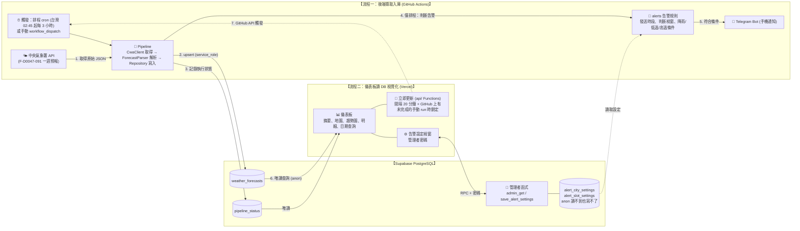
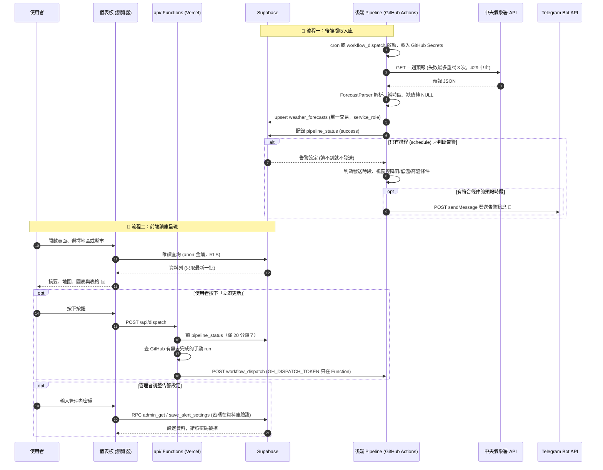

# 台灣天氣預報與自動化通報系統 (Taiwan Weather Forecast System)
# 系統規格書 (System Specification Document)

- **版本**: `v2.1.0`
- **狀態**: `Implemented: 後端排程與 Vercel 前端皆已上線運作；Streamlit 版保留在 streamlit 分支（見 §10 進度）`
- **文件路徑**: `forecast/SPECIFICATION.md`
- **核心流程規範**:
  1. **流程一（後端）**：GitHub Actions 排程執行 Python (`fetch_and_store.py`)，呼叫中央氣象署 API 取資料、後處理並寫入雲端 Supabase；符合條件時推播到個人的 Telegram。
  2. **流程二（前端）**：Vite + React + TypeScript 儀表板在瀏覽器以 `anon` 金鑰直接查詢 Supabase 並視覺化，部署於 Vercel（「立即更新」由 Vercel Functions 觸發 workflow）。v2.0.0 之前的 Streamlit + Folium 版保留在 `streamlit` 分支，繼續部署於 Streamlit Community Cloud。

---

## 📋 目錄 (Table of Contents)
1. [系統核心兩大流程與願景](#1-系統核心兩大流程與願景)
2. [系統架構圖與資料流程 (Mermaid)](#2-系統架構圖與資料流程-mermaid)
3. [中央氣象署 (CWA) API 介接規格](#3-中央氣象署-cwa-api-介接規格)
4. [安全性與環境變數管理 (Secrets)](#4-安全性與環境變數管理-secrets)
5. [資料庫模型與儲存設計 (Supabase)](#5-資料庫模型與儲存設計-supabase)
6. [流程一實作規格：Python 打 API 取資料存 DB (`fetch_and_store.py`)](#6-流程一實作規格python-打-api-取資料存-db-fetch_and_storepy)
7. [GitHub Actions 自動化排程工作流規格](#7-github-actions-自動化排程工作流規格)
8. [流程二實作規格：儀表板讀取 Supabase 視覺化與部署（Vercel）](#8-流程二實作規格儀表板讀取-supabase-視覺化與部署vercel)
9. [專案目錄與檔案結構藍圖](#9-專案目錄與檔案結構藍圖)
10. [實施里程碑與驗收清單](#10-實施里程碑與驗收清單)

---

## 1. 系統核心兩大流程與願景

### 1.1 核心兩大運作流程 (Core Two-Stage Pipeline)
本系統遵循「**後端擷取入庫**」與「**前端讀庫呈現**」的職責分離設計，兩者只透過雲端 Supabase 資料庫溝通：

```text
┌────────────────────────────────────────────────────────────────────────────┐
│ 🌟 流程一：Python 打 API 取資料存 DB (Ingestion & Persistence)             │
│    執行環境：GitHub Actions (排程 / 手動觸發)，密鑰存於 GitHub Secrets     │
│                                                                            │
│ [中央氣象署 CWA API] ──(requests)──> [解析清洗] ──> [Supabase 雲端 DB]     │
│                                                                            │
│ * 僅排程執行：符合資料庫告警設定 (縣市、條件、發送時段) 時推播至 [Telegram]│
└────────────────────────────────────────────────────────────────────────────┘
                                 │  (僅透過資料庫溝通)
                                 ▼
┌────────────────────────────────────────────────────────────────────────────┐
│ 🌟 流程二：儀表板讀 DB 視覺化 (Serving & Presentation)                     │
│    執行環境：Vercel（靜態頁 + api/ Functions）                             │
│                                                                            │
│ [Supabase 雲端 DB] ──(supabase-js 唯讀，anon 金鑰)──> [React + Vega + Leaflet]│
│                                                                            │
│ * 互動式儀表板：趨勢圖 + 明細表格 + 地圖 + 告警設定 (需管理者密碼)         │
└────────────────────────────────────────────────────────────────────────────┘
```

### 1.2 系統目標與特色
1. **讀寫分離 (Read/Write Separation)**：後端（GitHub Actions）是唯一的寫入端；前端只以唯讀權限讀取資料庫，不呼叫氣象署 API，也不持有後端寫入金鑰。
2. **教學原型探索 (微課程相容)**：延伸「煥哥 AI 創新微課程」之 Python、Pandas、Streamlit、Folium 台灣互動地圖實作；資料存取由課程原版的本機 `sqlite3` 改為雲端 Supabase（PostgreSQL）。前端先以 Streamlit 完成（`streamlit` 分支），v2.0.0 再改寫為 Vite + React 部署到 Vercel（決定與過程見 `VERCEL_PLAN.md`）。
3. **雲端自動維運 (Serverless & Free-tier)**：GitHub Actions 依固定排程（或手動觸發）自動執行流程一寫入 Supabase；前端部署於 Vercel（Hobby），皆使用免費方案。

---

## 2. 系統架構圖與資料流程 (Mermaid & Visual Diagrams)

### 2.1 系統總體架構圖 (Architecture Diagram)



#### 🖼️ 系統總體架構圖視覺呈現 (Architecture Visual Diagram)


> 💡 上圖為 Mermaid 版本（v2.0.0 已更新為 Vercel 前端）；向量圖檔 `architecture_diagram.svg` 是 v1.12.5 依 Streamlit 版繪製，前端部分以 Mermaid 版為準。

---

### 2.2 核心時序圖 (Sequence Diagram)



#### 🖼️ 核心資料流程時序圖視覺呈現 (Sequence Visual Diagram)


> 💡 Mermaid 版本見上方（v2.0.0 已更新為 Vercel 前端）；圖檔是 v1.12.5 依 Streamlit 版繪製，「立即更新」的路徑以 Mermaid 版為準。

---

## 3. 中央氣象署 (CWA) API 介接規格

### 3.1 授權碼取得與端點資訊
- **資料平台**: [中央氣象署開放資料平台 (CWA Open Data Platform)](https://opendata.cwa.gov.tw/)
- **認證機制**: HTTP Header `Authorization: <CWA_API_KEY>` 或 Query 參數 `Authorization=<CWA_API_KEY>`
- **核心資料集（本系統唯一使用）**: **未來 1 週天氣預報 `F-D0047-091`**（12 小時一個時段，約 7 天，全臺各縣市）。
  - 已放棄原先的「今明 36 小時預報 `F-C0032-001`」。

### 3.2 呼叫端點與常用 Query 參數
- **Endpoint**: `https://opendata.cwa.gov.tw/api/v1/rest/datastore/F-D0047-091`
- **HTTP Method**: `GET`
- **完整範例**: `https://opendata.cwa.gov.tw/api/v1/rest/datastore/F-D0047-091?Authorization={WEATHER_API_KEY}&format=JSON`
- **參數說明**:
  - `Authorization`: 氣象署會員授權碼 (必填)
  - `format`: `JSON`
  - `LocationName` / `ElementName`（選填）：可限縮縣市與氣象要素以減少回傳量；預設不加，一次取得全臺全部要素。

### 3.3 回傳 JSON 關鍵欄位解析對應

> ✅ 以下結構已依實際回應（`checks/check_cwa_api.py` 於 2026-09-20 存下的 `samples/F-D0047-091.json`，約 669 KB）驗證。

```text
success: true
records.Locations[]                     ← 1 筆 (LocationsName "台灣"，Dataid "D0047-091")
 └── Location[]                         ← 22 個縣市
      ├── LocationName: 縣市名稱 (如 "臺北市"，注意「臺」「台」用字依 API 為準)
      ├── Geocode: 行政區代碼 (如 "09007000")
      ├── Latitude / Longitude: 字串 (如 "26.154204")
      └── WeatherElement[15]:
           ├── ElementName: 平均溫度 / 最高溫度 / 最低溫度 / 平均露點溫度 /
           │   平均相對濕度 / 最高體感溫度 / 最低體感溫度 / 最大舒適度指數 /
           │   最小舒適度指數 / 風速 / 風向 / 12小時降雨機率 / 天氣現象 /
           │   紫外線指數 / 天氣預報綜合描述
           └── Time[]:
                ├── StartTime: "2026-09-20T00:00:00+08:00"   ← 已帶 +08:00
                ├── EndTime  : "2026-09-20T06:00:00+08:00"
                └── ElementValue[]: [{ "<鍵名依要素而異>": "字串值" }]
```

**本系統使用的要素與 `ElementValue` 鍵名**：

| 資料表欄位 | `ElementName` | `ElementValue` 鍵名 | 備註 |
| :--- | :--- | :--- | :--- |
| `weather_condition` | 天氣現象 | `Weather` | 另有 `WeatherCode` |
| `min_temp` | 最低溫度 | `MinTemperature` | 字串數值 |
| `max_temp` | 最高溫度 | `MaxTemperature` | 字串數值 |
| `avg_temp` | 平均溫度 | `Temperature` | 字串數值 |
| `rain_probability` | 12小時降雨機率 | `ProbabilityOfPrecipitation` | 遠期時段為 `"-"`（無資料），須轉為 NULL |
| `comfort_index` | 最大舒適度指數 | `MaxComfortIndexDescription` | 文字描述 (如 "舒適")，另有數值 `MaxComfortIndex` |
| `latitude` / `longitude` | （`Location` 層級） | `Latitude` / `Longitude` | 字串，轉為數值 |

**時段特性（實測）**：
- 每縣市每個要素 **15 個時段**（約 22 縣市 × 15 ≈ 330 列/次）；**第一個時段可能只有 6 小時**（如 `00:00–06:00`），其後為 12 小時，因此不可假設每段皆為 12 小時。
- 除「紫外線指數」（僅 7 個白天時段）外，其餘要素的時段完全一致，可用 `(縣市, StartTime, EndTime)` 對齊合併成一列。紫外線指數本系統不使用。
- 遠期時段部分要素為 `"-"` 或缺項（實測 `12小時降雨機率` 在 330 列中有 176 列為 `"-"`，其餘欄位皆有資料），該欄位寫入 NULL，不得中斷整批寫入；前端讀到 NULL 時顯示「—」。

### 3.4 時區處理規範
- 實測 `StartTime` / `EndTime` **已帶 `+08:00`**（如 `2026-09-20T00:00:00+08:00`），可直接以 ISO 8601 字串寫入 `TIMESTAMPTZ`，不需再補時區；仍應在程式中檢查字串含時區偏移，若日後 API 改為不含時區才補上 `+08:00`（`tz_localize("Asia/Taipei")`），否則 PostgreSQL 會當成 UTC，時間差 8 小時。
- 前端判斷「目前時段」與顯示時間時，一律以 `Asia/Taipei` 時區轉換；程式內**不可**使用無時區的 `datetime.now()`（GitHub Actions runner、Vercel 主機與使用者的瀏覽器皆可能為 UTC）。
- 排程 `cron` 以 UTC 計算：`45 */3 * * *` 對應台灣時間 **02:45、05:45、08:45、11:45、14:45、17:45、20:45、23:45**（每 3 小時，一天 8 次；避開整點以減少 GitHub 排程延遲）。

### 3.5 API 使用限制與用量評估（一般會員）
本系統使用氣象開放資料平台「**一般會員**」授權碼（適用個人使用或學術研究，輕中量用戶）。權益依平臺公告，平臺保留調整上限之權利，以官方【最新消息】為準：

| 項目 | 一般會員上限 |
| :--- | :--- |
| 資料擷取 API 下載次數 | 24 小時內 2 萬次（超過於期滿後重新計算） |
| 資料擷取 API 下載流量 | 每日 2 GB（超過後限流至 0 時重新計算） |
| 檔案下載次數 / 流量 | 24 小時內 2 萬次 / 每日 2 GB（本系統不使用檔案下載） |

**本系統用量評估**：
- 每次流程一只呼叫 **1 次** `F-D0047-091`（一次回傳全臺各縣市一週預報，不逐縣市分次呼叫）。
- 固定排程每天 8 次；加上「立即更新」（每次觸發 1 次 API，且受 §8.1 的 20 分鐘間隔限制，一天最多約 72 次），一天遠低於 2 萬次。
- 實測單次回應約 **669 KB**，每天排程 8 次約 5.4 MB，遠低於每日 2 GB 上限。
- **前端不呼叫 CWA API**，只讀 Supabase，因此使用者人數增加不會增加 CWA 用量。

**使用規範（實作須遵守）**：
1. **每次執行只打一次 API**：不得在迴圈中對每個縣市各發一次請求；如需限縮內容，用 `LocationName` / `ElementName` 參數，而不是拆成多次請求。
2. **限制重試**：失敗時最多重試 2～3 次並加延遲（例如 5 秒、15 秒），不得無限重試；遇 HTTP 429 或流量超限即中止本次執行，讓 workflow 標記失敗，等下次排程。
3. **限制「立即更新」頻率**：手動更新以資料庫 `pipeline_status` 表判斷，距上次成功更新須滿 20 分鐘才可觸發（見 §8.1），避免被連續點擊耗用額度；排程不受此限制。
4. **不要再調高排程頻率**：CWA 預報約每數小時才更新一次，排程加密沒有意義，反而浪費額度；維持每 3 小時。
5. **授權碼保密**：`WEATHER_API_KEY` 只放 GitHub Secrets / 本地 `.env`，不進前端與 repo。
6. **合規**：一般會員限個人使用或學術研究；若日後轉為商業或高用量用途，須改申請適用的會員類別，並遵守氣象資料開放平臺使用規範，違規平臺可終止服務。

---

## 4. 安全性與環境變數管理 (Secrets)

### 4.1 後端關鍵環境變數（GitHub Secrets / 本地 `.env`）

| 變數名稱 | 類型 | 說明 | 存放位置 |
| :--- | :--- | :--- | :--- |
| `WEATHER_API_KEY` | String | 中央氣象署 API 授權碼 | GitHub Secrets / 本地 `.env` |
| `SUPABASE_URL` | String | Supabase 專案端點 URL | GitHub Secrets / 本地 `.env` |
| `SUPABASE_KEY` | String | Supabase `service_role` 金鑰 (後端專用，繞過 RLS；嚴禁進入前端) | GitHub Secrets / 本地 `.env` |
| `TELEGRAM_BOT_TOKEN` | String | Telegram 機器人 token（向 @BotFather 建立取得）；**等同機器人的密碼，不可進資料庫、前端或 repo** | GitHub Secrets / 本地 `.env` |
| `TELEGRAM_CHAT_ID` | String | 接收告警的對話 ID（個人私訊；用 `tools/get_telegram_chat_id.py` 查詢） | GitHub Secrets / 本地 `.env` |

### 4.2 前端設定（Vercel 環境變數 / 本地 `forecast/web/.env.local`）

| 變數名稱 | 位置 | 說明 |
| :--- | :--- | :--- |
| `VITE_SUPABASE_URL` | 瀏覽器（建置時打包） | Supabase 專案端點 URL |
| `VITE_SUPABASE_ANON_KEY` | 瀏覽器（建置時打包） | Supabase `anon` 公開金鑰，僅能依 RLS 政策**唯讀** `weather_forecasts`、`pipeline_status`，並呼叫告警設定的資料庫函式 |
| `SUPABASE_URL`、`SUPABASE_ANON_KEY` | 只在 Function（選填） | `api/` 讀 `pipeline_status` 用；沒設定時沿用上面兩個 `VITE_` 變數（同一組 anon 值） |
| `GH_REPO` | 只在 Function | 格式 `owner/repo` |
| `GH_DISPATCH_TOKEN` | 只在 Function | GitHub Fine-grained PAT，僅授權此 repo 的 `Actions: Read and write`（查詢 workflow runs 與觸發 `workflow_dispatch`）；**不可**加 `VITE_` 前綴，否則會被打包進瀏覽器 |

> ⚠️ 前端**嚴禁**放入 `service_role` key 或任何可寫入資料庫的憑證；所有變數皆不得 commit 進 repo。
> ⚠️ Vercel 的環境變數類型一律選 **Config**：選 Secret 的變數在 Function 執行時讀不到（2026-09-26 實測）。改了變數要 Redeploy 才生效（`VITE_` 變數是建置時打包進去的）。

### 4.3 本地安全防護規範
- 專案根目錄必須配置 `.gitignore`，嚴禁 Commit 以下檔案：
  ```text
  .env
  .env.local            # forecast/web/.env.local（前端）
  node_modules/
  __pycache__/
  .venv/
  ```
- 提供範本檔 `.env.example`（後端）：
  ```bash
  WEATHER_API_KEY="CWA-XXXXXXXX-XXXX-XXXX-XXXX-XXXXXXXXXXXX"
  SUPABASE_URL="https://your-project.supabase.co"
  SUPABASE_KEY="eyJhbGciOiJIUzI1NiIsIn..."   # service_role
  SUPABASE_ANON_KEY="eyJhbGciOiJIUzI1NiIsIn..."   # anon（選填，只給 checks/ 的 RLS 檢查用）
  TELEGRAM_BOT_TOKEN="123456789:AAxxxxxxxx"
  TELEGRAM_CHAT_ID="123456789"
  ```
- 提供範本檔 `forecast/web/.env.example`（前端，複製成 `.env.local` 後填入）：
  ```bash
  VITE_SUPABASE_URL=https://xxxx.supabase.co
  VITE_SUPABASE_ANON_KEY=                # anon，非 service_role
  GH_REPO=hobartXIII/tw_forecast         # 只給 api/ 用，不可加 VITE_ 前綴
  GH_DISPATCH_TOKEN=
  ```

---

## 5. 資料庫模型與儲存設計 (Supabase)

系統統一採用雲端 Supabase (PostgreSQL) 作為唯一資料庫（免費方案即可：註冊 Supabase 並建立免費專案）。後端（GitHub Actions / 本地測試）與前端（瀏覽器、Vercel Functions）皆連線同一雲端資料庫，不使用本機 SQLite。

### 5.1 資料庫：Supabase (PostgreSQL)

#### 資料表：`weather_forecasts` (預報與歷史存檔)

> **欄位設計原則**：資料表欄位只保留「API 實際有提供的資料」，與 API 回傳取交集；API 沒有提供的資訊（如通知旗標、自增 id）不建對應欄位；唯一例外是系統維運用的 `updated_at`（資料建立/最後更新時間）。個別時段 API 給 `"-"` 者，該欄位值為 NULL。
```sql
CREATE TABLE IF NOT EXISTS public.weather_forecasts (
    location_name VARCHAR(50) NOT NULL,   -- 縣市 (LocationName)
    forecast_time_start TIMESTAMPTZ NOT NULL,
    forecast_time_end TIMESTAMPTZ NOT NULL,
    latitude NUMERIC(9, 6),               -- 縣市緯度 (Location 層級)
    longitude NUMERIC(9, 6),              -- 縣市經度
    weather_condition VARCHAR(100),       -- 天氣現象
    min_temp NUMERIC(4, 1),               -- 最低溫度
    max_temp NUMERIC(4, 1),               -- 最高溫度
    avg_temp NUMERIC(4, 1),               -- 平均溫度
    rain_probability INTEGER,             -- 12 小時降雨機率 (%)，未取得時無此值 (NULL)
    comfort_index VARCHAR(100),           -- 舒適度
    updated_at TIMESTAMPTZ NOT NULL DEFAULT now(),  -- 資料建立/最後更新時間 (新增時取預設值，更新時由觸發器與程式覆寫)

    -- 以「縣市 + 時段」為主鍵，同一縣市與同時段重複寫入即覆蓋 (upsert)
    PRIMARY KEY (location_name, forecast_time_start, forecast_time_end)
);

-- 索引優化（主鍵已涵蓋 location_name 開頭的查詢）
CREATE INDEX IF NOT EXISTS idx_weather_forecasts_time ON public.weather_forecasts(forecast_time_start DESC);

-- 資料庫預設時區設為台灣：timestamptz 內部仍以 UTC 儲存，此設定只影響查詢結果的顯示（顯示為 +08:00）
-- 對新連線生效（Supabase 資料庫名稱為 postgres）；已開啟的 SQL Editor 分頁需重新整理
ALTER DATABASE postgres SET timezone TO 'Asia/Taipei';
ALTER ROLE authenticator SET timezone TO 'Asia/Taipei';  -- PostgREST / supabase-py 連線所用角色

-- 既有資料表補欄位（首次建表者可略過；已存在的表會補上，既有列以執行當下時間填入）
ALTER TABLE public.weather_forecasts
    ADD COLUMN IF NOT EXISTS updated_at TIMESTAMPTZ NOT NULL DEFAULT now();

-- 每次 UPDATE（含 upsert 走到 ON CONFLICT DO UPDATE）自動刷新 updated_at
CREATE OR REPLACE FUNCTION public.set_updated_at() RETURNS TRIGGER AS $$
BEGIN
    NEW.updated_at := now();
    RETURN NEW;
END;
$$ LANGUAGE plpgsql;

DROP TRIGGER IF EXISTS trg_weather_forecasts_updated_at ON public.weather_forecasts;
CREATE TRIGGER trg_weather_forecasts_updated_at
    BEFORE UPDATE ON public.weather_forecasts
    FOR EACH ROW EXECUTE FUNCTION public.set_updated_at();

-- RLS 存取控制
ALTER TABLE public.weather_forecasts ENABLE ROW LEVEL SECURITY;

-- 僅開放 anon 角色「唯讀」；不建立任何 INSERT / UPDATE / DELETE policy（寫入一律拒絕）
CREATE POLICY "Allow anon read only" ON public.weather_forecasts
    FOR SELECT TO anon USING (true);
```

**時區說明**：`timestamptz` 一律以 UTC 儲存，`updated_at` 與預報時段皆同；上方 `ALTER DATABASE ... SET timezone` 讓查詢結果以台灣時間（+08:00）顯示。前端仍須依 §3.4 以 `Asia/Taipei` 轉換，不可依賴資料庫的顯示時區。

**RLS 設計說明**：
- **寫入端**：僅 GitHub Actions 的流程一使用 **`service_role` key** 寫入（會繞過 RLS）。
- **讀取端**：前端使用 `anon` key，只能透過上述 `SELECT` policy 讀取；因沒有寫入 policy，即使 `anon` key 外洩也無法新增、修改或刪除資料。
- `weather_forecasts` 只含公開氣象預報與告警旗標，開放匿名唯讀可接受；若日後加入敏感欄位，須改為僅授權特定角色或使用唯讀資料庫帳號（`psycopg2` 方案）。
- ⚠️ `service_role` key 權限等同管理員，只能存放於 GitHub Secrets / 本地 `.env`，**嚴禁**放入前端（Vercel 環境變數、`VITE_` 變數）或 commit 進 repo。

#### 資料表：`pipeline_status` (流程一執行狀態)

記錄排程 (`schedule`) 與手動 (`manual`) 各自「最後一次成功更新」的時間，供儀表板判斷手動更新是否已滿間隔。兩列固定，用 upsert 覆蓋。

```sql
CREATE TABLE IF NOT EXISTS public.pipeline_status (
    trigger_type TEXT PRIMARY KEY CHECK (trigger_type IN ('schedule', 'manual')),
    last_success_at TIMESTAMPTZ,          -- 最後一次成功寫入預報的時間（與該批預報的 updated_at 相同）
    last_run_at TIMESTAMPTZ,              -- 最後一次執行的時間（成功或失敗）
    last_status TEXT CHECK (last_status IN ('success', 'failed')),
    last_error TEXT                       -- 失敗時的簡短訊息
);

-- 初始資料：讓表一建立就有列可讀（前端讀不到就不放行手動更新）
INSERT INTO public.pipeline_status (trigger_type, last_success_at, last_run_at, last_status)
SELECT 'manual', max(updated_at), max(updated_at), CASE WHEN max(updated_at) IS NULL THEN NULL ELSE 'success' END
FROM public.weather_forecasts
ON CONFLICT (trigger_type) DO NOTHING;
INSERT INTO public.pipeline_status (trigger_type) VALUES ('schedule') ON CONFLICT (trigger_type) DO NOTHING;

ALTER TABLE public.pipeline_status ENABLE ROW LEVEL SECURITY;
CREATE POLICY "Allow anon read only" ON public.pipeline_status
    FOR SELECT TO anon USING (true);
```

- **寫入**：僅流程一以 `service_role` 寫入。成功時更新 `last_success_at`、`last_run_at`、`last_status = 'success'`；失敗時只更新 `last_run_at`、`last_status = 'failed'`、`last_error`，**不動 `last_success_at`**，因此失敗不會鎖住手動更新。寫入此表失敗只記警告，不使流程失敗。
- **來源判斷**：以 GitHub Actions 的 `GITHUB_EVENT_NAME` 決定寫入哪一列：`schedule` 寫 `schedule`；其餘（`workflow_dispatch`、本機直接執行）寫 `manual`。
- **讀取**：前端以 `anon` key 唯讀（見 §8.1 第 7 點）。

#### 資料表：`alert_city_settings`、`alert_slot_settings`（告警設定）

告警要發給哪些縣市、用什麼條件、在哪些時段發，由這兩張表設定（判斷邏輯見 §6.1 第 5 點）。

```sql
-- 縣市告警設定：縣市為主鍵；降雨／低溫／高溫三個條件各自有開關與門檻
CREATE TABLE IF NOT EXISTS public.alert_city_settings (
    location_name TEXT PRIMARY KEY,                  -- 縣市（與氣象署 LocationName 一致，如 臺北市）
    enabled BOOLEAN NOT NULL DEFAULT false,          -- 該縣市是否發送告警（預設關閉）
    rain_enabled BOOLEAN NOT NULL DEFAULT true,
    rain_threshold INTEGER NOT NULL DEFAULT 60 CHECK (rain_threshold BETWEEN 0 AND 100),                 -- 降雨機率 >= 此值
    min_temp_enabled BOOLEAN NOT NULL DEFAULT true,
    min_temp_threshold NUMERIC(4, 1) NOT NULL DEFAULT 12 CHECK (min_temp_threshold BETWEEN -20 AND 50),  -- 最低溫 <= 此值
    max_temp_enabled BOOLEAN NOT NULL DEFAULT true,
    max_temp_threshold NUMERIC(4, 1) NOT NULL DEFAULT 35 CHECK (max_temp_threshold BETWEEN -20 AND 50),  -- 最高溫 >= 此值
    updated_at TIMESTAMPTZ NOT NULL DEFAULT now()
);

-- 發送時段設定：只在啟用的時段（須是 cron 排程時槽）發送
CREATE TABLE IF NOT EXISTS public.alert_slot_settings (
    slot TEXT PRIMARY KEY CHECK (slot IN ('08:45', '14:45', '20:45')),  -- 台灣時間
    enabled BOOLEAN NOT NULL DEFAULT true,
    updated_at TIMESTAMPTZ NOT NULL DEFAULT now()
);

-- 初始資料：22 縣市全部關閉（不發送）、三個發送時段全部啟用
ALTER TABLE public.alert_city_settings ENABLE ROW LEVEL SECURITY;   -- 不建立任何 policy
ALTER TABLE public.alert_slot_settings ENABLE ROW LEVEL SECURITY;
REVOKE ALL ON public.alert_city_settings FROM anon, authenticated;
REVOKE ALL ON public.alert_slot_settings FROM anon, authenticated;
```

- **預設不發送**：22 縣市預設 `enabled = false`，要收哪個縣市的告警就把它啟用；勾選後直接套用標準條件（三個條件全開、門檻 60／12／35）。
- **存取權限**：RLS 不建立任何 policy，並撤銷 `anon`、`authenticated` 的權限，所以前端**完全讀不到、也寫不了**（設定內容不公開）。只有排程腳本以 `service_role` 讀取。
- **調整方式**：可用 Supabase SQL Editor 直接調整（範例見 `sql/init_supabase.sql` 檔尾），或使用儀表板標題列的「⚙️ 告警設定」按鈕（需輸入管理者密碼，見 §8.1 第 8 點）。
- 縣市名稱須與氣象署 `LocationName` 一致（「臺」而非「台」）；`init_supabase.sql` 已寫入 22 縣市。

#### 管理者密碼與設定函式（`private.admin_credential`、`admin_get_alert_settings`、`admin_save_alert_settings`）

管理者設定面板的密碼驗證**在資料庫內進行**，前端與程式碼裡都沒有密碼或雜湊值：

| 項目 | 設計 |
|---|---|
| 密碼表 | `private.admin_credential`（`id = 1` 單列、`password_hash`）。放在 `private` schema，**不對 API 開放**；RLS 不建 policy，並撤銷 `PUBLIC`／`anon`／`authenticated` 的所有權限 |
| 雜湊 | **bcrypt**（`$2a$` 格式，cost 12，加鹽），由 `pgcrypto` 的 `crypt()` 比對。雜湊值由本機腳本 `tools/make_admin_hash.py` 產生，密碼本身不會出現在資料庫工具的查詢紀錄或任何檔案 |
| 驗證函式 | `private.verify_admin(密碼)`：密碼錯誤、空值、NULL、尚未設定雜湊，**一律延遲 1 秒後拒絕**（錯誤訊息 `invalid_password`），讓連續猜測變慢；不做失敗次數鎖定，避免他人故意失敗把管理者鎖在外面 |
| 讀取函式 | `admin_get_alert_settings(密碼)`：密碼正確才回傳兩張設定表的內容 |
| 儲存函式 | `admin_save_alert_settings(密碼, 縣市設定, 時段設定)`：密碼正確才寫入；**只更新既有的縣市與時段，不能新增或刪除**；數值範圍由資料表 CHECK 把關；兩張表在同一個交易內更新，失敗全部回復 |
| 權限 | 兩個函式皆 `SECURITY DEFINER`、`search_path` 設為空並使用完整名稱；只授權 `anon` 執行（`PUBLIC` 預設權限已撤銷）。`anon` 只能「呼叫函式」，不能直接讀寫任何設定表或密碼表 |
| 設定／更換密碼 | 在 SQL Editor 執行 `INSERT INTO private.admin_credential (id, password_hash) VALUES (1, '<雜湊值>') ON CONFLICT (id) DO UPDATE ...`；忘記密碼時同樣重新寫入新的雜湊值，頁面上不提供改密碼功能。登入失敗時可用 `make_admin_hash.py --verify` 在本機比對密碼與資料庫裡的雜湊 |

**限制與風險**：任何人拿到 `anon` 金鑰都能直接呼叫這兩個函式猜密碼，防禦靠慢速雜湊、失敗延遲與足夠長的密碼（本專案採 12 碼隨機混合，被猜中的影響僅限於修改告警設定，取不到任何金鑰或預報資料）；密碼是函式參數，理論上可能出現在資料庫日誌，Supabase 預設不記錄參數值（未實際驗證）。

---

## 6. 流程一實作規格：Python 打 API 取資料存 DB (`fetch_and_store.py`)

### 6.1 職責與工作流程
1. **讀取環境變數**：載入 `WEATHER_API_KEY`、`SUPABASE_URL`、`SUPABASE_KEY`、`TELEGRAM_BOT_TOKEN`、`TELEGRAM_CHAT_ID`（由 GitHub Secrets 注入），並以 GitHub Actions 內建的 `GITHUB_EVENT_NAME` 判斷執行來源：`schedule` 為排程，其餘視為手動。
2. **呼叫氣象署 API**：
   ```python
   headers = {"Authorization": WEATHER_API_KEY}
   response = requests.get("https://opendata.cwa.gov.tw/api/v1/rest/datastore/F-D0047-091",
                           params={"format": "JSON"}, headers=headers, timeout=30)
   response.raise_for_status()
   raw_json = response.json()
   ```
3. **資料清洗與結構化**：解析巢狀 `Locations[].Location[].WeatherElement[].Time[]`（見 §3.3），只取用 §3.3 表列的 7 個要素，以 `(縣市, StartTime, EndTime)` 對齊合併成一列（約 22 縣市 × 15 時段 ≈ 330 列）；該時段 API 未給值（如 `"-"`）者轉為 NULL；經緯度與溫度字串轉為數值；並依 §3.4 確認時區為 `+08:00`。
4. **批量寫入 DB (Upsert)**：
   - 連線至 Supabase 執行 `supabase.table('weather_forecasts').upsert(records, on_conflict='location_name,forecast_time_start,forecast_time_end').execute()`。
   - 寫入前為整批 `records` 統一加上 `updated_at`（台灣時間 ISO 8601，本次寫入時間）；新增列取此值，既有列走 `ON CONFLICT DO UPDATE` 時一併更新；資料庫端另有 `DEFAULT now()` 與 `BEFORE UPDATE` 觸發器作為保底。
   - 單次 `upsert` 呼叫為單一資料庫交易（全部成功或全部失敗），前端不會讀到只寫入一半的批次。
   - 寫入成功後，以**同一個時間戳**更新 `pipeline_status`（見 §5.1）；執行失敗（含缺金鑰、HTTP 429）則記錄失敗狀態後照常以非 0 狀態碼結束。
5. **條件判斷與 Telegram 推播**（縣市、條件與發送時段由資料庫設定，見 §5.1）：
   - **只有排程（`schedule`）會推播**；手動更新與本機執行只更新資料、不推播。測試訊息格式可用 `checks/check_notify.py`。
   - **預設不發送**：`alert_city_settings` 的縣市預設關閉；沒有啟用任何縣市時，日誌記錄「尚未啟用任何縣市，不發送告警」。
   - **發送時段（可選）**：僅在 `alert_slot_settings` 啟用的時段發送，可選 08:45、14:45、20:45（皆為 `cron` 排程時槽）。腳本把「現在」對齊到最近一個已經過去的排程時槽（`current_slot`），時槽不在啟用的發送時段就略過（資料照常更新）。以時槽而非實際執行時間判斷，排程被 GitHub 延遲不到一個間隔也不受影響。
   - **判斷條件（每個縣市各自設定）**：降雨機率 ≥ 門檻、最低溫 ≤ 門檻、最高溫 ≥ 門檻，三個條件各有開關與門檻，已啟用的條件任一符合即列入；欄位為 NULL 不判斷。
   - **判斷視窗（W1）**：從這次發送時槽到「下一個啟用的發送時槽」之前，凡與視窗（時槽, 下一發送時槽］有交集的預報時段（**含進行中的**）才判斷，並標示「進行中」（時槽當下已開始）或「即將開始」。三個時段皆啟用時：
     - 08:45 → 涵蓋今日白天（進行中）
     - 14:45 → 白天（進行中）＋今晚（即將開始）
     - 20:45 → 今晚（進行中）＋明日白天（即將開始）
     - 只啟用單一時段時，視窗為隔天同一時間。
   - **重複出現屬預期**：進行中的時段會在相鄰兩次發送重複出現（如 06:00～18:00 在 08:45 與 14:45 都可能出現），這是「早、午、晚三次報告」的設計，不再有「每個時段只通知一次」的去重；一天最多 3 則。
   - **讀不到設定就不發送（fail closed）**：設定表不存在、連線失敗時略過推播並在日誌警告，資料照常更新、不視為失敗；不合法的縣市／時段列略過並警告。
   - **推播管道為 Telegram**（`src/tw_forecast/backend/notifier.py`）：符合條件則組成純文字訊息 —— 標題「🔔 天氣告警」、副標題「涵蓋 MM/DD HH:MM～MM/DD HH:MM，共 N 筆符合條件：降雨 a、低溫 b、高溫 c」（同一筆符合多個條件時各自計入，0 筆的條件不列）、每筆一行 `[觸發原因] 縣市 MM/DD HH:MM~HH:MM 進行中｜降雨 X%｜最低~最高°C`，觸發原因為 🌧️降雨／🥶低溫／🥵高溫（可多個）；只因溫度觸發時氣溫排在降雨前面（值為 NULL 顯示「—」）—— 呼叫 `sendMessage` 傳給 `TELEGRAM_CHAT_ID`。
   - **訊息格式**：以 HTML 模式送出（標題粗體），所有動態內容經過跳脫；Telegram 回 400（格式問題）時自動改用純文字重送一次。
   - **筆數與字數上限**：最多列 30 筆且總長不超過 4000 字，超過的部分以「另有 N 筆未列出」取代。
   - **⚠️ token 不可外洩**：`requests` 的例外訊息會帶完整網址（網址含 token），而失敗訊息會寫進 `pipeline_status.last_error`（前端可讀）。因此推播失敗一律改寫為不含網址的訊息（如「Telegram 回應 401：…」「無法連線至 Telegram（ConnectionError）」），且記錄失敗原因前會遮蔽所有機密環境變數的值。
   - **失敗處理**：未設定 `TELEGRAM_BOT_TOKEN` / `TELEGRAM_CHAT_ID` 時略過推播（不視為錯誤）；推播失敗時 workflow 標記失敗，但預報已寫入，`pipeline_status` 記錄 `failed` 與原因，不動 `last_success_at`。
   - **沒有符合條件時不發訊息**。
---

## 7. GitHub Actions 自動化排程工作流規格

工作流程自動執行**流程一**，將氣象資料寫入 Supabase；前端不需要重新部署，重新整理即可讀到新資料。

> 以下為實際使用的 `HW1/.github/workflows/weather_worker.yml`（repo 根目錄為 `HW1/`，故以 `working-directory: forecast` 執行，`requirements.txt` 在根目錄）。

**觸發方式**：
- **固定排程**：由 workflow 內的 `cron` 決定（台灣時間 02:45 起每 3 小時），排程時間僅能透過修改 `.yml` 並 commit 變更，前端不提供調整功能。排程不受任何手動更新限制。
- **手動立即更新**：前端按鈕呼叫 Vercel Function，由伺服器端以資料庫 `pipeline_status` 判斷距上次成功更新已滿 20 分鐘、且 GitHub 上沒有未完成的手動 run，才透過 GitHub API 觸發 `workflow_dispatch`（見 §8.1 第 7 點）。手動更新只更新資料，不推播告警。在 GitHub Actions 頁面直接手動執行不經過儀表板的檢查，可作為管理者的強制更新。

```yaml
name: Taiwan Weather Pipeline (Fetch -> Store)

on:
  schedule:
    # 台灣時間 02:45 起每 3 小時 (UTC 的 00:45 / 03:45 / ... / 21:45)。
    # ⚠️ config.py 的排程時槽 (SLOT_ANCHOR / SLOT_INTERVAL) 須與此處一致，修改時兩邊一起改。
    - cron: '45 */3 * * *'
  workflow_dispatch:      # 支援隨時手動點擊執行

permissions:
  contents: read

concurrency:
  group: weather-pipeline   # 排程與手動觸發不會同時執行
  cancel-in-progress: false

jobs:
  weather-sync:
    runs-on: ubuntu-latest
    timeout-minutes: 10
    defaults:
      run:
        working-directory: forecast   # repo 根目錄為 HW1/，專案程式碼在 forecast/
    steps:
      - name: 檢出專案程式碼
        uses: actions/checkout@v7

      - name: 安裝 Python 環境
        uses: actions/setup-python@v7
        with:
          python-version: '3.11'
          cache: 'pip'
          cache-dependency-path: requirements.txt

      - name: 安裝相依套件
        run: |
          pip install --upgrade pip
          pip install -r ../requirements.txt

      - name: 【流程一】Python 打 API 取資料存入 DB 並檢查告警
        env:
          WEATHER_API_KEY: ${{ secrets.WEATHER_API_KEY }}
          SUPABASE_URL: ${{ secrets.SUPABASE_URL }}
          SUPABASE_KEY: ${{ secrets.SUPABASE_KEY }}
          TELEGRAM_BOT_TOKEN: ${{ secrets.TELEGRAM_BOT_TOKEN }}
          TELEGRAM_CHAT_ID: ${{ secrets.TELEGRAM_CHAT_ID }}
        run: |
          python scripts/fetch_and_store.py
```

### 7.1 讀寫分離與失敗保護
- **寫入端**：僅此 workflow（流程一）會寫入 Supabase；前端完全唯讀。
- **更新完成前讀舊資料**：workflow 執行期間，資料庫保持上一次成功寫入的內容；`upsert` 成功後前端才讀到新資料。
- **失敗保護**：CWA API 失敗或寫入失敗時腳本應以非 0 狀態碼結束（workflow 標記失敗），資料庫維持舊資料。
- **密鑰**：全部來自 GitHub Secrets，不寫入程式碼或日誌。

---

## 8. 流程二實作規格：儀表板讀取 Supabase 視覺化與部署（Vercel）

前端為 **Vite + React + TypeScript** 的靜態頁（`forecast/web/`），在瀏覽器以 `@supabase/supabase-js` 與 `anon` 金鑰直接查詢 Supabase，取代課程原版的本機 `sqlite3`；圖表用 Vega-Lite（`vega-embed`），地圖用 Leaflet。只有「立即更新」需要伺服器端，由 `forecast/web/api/` 的兩支 Vercel Functions 處理。每個檔案的功能見 `ARCHITECTURE.md` §4。

> v2.0.0 之前的 Streamlit 版（`streamlit_app/app.py`、`src/tw_forecast/frontend/`）保留在 `streamlit` 分支，該分支的規格書 §8 記錄 Streamlit 版的實作細節；行為規則兩版相同，差異見下方各點的「Streamlit 版」說明。

### 8.1 互動儀表板（`web/src/App.tsx`）
1. **讀取資料庫（不快取）**：每次頁面載入與按「♻️ 重新載入資料」都重新查詢 Supabase，不快取查詢結果；篩選只在瀏覽器端重新整理已載入的資料，不重新查詢。畫面顯示目前顯示的預報時段起訖時間，以及該批資料的「資料更新時間」（取所顯示列的 `updated_at` 最大值），皆以台灣時間顯示（固定 UTC+8，集中在 `lib/time.ts`，不依賴瀏覽器或 Vercel 的時區）。
   - **只取最新批次**：CWA 第一個時段會隨時間縮短（如 `06:00~18:00` → `12:00~18:00`），而主鍵含 `forecast_time_end`，舊列會留在表中並與新列時段重疊。每次流程一都以同一個 `updated_at` 寫入整批，因此前端查詢後只保留 `updated_at` 等於最大值的列，避免同一縣市出現重疊時段；舊列保留作為歷史存檔。
   - 未設定 `VITE_SUPABASE_URL`／`VITE_SUPABASE_ANON_KEY` 時顯示「尚未設定」；讀不到 `pipeline_status` 只是不顯示更新時間，不影響其他區塊。
2. **「目前時段」定義**：查詢 `forecast_time_start <= 現在 < forecast_time_end` 的各縣市資料；若無符合資料，取最接近現在的最新時段。
   - **頁面左右留白**：兩側各 `(視窗寬度 - 1200px) / 6 + 5px`、最少 16px（v2.1.0 起縮為原本「內容最寬 1200px 置中」留白的 1/3；1920px 螢幕約 125px、1280px 約 18px）。
   - **版面**：過期警示在整列寬度；其下為左右兩欄：左欄寬度為內容寬的 2/9（最少 240px；1280px 螢幕約 273px），由上而下為更新資訊（最近排程更新、最近手動更新、手動更新需間隔 20 分鐘、預報時段、資料更新、時間皆為台灣時間，每項一行）、地區、縣市下拉（上下排列）與重點摘要輪播，靠左對齊，並與地圖區塊等高（更新資訊、地區、縣市、輪播四個區塊：最上方的更新資訊貼齊地圖框頂端、輪播貼齊底部，區塊之間的間距平均分配，最少 12px；手機上為一般的 12px 間距。更新資訊每行之間的距離由 `--info-line-gap`（12px）、標籤與下拉之間由 `--field-label-gap`（6px）、輪播高度由 `--carousel-height`（200px，手機 150px）設定；左欄貼齊地圖，輪播越高區塊間距越小，1280px 螢幕約 38px），左欄的文字（更新資訊、「地區」「縣市」標籤、卡片標題與天氣文字）與提示框同為 16px；右欄為地圖，佔其餘寬度（兩欄間距 16px）；手機（≤ 640px）改為上下排列：篩選 → 輪播 → 地圖。
   - **重點摘要（輪播）**：4 張卡片一次顯示一張；方塊與上方地區／縣市選單同寬，都等於左欄寬度（手機上為整欄寬），高度 200px（手機 150px），標題、數值與天氣文字水平與垂直置中（標題 1.2rem、數值 44px、天氣文字 1.1rem；標題只在空白處換行，如「最高降雨機率」／「臺北市」）；四張卡片版型一致：沒有進度條的卡片也保留進度條的位置（不顯示），每張都撐滿輪播高度，數值位置與圓點離底部邊框的距離都相同。每 4 秒自動換下一張（`lib/carousel.ts` 的 `CAROUSEL_INTERVAL_MS`），滑鼠移上去、以鍵盤（Tab）把焦點移進輪播或手指觸碰時暫停，手動換頁後重新計時；滑鼠點擊箭頭後焦點雖留在按鈕上，但不是鍵盤焦點（`:focus-visible`），不會暫停。系統設定「減少動態效果」（Windows 關閉「動畫效果」也算）時照樣自動換頁，只取消淡入與滑動動畫。‹ › 箭頭疊在卡片內左右兩側、4 個圓點疊在卡片內底部，可直接切換，頭尾相接；手機上左右滑動超過 40px 換頁（垂直為主的滑動照常捲動頁面）。切換時淡入並輕微滑入（四張卡片疊在同一格，不裁切，卡片光暈完整）；看不到的卡片對螢幕閱讀器隱藏。切換地區或縣市時回到第一張。4 張卡片的內容（v2.1.0 起最高溫與最低溫合併、新增溫差）：
     - **多縣市**：平均氣溫；最高／最低溫（數值為「最高 / 最低 °C」兩個數字各依級距上色，下方小字列出兩者各是哪個縣市，如「桃園市 / 苗栗縣」）；最大溫差（各縣市自己的「最高溫 − 最低溫」中最大的一個，標題接縣市名，如「最大溫差　桃園市」；邊框依溫差色階發光：< 6 °C 淡紫、6～9 °C 紫、≥ 10 °C 深紫，`lib/tempRange.ts`）；最高降雨機率（標題接縣市名）。
     - **單一縣市**：該縣市的平均氣溫、最高／最低溫、溫差、降雨機率，天氣現象（圖示與文字）顯示在平均氣溫數值（°C）的右側。輪播每張卡片的最上方以粗體顯示範圍名稱（`lib/summary.ts` 的 `summaryTitle`）：未選縣市時為「全部地區」或被選的地區，選了縣市時為縣市名稱（因此平均氣溫卡片的標題只寫「平均氣溫」，不再重複縣市名）；四張卡片都一樣，切換時固定不動。欄位為 NULL 時顯示「—」。卡片邊框依級距色發光（邊框混入淡淡的級距色，外圍加一圈同色柔光，深色主題光暈較濃）：溫度卡片依氣溫級距（與地圖標記同色），降雨機率卡片依降雨色階（`lib/rain.ts`：< 30% 淡天藍、30～59% 雨藍、≥ 60% 靛藍，60% 與告警門檻一致），降雨機率卡片另在數值下方加一條同色進度條；數值為 NULL 時為一般玻璃邊框、不發光，也不畫進度條。
   - 若沒有涵蓋此刻的時段（資料過期），以警示提醒「顯示的是最接近的時段…可按『立即更新』」。
3. **地區／縣市互斥下拉選單**（兩個原生 `<select>`，整頁內容都跟著選擇更新）：
   - 「地區」：`全部地區`、`北部地區`、`中部地區`、`南部地區`、`東部地區`、`離島地區`（澎湖、金門、連江不屬於四大分區，另列離島）；縣市對應分區由前端靜態對照表（`lib/regions.ts`）提供。
   - 「縣市」：`全部縣市` 加上固定的 22 個縣市（依地區順序排列）。原生下拉在手機上是系統的選單，不會跳出鍵盤（Streamlit 版需關閉打字搜尋才能避免）。
   - **兩者互斥**：選「地區」時，縣市自動回到「全部縣市」；選「縣市」時，地區選單改顯示空白提示「— 已選縣市 —」（值為空，不是「全部地區」）。這是刻意的：下拉選單只有在值改變時才會觸發切換，若仍顯示「全部地區」，使用者再點「全部地區」就不會有反應、縣市也清不掉。因此選「全部地區」會清掉縣市回到全台檢視；選回「全部縣市」則地區回到「全部地區」。
   - **選擇保存在網址參數**（`?region=中部地區` 或 `?city=臺中市`，`lib/urlState.ts`）：重新整理或分享網址後保留選擇。
   - 依選擇決定顯示層級：**全台**（地區＝全部地區、縣市＝全部縣市）→ **地區**（選定地區、縣市＝全部縣市）→ **單一縣市**。單一縣市時，地圖與對照範圍使用**該縣市所屬的地區**。
   - 經緯度與 `avg_temp` 直接取自資料庫（`avg_temp` 若為 NULL，退回 `(min_temp + max_temp) / 2`）。
4. **趨勢圖（未來一週，以分頁呈現）**：不再另設「趨勢圖範圍」選單，範圍由上面兩個下拉決定；圖上以虛線標示「現在」。只渲染目前的分頁，其他分頁的圖表與查詢不會在背景執行。
   - 「氣溫趨勢」與「降雨機率」兩個分頁，與明細表格同屬一組分頁（全台／地區層級另有「後續時段」分頁，見第 5 點）。
   - **全台層級**：每個地區的平均為一條線（5 條），各一種顏色。
   - **地區層級**：該地區每個縣市一條線（≤ 6 條），各一種顏色（色盲友善的 Okabe-Ito 色盤）。
   - **單一縣市層級**：降雨機率與全台／地區層級用同一種折線圖（一條線）；**氣溫則把最高溫、平均溫、最低溫三條線畫在同一張圖**（暖色橘紅＝最高、綠＝平均、冷色藍＝最低，可點圖例強調單一線條），不再顯示指標單選鈕。最低溫與最高溫之間鋪一條半透明溫度帶（下緣藍、上緣橙的漸層，滑鼠移上去顯示該時段溫差），兩者任一為 NULL 的時段不畫。
   - **氣溫指標切換**（僅全台／地區層級）：最高溫、最低溫、平均溫三選一（預設最高溫），避免每個縣市兩條線再乘上三個指標造成畫面過於擁擠。
   - **折線為柔和的曲線**（Vega-Lite `monotone` 插值：平滑且不會超出資料點的範圍，溫度不會出現實際不存在的高低點）；圖高 440px；背景透明（透出頁面漸層光暈）、格線為淡虛線、不畫座標軸線與圖框。圖表文字與格線顏色依淺色／深色切換（Vega 讀不到頁面的 CSS 變數，由 `lib/charts.ts` 的 `LIGHT_CHART`／`DARK_CHART` 傳入）。
   - **氣溫圖 Y 軸從 0 開始**（各層級一致）；降雨機率 Y 軸固定 0～100。
   - **降雨機率**（全台／地區／單一縣市）：折線加點，畫出 60% 紅色虛線門檻（與告警門檻一致），超過者的點放大並加紅框；Y 軸固定 0～100。
   - **氣象署未提供的時段（NULL）在圖上補 0**：折線連續延伸到整個一週；補值的點畫成**空心點**（底色、系列色外框），滑鼠移上去提示「0（氣象署未提供，以 0 顯示）」，避免被誤讀成預報 0%。先算完地區平均再補 0。折線本身維持實線（Vega 折線無法只讓補值段變虛線）。
   - 補 0 **只用於降雨機率圖**；明細表格與重點摘要仍顯示「—」，不補 0。頁面另附說明「空心點：氣象署未提供…並非預報 0%」。
   - **圖例互動**：點圖例可強調單一系列、淡化其他系列（在圖內完成，不重新載入頁面）。**手機（≤ 640px）上圖例每列最多 3 項**，避免一列放不下時最後一項（如「離島地區」）被切掉。
   - **提示框在捲動時收起**：手機沒有「滑鼠移開」，點資料點跳出的提示框原本會一直停留；頁面任何捲動或手指滑動時會把提示框收起，再點資料點仍照常出現（`lib/tooltipAutoHide.ts`，以 capture 監聽 `scroll`／`touchmove`；依賴 vega-tooltip 的 `#vg-tooltip-element` 與 `visible` class，若改名只會退回「提示框停留」的舊行為）。
   - 氣象署時段為白天（06–18）與夜間（18–06）交替，最高溫折線會呈現日夜起伏，屬資料本身特性。
   - 若資料已過期（沒有尚未結束的時段），顯示提示並引導使用者按「立即更新」，不得拋出例外。
   - 趨勢查詢須限制範圍（例如近 N 天 + `order` + `limit`），避免超過 Supabase 預設單次 1000 筆上限。
5. **明細資料表格**（自己畫的 `<table>`，`components/ForecastTable.tsx`）：
   - 全台／地區層級：呈現目前時段各縣市的時段、地區、天氣現象、氣溫、降雨機率、舒適度（對應海報步驟 15）。
   - 單一縣市層級：分頁改名為「一週預報」，列出該縣市所有尚未結束的時段（約一週、每個時段約 12 小時），與趨勢圖對照。該層級沒有「後續時段」分頁。
   - **「後續時段」分頁**（僅全台／地區層級，位於「目前時段明細」右邊）：列出每個縣市「目前時段」之後的 **2 個時段**（不含目前時段），依**縣市（地區順序：北→中→南→東→離島）→ 時間**排序，時段含日期；表格不另設「階段」欄。資料過期時以畫面顯示的「最接近時段」為基準。
   - 「天氣現象」前加對應 emoji，降雨機率以進度條呈現，選定地區時隱藏「地區」欄；NULL 顯示「—」或留白。**點欄位標題可排序**（再點一次反向，沒有值的排最後）。
   - **溫度數字依級距上色**：重點摘要（平均、最高、最低溫）、明細表格的「最低／最高／平均 (°C)」欄、地圖提示的平均／最高／最低溫，文字色沿用地圖色階（見第 6 點）；NULL 不上色。
   - **天氣圖示區分日夜**（各表格、地圖提示、單一縣市摘要皆依該列自己的時段判斷）：以時段**中點**判斷，中點在 06:00～18:00 為日間，其餘為夜間（氣象署時段以 06、18 時為日夜分界，第一個時段被截短時中點判斷仍正確）。有太陽的圖示夜間不出現：

     | 天氣現象 | 日間 | 夜間 |
     | :--- | :---: | :---: |
     | 晴 | ☀️ | 🌙 |
     | 晴時多雲 | 🌤️ | 🌙☁️ |
     | 多雲、多雲時晴 | ⛅ | ☁️ |
     | 陰、陰時多雲、多雲時陰 | ☁️ | ☁️ |
     | 雨、雷、雪、霧 | 🌧️ ⛈️ ❄️ 🌫️（日夜相同） | 同左 |
6. **台灣地圖視覺化（Leaflet）**：
   - 依縣市座標與 `avg_temp` 繪製標記（`lib/mapView.ts`、`components/TemperatureMap.tsx`）；標記內直接顯示平均氣溫（整數）；滑鼠移上去顯示提示（位置維持在標記右側），依序為：縣市名、天氣現象、平均氣溫、**最高溫與最低溫（獨立一行，整數）**、降雨機率；值為 NULL 顯示「—」。Leaflet 與手勢外掛在第一次顯示地圖時才載入。
   - **互動**：使用 `leaflet-gesture-handling` 外掛（npm 套件）：**手機單指滑動是捲動頁面、雙指才移動或縮放地圖**（並顯示「請用兩指移動地圖」），**電腦滾輪需按住 Ctrl（Mac 為 ⌘）才縮放**，提示停留約 1 秒（`duration` 須明確設定，因為自訂文字的選項會整個取代外掛預設值）；左上角 ＋／－ 按鈕仍可縮放；選擇單一地區時，視野自動聚焦到該地區的縣市。
   - **單一縣市**：保留該縣市所屬地區的其他縣市作為對照（淡化），被選的縣市放大、加外框並置中（縮放層級 9）。
   - 色階分級標記：
     - `< 20°C`: 藍綠色
     - `20 ~ 25°C`: 綠色
     - `25 ~ 30°C`: 橙黃色（含 30）
     - `> 30°C`: 鮮紅色
   - 底圖使用 OpenStreetMap 官方圖磚，保留「© OpenStreetMap contributors」標示；流量變大時應改用正式的圖磚服務。底圖不論主題都是淺色，圖例與滑鼠提示框固定用淺色玻璃（半透明白＋模糊）。
   - 文字上的溫度級距色與標記填色分開：標記底色用上面較亮的色階；文字色改用中等明度（`#0b8ba0`／`#2b8a3e`／`#cc6a00`／`#e03131`），在淺色與深色底上對比都約 3:1 以上（橙黃 `#f59f00` 在暖白上僅 2.0:1，不適合當文字色）。
7. **「立即更新」按鈕**（只在 Vercel 版提供；Streamlit 版自 v1.16.0 起以開關關閉）：
   - **判斷依據**：以資料庫 `pipeline_status` 表（§5.1）的最後成功更新時間為準（排程與手動兩列取較新者），與使用者人數、瀏覽器狀態無關。距上次成功更新**不滿 20 分鐘**不可手動更新；排程不受此限制。**另外，GitHub 上有尚未完成（排隊中、執行中）的手動 run 時也不可更新**（取代 Streamlit 版伺服器記憶體裡的 `DispatchLog`），所以按 F5、開新分頁或其他使用者開啟頁面，看到的都是同一個狀態。建立超過 10 分鐘仍未完成的 run 不再算鎖定，避免 run 卡住時一直停用（`RUN_LOCK_MINUTES`）。
   - **流程**：頁面載入、按「重新載入資料」、倒數結束時都呼叫 `GET /api/update-status`，回傳可否更新、訊息、剩餘秒數、是否有更新進行中與伺服器時間。按下按鈕時呼叫 `POST /api/dispatch`，**伺服器端重新判斷一次（不信任瀏覽器）**，通過才觸發；`GH_DISPATCH_TOKEN` 只在 Function，不會到瀏覽器。
   - **讀不到就不放行**：`pipeline_status` 讀取失敗或沒有任何列時，不放行並顯示「無法確認最後更新時間，暫不開放手動更新」；GitHub API 失敗、`api/` 連不上（例如本機只跑頁面）或未設定 `GH_REPO`／`GH_DISPATCH_TOKEN` 時同樣不放行並顯示原因（遮蔽 token 與金鑰）。若有列但從未成功更新過（欄位皆空），視為可更新。
   - **以成功時間計算**：上次手動更新失敗不會鎖住按鈕，使用者可立即重試。
   - 觸發方式：`POST https://api.github.com/repos/{GH_REPO}/actions/workflows/weather_worker.yml/dispatches`，Header 帶 `Authorization: Bearer {GH_DISPATCH_TOKEN}`，Body `{"ref": "main"}`（成功回傳 HTTP 204；官方文件現列 200，程式將 200 與 204 都視為成功）。查詢未完成的 run 用同一個 workflow 的 `runs?event=workflow_dispatch`。
   - **觸發後 60 秒自動重新載入**：成功後按鈕改為「⏳ 更新中…」並停用、顯示倒數；60 秒到就重新查詢資料與狀態（地區／縣市的選擇不變，開著的告警設定視窗也不受影響）。之後以伺服器時間比對：最後成功時間仍早於觸發時間時提示「更新尚未完成，請稍後按『重新載入資料』」，已完成則顯示「資料已更新完成」。
   - 頁面上另顯示「最近排程更新」與「最近手動更新」時間，以及「手動更新需間隔 20 分鐘」。
   - **間隔倒數與自動再查**：被「距上次成功更新不滿 20 分鐘」擋住時，訊息改為即時倒數「距上次更新僅 N 分鐘，需間隔 20 分鐘，還需 mm:ss 才可更新」；兩個數字由同一個剩餘秒數推導、每 250ms 一起更新，保證同步（`lib/countdown.ts`）。時間到後多等 1 秒再查一次狀態，按鈕即變成可按。
   - **已知的競爭情形**：觸發後到 run 出現在 GitHub API 之間約數秒，這段時間其他人按下仍可能多觸發一次；workflow 的 `concurrency` 會讓多出的那次排隊，不會同時執行。
   - 只更新資料，不提供修改排程週期的功能。
8. **告警設定**（管理者；標題列的「⚙️ 告警設定」按鈕，以視窗呈現）：
   - **入口**：標題列按鈕由左至右為「🔄 立即更新」「♻️ 重新載入資料」「⚙️ 告警設定」與主題按鈕（見第 9 點）；未設定 Supabase 連線時停用。**手機版**（視窗寬度 ≤ 640px）：三顆按鈕收進「☰ 選單」（按鈕約 1/3 寬並靠右），點開才上下排列顯示，按了其中一顆就收起；按鈕只有一組，由 CSS 切換顯示方式。
   - **兩個視窗（原生 `<dialog>` 的 modal 模式，同一時間只開一個；按 Esc、右上角 ✕ 或點視窗外都會關閉）**：
     - **登入視窗（小，≤ 420px）**：只有一個密碼輸入框，看不到任何設定；輸入密碼後由資料庫函式 `admin_get_alert_settings` 驗證，錯誤顯示「密碼錯誤」且不透露其他資訊，輸入框清空；空白不送出。連續失敗越多次，前端額外等待越久（最多 5 秒，加上資料庫端每次 1 秒）。登入成功後關閉登入視窗、開啟設定視窗。
     - **設定視窗（大，≤ 1000px）**：內容：三個發送時段勾選（08:45、14:45、20:45，視窗為「該時段到下一個勾選時段之前」）；22 縣市設定表格（依北→中→南→東→離島排序）：`啟用`、`降雨`＋`降雨門檻 (%)`、`低溫`＋`低溫門檻 (°C)`、`高溫`＋`高溫門檻 (°C)`，縣市欄不可編輯、數值輸入框有範圍與間距；按鈕：**💾 儲存**、**全部啟用／全部關閉**（只改表格，仍需按儲存）、**重新載入（放棄未儲存的修改）**、**登出**。沒有啟用任何縣市時顯示「尚未啟用任何縣市，不會發送告警」；儲存後以資料庫實際存下的值重新顯示，並提示「設定會在下一個發送時段生效」。手機上表格可左右捲動。
   - **開啟邏輯**（按下按鈕時）：未登入或已閒置逾時 → 登入視窗；已登入 → 設定視窗，並**先從資料庫重新讀取設定**（關閉視窗後未儲存的修改不保留，也能反映在 SQL Editor 直接改過的值）；讀取時若密碼已失效（例如管理者在資料庫換了密碼）→ 登出並提示重新登入。關閉視窗不會登出，再按一次按鈕不必重新輸入密碼，直到閒置逾時或按「登出」。
   - **儲存前檢查**：前端驗證（門檻範圍、整數、不可空白、縣市不重複，最多列出 5 項）不過就不呼叫資料庫；資料庫另有 CHECK 把關。
   - **密碼處理**：密碼只放在這個頁面的記憶體（React 的 `useRef`），不寫入 localStorage、不寫入日誌、不顯示；錯誤訊息一律遮蔽密碼；送出後輸入框清空。重新整理或關閉分頁即登出（`VERCEL_PLAN.md` §6 的方式 A）。
   - **閒置逾時**：超過 15 分鐘沒有操作即登出（每 15 秒檢查一次，視窗關著也會登出），以右下角浮動提示「已因閒置超過 15 分鐘登出，請重新登入」；登出、密碼失效也以浮動提示告知。
   - 資料層在 `lib/admin.ts`（`AlertSettingsService`），登入狀態與流程在 `hooks/useAdminSession.ts`，畫面在 `components/AdminDialogs.tsx`；沿用 `anon` 金鑰，沒有新增任何環境變數。
9. **玻璃擬態外觀（淺色／深色）**：
   - **主題**：淺色（淡米白 `#F7F5F0` → 淡天空藍 `#EAF3F8` 的左右漸層）與深色（深藍灰 `#12141C`）。標題列的**主題按鈕**點一下依序切換「🌓 自動（跟著系統）→ ☀️ 淺色 → 🌙 深色 → 自動」，預設為自動（跟著 `prefers-color-scheme`，系統改設定時即時切換）。電腦版是標題列最右邊只有圖示的小按鈕（滑鼠移上去顯示目前主題與下一個）；手機版收在「☰ 選單」裡、顯示「主題：…」文字，按了不會收起選單（可以連按）。選擇記在瀏覽器（localStorage，key `tw-forecast-theme`；選回自動即刪除），讀寫失敗（如私密模式）時當作自動。`index.html` 在頁面載入前先套用，不會先閃一下另一種顏色。實作在 `lib/theme.ts`：算出實際是淺色或深色，一律寫到 `<html data-theme>`，CSS 只有一份深色規則；圖表配色（`useDarkMode`）也依此切換。
   - **樣式**：全部在 `web/src/styles/global.css`。顏色與模糊程度集中為 `:root` 的 CSS 變數（`--glass-bg`、`--glass-border`、`--glass-shadow`、`--glass-blur`、`--glow-1～3` 等），深色模式在 `:root[data-theme="dark"]` 覆寫。
   - **套用範圍**：背景在淺色為左右線性漸層加三個淡光暈（左上暖橘、右上天藍、右下淡紫），深色為深藍灰底加三個較濃的彩色光暈（玻璃需要背後有色彩變化才看得出模糊；背景放在固定的 `body::before`，因為 iOS Safari 不支援 `background-attachment: fixed`）；重點摘要 4 張卡片為玻璃卡片，載入時由下往上依序淡入（每張間隔 80ms）、降雨進度條由左長出，滑鼠移上去微微浮起、光暈變亮；地圖區與分頁區各為一個玻璃面板（手機上內距縮小）；按鈕與下拉也是玻璃外觀（展開的選項清單不透明）；分頁頁籤為藥丸狀（選中的頁籤為淡主色底加細框，滑鼠移上去淡淡亮起）；系統設定「減少動態效果」（`prefers-reduced-motion`）時不套用動畫；滑鼠移上的效果只在有滑鼠的裝置（`hover: hover`）套用，觸控螢幕點過之後不會一直亮著；兩個告警視窗背後頁面模糊，視窗加圓角、細邊框與陰影，視窗底色不透明（內部表格才讀得清楚）；地圖圖例與提示框見第 6 點。
   - **已知限制**：深色主題下地圖底圖仍是淺色圖磚（OpenStreetMap）。
10. **日期查詢（歷史預報存檔）**：
   - **位置**：明細分頁的最右邊「📅 日期查詢」分頁（全台／地區層級在「後續時段」右邊；單一縣市層級在「一週預報」右邊）。
   - **可選日期**：下拉選單只列**資料庫裡有完整 12 小時時段**的日期，範圍為今天前 3 天到後 7 天（以台灣日期計）；只查一個縣市的時段起點就能得到清單（所有縣市同一批寫入），筆數約 30。預設為「請選擇日期」，選了才查表格。
   - **範圍**：跟著上方的地區／縣市選擇（全台、地區、單一縣市）。
   - **內容**：只有表格，**沒有折線圖**，欄位與「後續時段」相同（縣市、地區、時段含日期、天氣現象、最低／最高／平均溫、降雨機率、舒適度；選了地區時隱藏「地區」欄，單一縣市時隱藏「縣市」與「地區」）；**只顯示被選日期當天的資料**，依縣市（地區順序）→ 時間排序，溫度數字同樣依級距上色。表格上方註明為預報存檔、非實測值。
   - **日期歸屬**：以時段**起點**的台灣日期歸屬，夜間時段（18:00～隔天 06:00）歸屬於起點那天；時段欄顯示完整起訖。
   - **只提供完整的 12 小時時段**（06:00～18:00、18:00～隔天 06:00）：氣象署的第一個時段會被縮短（如 `06:00~18:00` → `12:00~18:00`），縮短後是不同主鍵的另一列，日期查詢**不提供這些被縮短的資料**；完整時段的那一列是縮短之前寫入的，不會被覆蓋。完整時段的主鍵唯一，所以不需要另外去重，也不沿用「只取最新批次」（歷史列的 `updated_at` 不是全表最大值）。只有被縮短列的日期不會出現在下拉清單。
   - **查詢上限**：只查被選的那一天（全台約 44 列、單一地區約 8～12 列、單一縣市約 2 列），遠低於 Supabase 單次 1000 筆的上限。
   - **資料性質**：資料表以（縣市、時段起、時段迄）為主鍵，同一時段重複寫入即覆蓋，因此歷史列是該時段結束前最後一次寫入的預報，看不到預報的變動過程；只有排程成功執行過的時段才有資料。

### 8.2 資料庫連線方式

瀏覽器以 `@supabase/supabase-js` 與 `anon` key 連線（`lib/supabase.ts`，整頁共用一個連線，不保存登入 session）：

```ts
import { createClient } from "@supabase/supabase-js";

const sb = createClient(import.meta.env.VITE_SUPABASE_URL, import.meta.env.VITE_SUPABASE_ANON_KEY,
  { auth: { persistSession: false } });
const now = new Date().toISOString();
const { data, error } = await sb.from("weather_forecasts").select("*")
  .lte("forecast_time_start", now).gt("forecast_time_end", now);
```
- 權限完全由 §5.1 的 RLS `SELECT` policy 控制，`anon` key 無法寫入；告警設定只能透過需要密碼的資料庫函式（`sb.rpc("admin_get_alert_settings", …)`）讀寫。
- `api/` 的 Function 只需要讀 `pipeline_status`，直接呼叫 Supabase REST（`/rest/v1/pipeline_status`），不另外安裝套件。
- Streamlit 版曾評估的 `psycopg2` + 唯讀資料庫帳號方案不再適用：瀏覽器無法直連 PostgreSQL。

### 8.3 部署至 Vercel
1. 將 repo 推送至 GitHub（`HW1/` 為 repo 根目錄，見 §9）。
2. 於 Vercel 匯入此 repo，**Root Directory** 設為 `forecast/web`，Framework Preset 選 **Vite**（`vercel.json` 已指定）；建置指令為 `npm run build`（型別檢查 → Vitest → 打包，測試失敗就不部署）。
3. 於 **Settings → Environment Variables** 設定 §4.2 所列變數（類型選 **Config**、勾選 Production）。
4. **只在前端有變動時建置**：`vercel.json` 的 `ignoreCommand` 為 `git diff --quiet HEAD^ HEAD -- .`，只改後端或文件時不會觸發建置。
5. 部署後，push 至 `main` 會自動重新部署；資料更新則由 GitHub Actions 寫入 Supabase，頁面重新整理即可看到，不需要重新部署。

> 正式網址：<https://tw-forecast.vercel.app>。Streamlit 版（`streamlit` 分支）仍部署於 Streamlit Community Cloud，作為備用。

---

## 9. 專案目錄與檔案結構藍圖

> **Repo 根目錄約定**：GitHub 只會執行 **repo 根目錄**下的 `.github/workflows/`。本專案以 `HW1/` 作為 **repo 根目錄**，專案程式碼與文件全部放在 `forecast/` 子資料夾；`.github/`、`.gitignore` 與 `requirements.txt` 只在根目錄保留一份。因此：
> - workflow 位於 `HW1/.github/workflows/`，每個 `run` 步驟以 `working-directory: forecast` 執行，`cache-dependency-path` 指向根目錄的 `requirements.txt`。
> - `requirements.txt`（只有後端套件）放在 repo 根目錄，全 repo 唯一一份，workflow 以 `../requirements.txt` 引用。
> - Vercel 的 Root Directory 為 `forecast/web`（前端自成一個 npm 專案，`package.json` 在該資料夾）。

```text
HW1/                                     # repo 根目錄
├── .devcontainer/
│   └── devcontainer.json                # GitHub Codespaces／Dev Container 開發環境（Python 3.11 + Node.js，自動啟動前端開發伺服器）
├── .github/
│   └── workflows/
│       └── weather_worker.yml           # 自動排程: 執行流程一
├── .gitignore                           # 安全防護清單（全 repo 唯一一份）
├── CLAUDE.md                            # 給 Claude Code 的專案指示（本專案開發流程）
├── requirements.txt                     # 後端相依套件（requests、python-dotenv、supabase）
├── requirements-dev.txt                 # 開發用套件（pytest），部署不需要
└── forecast/                            # 專案程式碼與文件
    ├── src/tw_forecast/                 # 後端程式碼（OOP + 模組化，每個模組開頭有輸入／輸出說明）
    │   ├── config.py                    # 常數：時區、資料集、排程時槽（須與 workflow cron 一致）、資料表名、發送時段
    │   └── backend/                     # 流程一（GitHub Actions 執行）
    │       ├── cli.py                   # 命令列入口：組裝 Pipeline（--dry-run / --from-sample）、執行來源判斷、失敗記錄
    │       ├── pipeline.py              # Pipeline：取得預報 → 解析 → 寫入 → 告警判斷 → 推播（相依皆由外部注入）
    │       ├── cwa_client.py            # CwaClient：打氣象署 API（重試、429 中止）
    │       ├── parser.py                # ForecastParser：巢狀 JSON → 平面列
    │       ├── slots.py                 # 排程時槽計算（純函式）
    │       ├── alerts.py                # 告警規則（設定解析、判斷視窗、條件命中；純函式，不連網）
    │       ├── notifier.py              # TelegramNotifier（訊息組合、跳脫、400 重送、token 不外洩）
    │       ├── repository.py            # ForecastRepository / StatusRepository / AlertSettingsRepository（寫入與讀取資料庫）
    │       ├── security.py              # 機密遮蔽
    │       └── errors.py                # AbortRun、NotifyError
    ├── scripts/
    │   └── fetch_and_store.py           # 🌟 流程一入口（Actions 執行；只呼叫 backend.cli.main，支援 --dry-run / --from-sample）
    ├── web/                             # 🌟 流程二：儀表板（Vite + React + TypeScript；Vercel 的 Root Directory）
    │   ├── api/                         # Vercel Functions：update-status.ts（GET）、dispatch.ts（POST）
    │   ├── src/
    │   │   ├── main.tsx、App.tsx        # 入口與頁面組裝
    │   │   ├── lib/                     # 資料存取與純函式（查詢、篩選範圍、表格、圖表規格、地圖、級距、更新門檻、告警設定資料層）
    │   │   ├── server/                  # updateService.ts：「立即更新」的伺服器端邏輯（只給 api/ 用）
    │   │   ├── hooks/                   # useUpdateFlow、useAdminSession、useDarkMode
    │   │   ├── components/              # 畫面元件（篩選、摘要卡片、地圖、分頁、表格、告警設定視窗等）
    │   │   └── styles/global.css        # 全部樣式（淺色／深色、玻璃擬態、動畫、手機版）
    │   ├── tests/                       # Vitest（不連網、不連資料庫；以非台灣時區執行）
    │   ├── .env.example                 # 前端環境變數範本（實際 .env.local 不得 commit）
    │   ├── package.json、vite.config.ts、tsconfig.json
    │   └── vercel.json                  # Framework、只在前端變動時建置
    ├── tests/                           # 後端測試（pytest；不連網、不連資料庫，也不依賴 samples/）
    │   ├── fakes.py                     # 假 Supabase、假 API 回應
    │   └── backend/                     # 解析、時槽、告警規則、推播、API 客戶端、Pipeline、Repository、CLI
    ├── checks/                          # 需要真實連線的檢查（手動執行，不屬於自動測試）
    │   ├── check_cwa_api.py             # 驗證 CWA API 並存下範例回應到 samples/
    │   ├── check_rls.py                 # 驗證 RLS：anon 可讀不可寫、service_role 可寫
    │   ├── check_admin_rpc.py           # 驗證管理者設定功能：錯誤密碼被擋、登入、儲存、設定未被改動
    │   └── check_notify.py              # 傳範例告警到 Telegram，確認推播設定與格式
    ├── tools/                           # 維運小工具
    │   ├── make_admin_hash.py           # 本機產生管理者密碼的 bcrypt 雜湊（只在本機使用，需 pip install bcrypt）
    │   └── get_telegram_chat_id.py      # 查詢 TELEGRAM_CHAT_ID（token 只讀本機 .env）
    ├── pytest.ini                       # pythonpath = src tests
    ├── ARCHITECTURE.md                  # 程式架構說明：每個檔案的功能、前後端資料流、修改對照表
    ├── VERCEL_PLAN.md                   # 前端改寫到 Vercel 的決定、步驟與交接紀錄
    ├── sql/
    │   └── init_supabase.sql            # Supabase DDL 建表 + RLS 腳本
    ├── .env.example                     # 後端環境變數範本
    ├── SPECIFICATION.md                 # 系統規格書 (本文件)
    └── README.md                        # 作業報告
```

---

## 10. 實施里程碑與驗收清單

| 里程碑 | 項目內容 | 核心對應 | 驗收標準 (Acceptance Criteria) |
| :---: | :--- | :--- | :--- |
| **M0** | **建立 GitHub Repo** | 專案結構 | 於 `HW1/` 初始化 git 並推送至 GitHub（`HW1/` 為 repo 根目錄，程式碼在 `forecast/`，見 §9），確認 `.github/workflows/` 位於 repo 根目錄。 |
| **M1** | **金鑰與環境準備** | 安全配置 | 備妥 CWA API Key、Telegram 機器人 token 與 chat_id；註冊 Supabase 並建立免費專案取得 URL、`service_role` key、`anon` key；後端 Secrets 設定於 GitHub Secrets 與本地 `.env`。 |
| **M2** | **資料庫綱要建立** | 儲存層 | 於雲端 Supabase 執行 `init_supabase.sql` 建立 `weather_forecasts` 表與 RLS；以 `anon` key 驗證可讀取、不可寫入。 |
| **M3** | **流程一實作** | **Python 打 API 存 DB** | （`F-D0047-091` 實際回應結構已於 §3.3 驗證）`fetch_and_store.py` 成功抓取一週預報、清洗入庫，並依資料庫設定（縣市、條件、發送時段）推播 Telegram（僅排程推播，手動不推播）。 |
| **M4** | **GitHub Actions 自動化** | 排程管線 | `.github/workflows/weather_worker.yml` 依排程與手動觸發成功執行流程一，資料寫入 Supabase，密鑰皆來自 GitHub Secrets。 |
| **M5** | **Streamlit 讀 DB 渲染** | 前端呈現 | Streamlit 儀表板以 `supabase-py`（或 `psycopg2`）成功讀取 Supabase，完整呈現地圖、折線圖與明細表格，並含「立即更新」按鈕。 |
| **M6** | **部署至 Streamlit Community Cloud** | 前端上線 | 於 Streamlit Community Cloud 部署成功，Secrets 設定完成，公開網址可正常顯示最新資料。 |
| **M7** | **前端改寫並部署至 Vercel** | 前端上線 | Vite + React 版與 Streamlit 版逐項功能一致；「立即更新」在 Vercel 實際觸發並驗證鎖定與倒數；告警設定以真實密碼登入並儲存成功；電腦與手機、淺色與深色截圖確認。 |

---

### 10.1 目前進度

| 里程碑 | 狀態 | 備註 |
| :---: | :---: | :--- |
| M0 | ✅ 完成 | repo：`hobartXIII/tw_forecast`，根目錄 `HW1/` |
| M1 | ✅ 完成 | CWA、Supabase 金鑰已備妥；推播管道由 Google Chat 改為 **Telegram**（個人 Gmail 無法使用 Google Chat webhook 與 API，官方文件要求 Business/Enterprise Workspace）。`TELEGRAM_BOT_TOKEN` / `TELEGRAM_CHAT_ID` 已設定於本機 `.env` 與 GitHub Secrets（Secrets 為使用者回報，尚未經實際排程推播驗證） |
| M2 | ✅ 完成 | 資料表與函式皆已建立並驗證：`weather_forecasts`（含 `updated_at`、觸發器、`Asia/Taipei` 時區）、`pipeline_status`、`alert_city_settings`、`alert_slot_settings`（`anon` 完全讀不到也寫不了）、`private.admin_credential`（bcrypt 雜湊）與三個驗證／存取函式。`check_rls.py` 13 項全數通過（含兩張告警設定表）；`check_admin_rpc.py` 以真實密碼完整通過：錯誤密碼、空值、NULL、SQL 注入字串皆被拒絕且延遲約 1 秒，正確密碼可讀取與儲存，不合法門檻被資料庫拒絕，不能新增縣市，測試前後設定完全相同。**`init_supabase.sql` 內 `verify_admin` 已改為「無法確定就拒絕」（`IS DISTINCT FROM`）的加強版，並已由使用者在 Supabase 重新執行** |
| M3 | ✅ 完成 | Telegram 推播已實測（手機收到範例訊息）。告警設定化（第 1 階段）已完成：縣市為主鍵、降雨／低溫／高溫各自的開關與門檻、可選發送時段（08:45／14:45／20:45）、W1 判斷視窗、預設全部縣市關閉、讀不到設定就不發送；單元與流程測試通過，並用真實資料模擬過。設定表已在 Supabase 建立，2026-09-20 23:52 的排程已用新版程式成功執行（該時槽不是發送時段，未發送）。**2026-09-21 08:45 的發送時段已實際收到由排程推播的告警（使用者確認）**，整條流程（排程觸發 → 讀取資料庫設定 → 條件判斷 → Telegram 推播）驗證正常。測試用設定由使用者自行還原 |
| M4 | ✅ 完成 | 手動觸發與自動排程皆已實際成功：`cron`（台灣時間 02:45 起每 3 小時）已觀察到兩次自動觸發——2026-09-20 20:55（較時槽 20:45 延遲約 10 分鐘）與 23:52（較時槽 23:45 延遲約 7 分鐘），皆成功寫入預報並更新 `pipeline_status` 的 `schedule` 列（最後為 23:53）。**使用者確認昨日到今日（2026-09-21 前後）的排程皆穩定取得資料**，後續時槽也持續自動觸發 |
| M5 | ✅ 完成 | 地區／縣市互斥篩選、地圖（提示含平均、最高、最低溫與降雨機率；手機雙指才操作）、趨勢圖（曲線；全台與地區可切換指標，單一縣市最高／平均／最低三條線合併，氣溫圖 Y 軸從 0 開始）、明細與後續時段表格、日期查詢；溫度數字依級距上色（摘要、明細表格、地圖提示）。「立即更新」（20 分鐘間隔、觸發後 60 秒自動重整）已於 2026-09-20 21:27 實際驗證。告警設定：標題列「⚙️ 告警設定」按鈕，登入為小視窗、登入後設定為大視窗；測試涵蓋視窗內容 30 項、視窗開啟接線 26 項，並以真實瀏覽器（Edge）截圖確認標題列與登入視窗，設定視窗以假資料確認排版；資料庫端以真實密碼驗證登入與儲存。**告警設定視窗已在部署端由使用者驗證無誤**（輸入密碼前須將輸入法切為英文） |
| M6 | ✅ 完成（Streamlit 版） | 已部署至 Streamlit Community Cloud 並正常顯示資料；部署端 Python 版本為 3.14（使用者確認）。`requirements.txt` 已固定 `streamlit==1.64.0`、`streamlit-folium==0.27.4`（以 Python 3.14 試算安裝確認可解析；Streamlit 的實際安裝版本未另行查證）。**溫度上色與縣市氣溫圖改版（v1.8.3）、告警設定視窗、玻璃擬態外觀（v1.9.0，淺色／深色）、日期查詢分頁（v1.10.0）與手機版選單和卡片間隔（v1.11.0）部署後皆已由使用者確認功能正常**；**程式碼重構為 `src/tw_forecast/`（v1.12.0）已由使用者在雲端另建測試 app（分支 `refactor/src-layout`）驗證：資料、地圖與分頁皆正常顯示**，隨後合併進 `main`；**v1.12.1（立即更新鎖定）已由使用者在雲端驗證：按 F5 後按鈕維持停用並顯示鎖定訊息；地圖手機雙指手勢也已由使用者在手機上驗證正常**；**v1.12.2（已選縣市時點「全部地區」回到全台）已由使用者在雲端驗證**；**v1.15.1（手機上滑動時收起趨勢圖提示框）與 v1.15.2（手機上點縣市下拉不跳鍵盤）已由使用者於 2026-09-23 在手機上確認**；v1.13.0（間隔倒數）已部署，手機上的倒數框排版尚待使用者實際確認；多檔案更新時可能出現舊模組快取的 `ImportError`，於 Manage app 選 Reboot app 即可 |
| M7 | ✅ 完成 | 2026-09-26 完成（分 7 個階段，見 `VERCEL_PLAN.md`）：正式網址 <https://tw-forecast.vercel.app>；「立即更新」在 Vercel 實際觸發一次，使用者確認更新中倒數、F5／新分頁仍停用、完成訊息與 20 分鐘間隔倒數皆正常；告警設定由使用者以真實密碼在本機登入、修改、儲存並還原成功；自動測試為 Vitest 182 項（前端）與 pytest 86 項（後端）。`main` 上的 Streamlit 版前端已刪除，保留在 `streamlit` 分支 |

### 10.2 待辦
- 留意 **2026-10-19** GitHub 的 `ubuntu-latest` 會遷移到 Ubuntu 26（Actions 日誌上的通知）：遷移後觀察排程是否正常；若有相容性問題，可先把 `runs-on` 暫時固定為 `ubuntu-24.04`。目前未受影響，遷移後的行為尚未驗證。

### 10.3 版本紀錄
- **v2.1.0**：新增淺色／深色的主題切換按鈕（自動／淺色／深色三種，記在瀏覽器；電腦版為小圖示鈕，手機版在選單內；見 §8.1 第 9 點），新增 `lib/theme.ts`、`components/ThemeToggle.tsx`；更新資訊（最近排程／手動更新、預報時段、資料更新）、地區／縣市篩選與重點摘要移到地圖左側（兩欄版面，更新資訊每項一行，手機上下排列）；4 張摘要卡片改為輪播（寬度為左欄的 2/3、文字置中），箭頭與圓點疊在卡片內；頁面左右留白縮為原本的 1/3（每 4 秒自動換頁，滑鼠移上去、鍵盤焦點或觸碰時暫停；減少動態效果時照樣換頁但不播動畫；手機左右滑動；換範圍時回到第一張）。本機確認時發現並修正：Windows 關閉動畫效果時原本完全不自動換頁、滑鼠按過箭頭後焦點留在按鈕上導致一直暫停（已在真實瀏覽器驗證）。新增 `lib/carousel.ts` 與 16 項測試（Vitest 共 198 項）；已在電腦（淺色、深色）與手機（390px）截圖確認。
- **v2.0.0**：前端改寫為 Vite + React + TypeScript 並部署到 Vercel（`forecast/web/`，規劃與過程見 `VERCEL_PLAN.md`）。功能與 Streamlit 版逐項一致，差異：「立即更新」改由 Vercel Functions（`api/update-status`、`api/dispatch`）在伺服器端判斷並觸發，觸發後的鎖定改查 GitHub 上未完成的手動 run（取代伺服器記憶體的 `DispatchLog`）；觸發後 60 秒改為重新查詢資料（不整頁重跑，開著的視窗不受影響）；告警設定的密碼只放在頁面記憶體，閒置逾時改為背景檢查；選擇的地區／縣市保存在網址參數；表格可點欄位排序；主題跟隨系統設定。`main` 上刪除 Streamlit 版前端（`src/tw_forecast/frontend/`、`streamlit_app/`、`tests/frontend/`、`.streamlit/`）與只給前端用的套件（`pandas`、`streamlit`、`folium`、`streamlit-folium`）；Streamlit 版保留在 `streamlit` 分支（其 v1.16.0、v1.16.1 只存在於該分支）。
- **v1.15.3**：驗證狀態更新：v1.15.1（手機上滑動時收起趨勢圖提示框）與 v1.15.2（手機上點縣市下拉不跳鍵盤）已由使用者於 2026-09-23 在手機上確認正常。
- **v1.15.2**：手機上點「縣市」下拉不再跳出鍵盤：縣市選單設 `filter_mode=None`（Streamlit 1.64 在手機上選項 > 10 個時輸入框可打字，會叫出鍵盤），代價是電腦上也不能打字搜尋縣市；新增 1 項整頁測試；已在瀏覽器確認縣市輸入框為 `inputmode="none"`。
- **v1.15.1**：手機上點趨勢圖資料點跳出的提示框，在頁面捲動或手指滑動時自動收起（見 §8.1 第 4 點）；只放腳本的 `st.html` 外層容器以 CSS 隱藏，避免多出一個元素間距；新增 1 項整頁測試。已在瀏覽器以模擬手機（390px、觸控）驗證：提示框出現後不滑動會停留，手指滑動或頁面捲動後收起、再點仍會出現。
- **v1.15.0**：地圖區與分頁區改為玻璃容器（`glass_map`、`glass_tabs`）；分頁頁籤改藥丸狀（Streamlit 1.64 的頁籤是 React Aria 元件，以 `role="tab"`／`aria-selected` 選取，藏起 `.react-aria-SelectionIndicator` 底線與 tablist 的 `::after` 基準線）；摘要卡片的頂端色帶改為依級距色發光的邊框（使用者認為色帶不好看、意義不明）；新增 1 項整頁測試。已用假資料在瀏覽器截圖確認電腦版與手機版（390px）、淺色與深色主題。
- **v1.14.0**：前端視覺強化：摘要卡片加頂端色帶（溫度依氣溫級距、降雨依新的降雨色階淺藍 → 靛藍）、降雨進度條、依序淡入與滑鼠浮起動畫（尊重「減少動態效果」設定）；單一縣市氣溫圖在最低～最高溫之間加漸層溫度帶；所有趨勢圖改為透明背景、淡虛線格線、無圖框；淺色主題背景加三個淡光暈。新增 `frontend/rain.py`（`RAIN_ALERT` 由 `charts.py` 移入）；新增 18 項測試（共 229 項）。地圖底圖維持 OpenStreetMap（評估過 CartoDB，但 folium 已警告需 API key，暫不採用）。
- **v1.13.3**：驗證狀態更新：重構後的告警推播路徑（讀設定 → 判斷 → Telegram）已在 Actions 上實際跑過並確認正常（使用者於 2026-09-23 確認），移除對應待辦；待辦剩 `ubuntu-latest` 遷移觀察。
- **v1.13.2**：`ARCHITECTURE.md` 新增「頁面區塊對照」（畫面示意圖 A～H、區塊 ↔ 檔案、HTML 概念 ↔ Streamlit、版面樣式調整位置）與「後端步驟對照」（步驟 1～7、每步的日誌訊息、「為什麼沒收到告警」對照）；`app.py`、`pipeline.py`、`cli.py` 加上對應的區塊／步驟註解（只有註解，行為不變）。
- **v1.13.1**：驗證狀態更新：v1.12.2（地區選單重設）已由使用者在雲端驗證通過，移除對應待辦；待辦剩告警推播驗證與 `ubuntu-latest` 遷移觀察。
- **v1.13.0**：「立即更新」被 20 分鐘間隔擋住時改為即時倒數並在時間到時自動重整（見 §8.1）：倒數由瀏覽器計時、伺服器只在歸零時整頁重跑一次；改用 `st.iframe` 而非已棄用的 `st.components.v1.html`；已用假資料在真實瀏覽器驗證倒數會跳動、歸零後按鈕自動變成可按；新增 17 項測試（共 210 項）。
- **v1.12.8**：雲端上驗證重構用的測試 app 已由使用者刪除，移除對應待辦。
- **v1.12.7**：驗證狀態更新：v1.12.1 的 F5 更新鎖定與地圖手機雙指手勢已由使用者在雲端與手機驗證通過；待辦只剩 v1.12.2 的地區選單重設。
- **v1.12.6**：workflow 升級 `actions/checkout` v4→v7、`actions/setup-python` v5→v7（兩者皆改用 Node 24）；已在 Actions 以升級分支手動執行驗證成功（2026-09-21 22:55，run 35615448013），原本的「Node.js 20 deprecated」警告消失，日誌只剩 `ubuntu-latest` 遷移通知；規格書 §7 的 workflow 範例、README 常見問題與待辦同步更新。
- **v1.12.5**：重繪 `architecture_diagram.svg`（系統總體架構）與 `sequence_diagram.svg`（核心資料流程），並更新 §1.1 文字圖與 §2 的 Mermaid 流程圖、時序圖，反映目前架構（Telegram、告警設定、管理者登入、`pipeline_status`、立即更新鎖定、後端不使用 pandas 等）；移除舊版檢視頁 `view_architecture.html`。
- **v1.12.4**：待辦更新：重構後的後端手動執行已在 Actions 驗證成功，告警推播路徑仍待發送時段驗證；已合併的分支已清理，倉庫只保留 `main` 與 `old`（重構前的版本）。
- **v1.12.3**：新增 `ARCHITECTURE.md`（每個檔案的功能、前後端資料流圖、「想改某功能該看哪個檔案」對照表）；README、規格書與 `CLAUDE.md` 更新至目前版本（單一縣市合併氣溫圖與曲線、地圖雙指手勢、立即更新鎖定、地區選單重設、`.devcontainer/`、`requirements-dev.txt`、待辦與驗證狀態）。
- **v1.12.2**：修正已選縣市時再點地區的「全部地區」沒有反應：選了縣市時地區選單改顯示空白提示，「全部地區」成為一次真正的改變，點了即清掉縣市回到全台（見 §8.1 第 3 點）；新增 3 項整頁測試。
- **v1.12.1**：修正「立即更新」按 F5 後按鈕又可點擊的問題：觸發成功後由伺服器記憶體（所有連線共用）記下觸發時間，5 分鐘內且資料庫尚無更新的成功紀錄時維持停用（見 §8.1「觸發後鎖定」）；新增 7 項測試，含「觸發 → 全新連線」的整頁測試。
- **v1.12.0**：程式碼重構（行為不變）：正式程式碼移到 `src/tw_forecast/`（`backend/`、`frontend/`、共用 `config.py`），依職責拆成 OOP 類別與純函式（`CwaClient`、`ForecastParser`、`Pipeline`、`TelegramNotifier`、`ForecastQuery`、`Scope`、`SeriesChart`、`TemperatureMap`、`AdminPanel` 等），每個模組開頭說明輸入／處理／輸出；`app.py` 拆成 `frontend/views/` 各區塊，只負責串接；`scripts/` 只留 `fetch_and_store.py` 入口（Actions 指令不變）。測試與正式程式分離：`tests/`（pytest，183 項，不連網、不連資料庫）、`checks/`（需真實連線的手動檢查）、`tools/`（維運小工具）。重構前後以相同輸入比對：後端輸出（解析列、時槽、告警、訊息文字）與前端 6 種操作狀態下的畫面輸出（文字、表格、圖表規格、地圖 HTML）完全一致。
- **v1.11.0**：手機版（寬度 ≤ 640px）標題列的「立即更新」「重新載入資料」「告警設定」收進「☰ 選單」，點開才顯示；電腦版維持並排三顆按鈕。摘要卡片在手機上上下堆疊時，卡片底部加 12px 間隔。
- **v1.10.0**：新增「📅 日期查詢」分頁：下拉選擇資料庫有資料的日期（今天前 3 天到後 7 天），範圍跟著地區／縣市選擇，只以表格（欄位同「後續時段」）呈現被選當天的預報存檔，不含折線圖；`db.py` 新增 `fetch_available_dates`、`fetch_day`（只取完整 12 小時時段，排除被縮短的時段）。
- **v1.9.0**：玻璃擬態外觀（淺色／深色兩組主題，`config.toml` 的 `[theme.light]`／`[theme.dark]` 加 `components/style.py` 的 CSS）：漸層光暈背景、摘要玻璃卡片、告警視窗模糊背景與圓角邊框、地圖圖例與提示框淺色玻璃；溫度文字色改為中等明度以兼顧淺色與深色底；降雨機率摘要改為與溫度相同的卡片。
- **v1.8.3**：溫度數字依級距上色（重點摘要、明細表格、地圖提示，沿用地圖色階）；單一縣市氣溫圖改為與地區、全台相同的折線圖（含最高／最低／平均溫切換），移除原本的雙折線加範圍帶圖；氣溫圖 Y 軸從 0 開始；`requirements.txt` 固定 `streamlit==1.64.0`、`streamlit-folium==0.27.4`；新增 `CLAUDE.md`（Streamlit 開發慣例）。
- **v1.8.2**：地圖標記的滑鼠提示新增獨立的「最高／最低」一行，並移除原本括號內的溫度範圍（重複資訊）；空值顯示「—」，不再出現 nan。
- **v1.8.1**：告警設定入口改到標題列（「重新載入資料」右邊，沿用相同按鈕樣式），登入改為小視窗、登入後的設定改為大視窗（`st.dialog`），移除頁面下方的展開區塊；按下按鈕時若已登入會先從資料庫重讀設定；閒置逾時的提示改為偵測到時立刻顯示；畫面內容獨立為 `components/admin_ui.py`。
- **v1.8.0**：告警設定面板（第 2 階段）：儀表板最下方新增需輸入管理者密碼的「告警設定」面板，可編輯 22 縣市各自的降雨／低溫／高溫開關與門檻、三個發送時段，並有全部啟用／全部關閉；密碼驗證在資料庫內進行（`private.admin_credential` 存 bcrypt 雜湊，`admin_get_alert_settings`／`admin_save_alert_settings` 以 `pgcrypto` 驗證，錯誤延遲 1 秒），設定內容未登入完全看不到；新增 `make_admin_hash.py`、`check_admin_rpc.py`、`components/admin.py`。
- **v1.7.0**：告警設定化（第 1 階段）：新增 `alert_city_settings`（縣市為主鍵，降雨／低溫／高溫各自的開關與門檻，預設全部關閉）與 `alert_slot_settings`（可選發送時段 08:45／14:45／20:45），`anon` 完全讀不到也寫不了；排程腳本改讀資料庫設定，只在啟用的發送時段發送，判斷視窗改為「本次發送時槽到下一個啟用時槽」（含進行中時段，標示進行中／即將開始，不再逐時段去重）；讀不到設定時不發送；新增 `scripts/alert_rules.py`。訊息副標題與每行格式隨之調整（涵蓋範圍、時段起訖）。
- **v1.6.0**：推播管道由 Google Chat 改為 Telegram（個人 Gmail 無法使用 Google Chat webhook／API）；訊息改為純文字（HTML 模式加跳脫，400 時純文字重送），超過上限顯示「另有 N 筆未列出」；推播失敗訊息與 `pipeline_status` 記錄一律不含 token；新增 `notifier.py`、`get_telegram_chat_id.py`、`test_notify.py`。
- **v1.5.0**：地區與縣市下拉改為互斥（選其一會清除另一個），縣市選單固定 22 縣市；全台／地區層級於明細右邊新增「後續時段」分頁（每縣市目前時段之後 2 個時段，依縣市、時間排序）；單一縣市的降雨機率長條圖改為與地區一致的折線圖；氣象署未提供的降雨機率在圖上補 0 並以空心點與提示標示；天氣圖示依日夜區分（夜間不使用太陽圖示）。
- **v1.4.0**：排程改為台灣時間 02:45 起每 3 小時（`45 */3 * * *`）；新增 `pipeline_status` 表記錄排程與手動各自最後成功更新的時間；手動更新須距上次成功更新滿 20 分鐘（一律以該表判斷，讀不到不放行，排程不受影響），觸發後 60 秒自動重整頁面；告警改為只由排程推播，並以排程時槽計算視窗（延遲不漏發、不重複）。
- **v1.3.0**：資料表新增 `updated_at`（建立／更新時間）與資料庫時區 `Asia/Taipei`；前端「只取最新批次」以避免重疊時段；地區／縣市連動篩選、重點摘要、多系列趨勢圖、降雨機率圖、關閉滾輪縮放；`requirements.txt` 移至 repo 根目錄；repo 根目錄改為 `HW1/`。
- **v1.2.0**：前端僅保留 Streamlit + Folium 並直接讀取 Supabase，部署於 Streamlit Community Cloud；後端維持「GitHub Actions 排程 + `fetch_and_store.py` 寫入 Supabase」。

---

*本規格書目前為 v2.1.0。*
