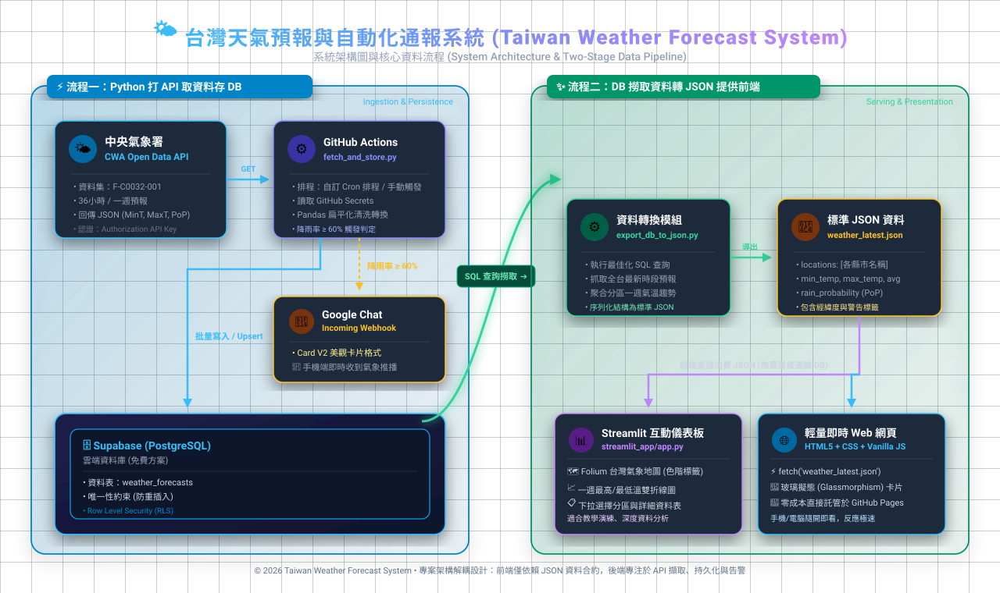
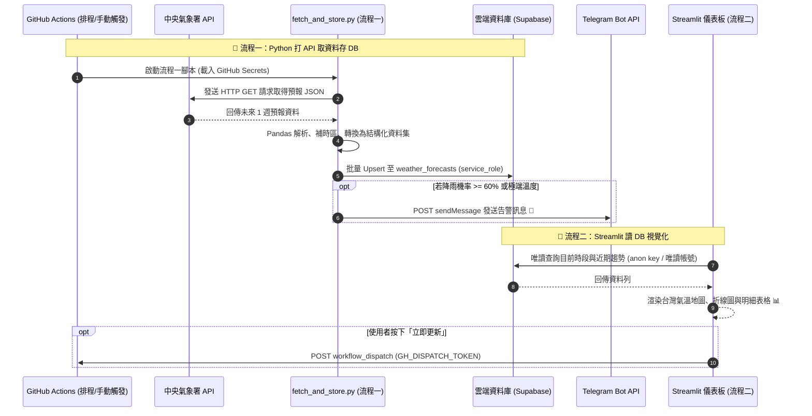
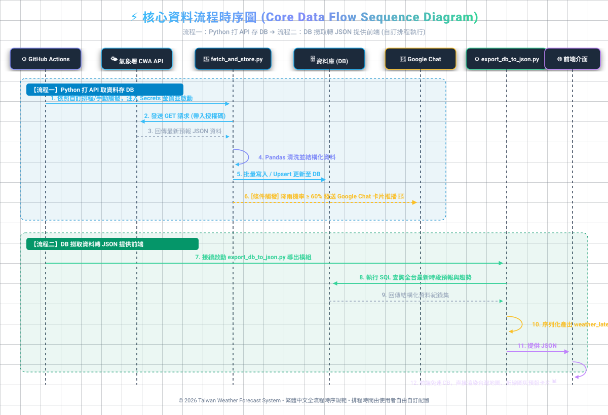

# 台灣天氣預報與自動化通報系統 (Taiwan Weather Forecast System)
# 系統規格書 (System Specification Document)

- **版本**: `v1.8.2`
- **狀態**: `Implemented: 後端排程與 Streamlit 前端皆已上線運作（見 §10 進度）`
- **文件路徑**: `forecast/SPECIFICATION.md`
- **核心流程規範**:
  1. **流程一（後端）**：GitHub Actions 排程執行 Python (`fetch_and_store.py`)，呼叫中央氣象署 API 取資料、後處理並寫入雲端 Supabase；符合條件時推播到個人的 Telegram。
  2. **流程二（前端）**：Streamlit + Folium 儀表板直接連線 Supabase（`supabase-py` 或 `psycopg2`）讀取資料並視覺化，部署於 Streamlit Community Cloud。

---

## 📋 目錄 (Table of Contents)
1. [系統核心兩大流程與願景](#1-系統核心兩大流程與願景)
2. [系統架構圖與資料流程 (Mermaid)](#2-系統架構圖與資料流程-mermaid)
3. [中央氣象署 (CWA) API 介接規格](#3-中央氣象署-cwa-api-介接規格)
4. [安全性與環境變數管理 (Secrets)](#4-安全性與環境變數管理-secrets)
5. [資料庫模型與儲存設計 (Supabase)](#5-資料庫模型與儲存設計-supabase)
6. [流程一實作規格：Python 打 API 取資料存 DB (`fetch_and_store.py`)](#6-流程一實作規格python-打-api-取資料存-db-fetch_and_storepy)
7. [GitHub Actions 自動化排程工作流規格](#7-github-actions-自動化排程工作流規格)
8. [流程二實作規格：Streamlit 讀取 Supabase 視覺化與部署](#8-流程二實作規格streamlit-讀取-supabase-視覺化與部署)
9. [專案目錄與檔案結構藍圖](#9-專案目錄與檔案結構藍圖)
10. [實施里程碑與驗收清單](#10-實施里程碑與驗收清單)

---

## 1. 系統核心兩大流程與願景

### 1.1 核心兩大運作流程 (Core Two-Stage Pipeline)
本系統遵循「**後端擷取入庫**」與「**前端讀庫呈現**」的職責分離設計，兩者只透過雲端 Supabase 資料庫溝通：

```text
┌────────────────────────────────────────────────────────────────────────────┐
│ 🌟 流程一：Python 打 API 取資料存 DB (Ingestion & Persistence)             │
│    執行環境：GitHub Actions (排程 / 手動觸發)，密鑰存於 GitHub Secrets     │
│                                                                            │
│ [中央氣象署 CWA API] ──(requests)──> [Pandas 清洗] ──> [Supabase 雲端 DB]  │
│                                                                            │
│ * 觸發條件滿足時 (降雨率 >= 60%)：同時推播告警至 [Telegram]                │
└────────────────────────────────────────────────────────────────────────────┘
                                 │  (僅透過資料庫溝通)
                                 ▼
┌────────────────────────────────────────────────────────────────────────────┐
│ 🌟 流程二：Streamlit 讀 DB 視覺化 (Serving & Presentation)                 │
│    執行環境：Streamlit Community Cloud                                     │
│                                                                            │
│ [Supabase 雲端 DB] ──(supabase-py / psycopg2 唯讀)──> [Streamlit + Folium] │
│                                                                            │
│ * 互動式儀表板：折線圖 + 明細表格 + Folium 台灣地圖                        │
└────────────────────────────────────────────────────────────────────────────┘
```

### 1.2 系統目標與特色
1. **讀寫分離 (Read/Write Separation)**：後端（GitHub Actions）是唯一的寫入端；前端只以唯讀權限讀取資料庫，不呼叫氣象署 API，也不持有後端寫入金鑰。
2. **教學原型探索 (微課程相容)**：相容「煥哥 AI 創新微課程」之 Python、Pandas、Streamlit、Folium 台灣互動地圖實作；資料存取由課程原版的本機 `sqlite3` 改為雲端 Supabase（PostgreSQL）。
3. **雲端自動維運 (Serverless & Free-tier)**：GitHub Actions 依固定排程（或手動觸發）自動執行流程一寫入 Supabase；前端部署於 Streamlit Community Cloud，皆使用免費方案。

---

## 2. 系統架構圖與資料流程 (Mermaid & Visual Diagrams)

### 2.1 系統總體架構圖 (Architecture Diagram)

```mermaid
flowchart TD
    subgraph Stage1["【流程一：Python 打 API 取資料存 DB (GitHub Actions)】"]
        CWA["🌤️ 中央氣象署 API (CWA F-D0047-091 一週預報)"]
        PyIngest["🐍 核心腳本: fetch_and_store.py\n(發送 GET 請求、Pandas 清洗整理)"]
        GChat["🔔 Telegram Bot (降雨機率 >= 60% 手機通知)"]

        CWA -->|1. 取得原始 JSON 氣象| PyIngest
        PyIngest -->|2. 觸發降雨/氣溫警戒| GChat
    end

    subgraph DataStorage["【資料持久層 (DB)】"]
        CloudDB[("🗄️ Supabase PostgreSQL (weather_forecasts)")]
    end

    PyIngest -->|3. 結構化資料寫入 / Upsert (service_role)| CloudDB

    subgraph Stage2["【流程二：Streamlit 讀 DB 視覺化 (Streamlit Community Cloud)】"]
        StreamlitApp["📊 Streamlit 互動儀表板\n(折線圖 + 明細表格 + Folium 地圖)"]
        RefreshBtn["🔄 立即更新按鈕\n(觸發 GitHub Actions workflow_dispatch)"]

        CloudDB -->|4. 唯讀查詢 (supabase-py / psycopg2)| StreamlitApp
        StreamlitApp --- RefreshBtn
    end

    RefreshBtn -.->|5. GitHub API 手動觸發| PyIngest
```

#### 🖼️ 系統總體架構圖視覺呈現 (Architecture Visual Diagram)


> 💡 **檢視提示**：
> - 亦可開啟包含切換功能的網頁：[view_architecture.html](view_architecture.html)
> - ⚠️ 上述圖檔為 v1.1.0 版本繪製（含「匯出 JSON」與「Web 前端」），與本版架構不一致，需重新繪製。

---

### 2.2 核心時序圖 (Sequence Diagram)



#### 🖼️ 核心資料流程時序圖視覺呈現 (Sequence Visual Diagram)


> ⚠️ 此圖檔為 v1.1.0 版本繪製，與本版時序不一致，需重新繪製。

---

## 3. 中央氣象署 (CWA) API 介接規格

### 3.1 授權碼取得與端點資訊
- **資料平台**: [中央氣象署開放資料平台 (CWA Open Data Platform)](https://opendata.cwa.gov.tw/)
- **認證機制**: HTTP Header `Authorization: <CWA_API_KEY>` 或 Query 參數 `Authorization=<CWA_API_KEY>`
- **核心資料集（本系統唯一使用）**: **未來 1 週天氣預報 `F-D0047-091`**（12 小時一個時段，約 7 天，全臺各縣市）。
  - 已放棄原先的「今明 36 小時預報 `F-C0032-001`」。

### 3.2 呼叫端點與常用 Query 參數
- **Endpoint**: `https://opendata.cwa.gov.tw/api/v1/rest/datastore/F-D0047-091`
- **HTTP Method**: `GET`
- **完整範例**: `https://opendata.cwa.gov.tw/api/v1/rest/datastore/F-D0047-091?Authorization={WEATHER_API_KEY}&format=JSON`
- **參數說明**:
  - `Authorization`: 氣象署會員授權碼 (必填)
  - `format`: `JSON`
  - `LocationName` / `ElementName`（選填）：可限縮縣市與氣象要素以減少回傳量；預設不加，一次取得全臺全部要素。

### 3.3 回傳 JSON 關鍵欄位解析對應

> ✅ 以下結構已依實際回應（`scripts/check_cwa_api.py` 於 2026-09-20 存下的 `samples/F-D0047-091.json`，約 669 KB）驗證。

```text
success: true
records.Locations[]                     ← 1 筆 (LocationsName "台灣"，Dataid "D0047-091")
 └── Location[]                         ← 22 個縣市
      ├── LocationName: 縣市名稱 (如 "臺北市"，注意「臺」「台」用字依 API 為準)
      ├── Geocode: 行政區代碼 (如 "09007000")
      ├── Latitude / Longitude: 字串 (如 "26.154204")
      └── WeatherElement[15]:
           ├── ElementName: 平均溫度 / 最高溫度 / 最低溫度 / 平均露點溫度 /
           │   平均相對濕度 / 最高體感溫度 / 最低體感溫度 / 最大舒適度指數 /
           │   最小舒適度指數 / 風速 / 風向 / 12小時降雨機率 / 天氣現象 /
           │   紫外線指數 / 天氣預報綜合描述
           └── Time[]:
                ├── StartTime: "2026-09-20T00:00:00+08:00"   ← 已帶 +08:00
                ├── EndTime  : "2026-09-20T06:00:00+08:00"
                └── ElementValue[]: [{ "<鍵名依要素而異>": "字串值" }]
```

**本系統使用的要素與 `ElementValue` 鍵名**：

| 資料表欄位 | `ElementName` | `ElementValue` 鍵名 | 備註 |
| :--- | :--- | :--- | :--- |
| `weather_condition` | 天氣現象 | `Weather` | 另有 `WeatherCode` |
| `min_temp` | 最低溫度 | `MinTemperature` | 字串數值 |
| `max_temp` | 最高溫度 | `MaxTemperature` | 字串數值 |
| `avg_temp` | 平均溫度 | `Temperature` | 字串數值 |
| `rain_probability` | 12小時降雨機率 | `ProbabilityOfPrecipitation` | 遠期時段為 `"-"`（無資料），須轉為 NULL |
| `comfort_index` | 最大舒適度指數 | `MaxComfortIndexDescription` | 文字描述 (如 "舒適")，另有數值 `MaxComfortIndex` |
| `latitude` / `longitude` | （`Location` 層級） | `Latitude` / `Longitude` | 字串，轉為數值 |

**時段特性（實測）**：
- 每縣市每個要素 **15 個時段**（約 22 縣市 × 15 ≈ 330 列/次）；**第一個時段可能只有 6 小時**（如 `00:00–06:00`），其後為 12 小時，因此不可假設每段皆為 12 小時。
- 除「紫外線指數」（僅 7 個白天時段）外，其餘要素的時段完全一致，可用 `(縣市, StartTime, EndTime)` 對齊合併成一列。紫外線指數本系統不使用。
- 遠期時段部分要素為 `"-"` 或缺項（實測 `12小時降雨機率` 在 330 列中有 176 列為 `"-"`，其餘欄位皆有資料），該欄位寫入 NULL，不得中斷整批寫入；前端讀到 NULL 時顯示「—」。

### 3.4 時區處理規範
- 實測 `StartTime` / `EndTime` **已帶 `+08:00`**（如 `2026-09-20T00:00:00+08:00`），可直接以 ISO 8601 字串寫入 `TIMESTAMPTZ`，不需再補時區；仍應在程式中檢查字串含時區偏移，若日後 API 改為不含時區才補上 `+08:00`（`tz_localize("Asia/Taipei")`），否則 PostgreSQL 會當成 UTC，時間差 8 小時。
- 前端 Streamlit 判斷「目前時段」與顯示時間時，一律以 `Asia/Taipei` 時區轉換；程式內**不可**使用無時區的 `datetime.now()`（GitHub Actions runner 與 Streamlit Cloud 主機皆為 UTC）。
- 排程 `cron` 以 UTC 計算：`45 */3 * * *` 對應台灣時間 **02:45、05:45、08:45、11:45、14:45、17:45、20:45、23:45**（每 3 小時，一天 8 次；避開整點以減少 GitHub 排程延遲）。

### 3.5 API 使用限制與用量評估（一般會員）
本系統使用氣象開放資料平台「**一般會員**」授權碼（適用個人使用或學術研究，輕中量用戶）。權益依平臺公告，平臺保留調整上限之權利，以官方【最新消息】為準：

| 項目 | 一般會員上限 |
| :--- | :--- |
| 資料擷取 API 下載次數 | 24 小時內 2 萬次（超過於期滿後重新計算） |
| 資料擷取 API 下載流量 | 每日 2 GB（超過後限流至 0 時重新計算） |
| 檔案下載次數 / 流量 | 24 小時內 2 萬次 / 每日 2 GB（本系統不使用檔案下載） |

**本系統用量評估**：
- 每次流程一只呼叫 **1 次** `F-D0047-091`（一次回傳全臺各縣市一週預報，不逐縣市分次呼叫）。
- 固定排程每天 8 次；加上「立即更新」（每次觸發 1 次 API，且受 §8.1 的 20 分鐘間隔限制，一天最多約 72 次），一天遠低於 2 萬次。
- 實測單次回應約 **669 KB**，每天排程 8 次約 5.4 MB，遠低於每日 2 GB 上限。
- **前端 Streamlit 不呼叫 CWA API**，只讀 Supabase，因此使用者人數增加不會增加 CWA 用量。

**使用規範（實作須遵守）**：
1. **每次執行只打一次 API**：不得在迴圈中對每個縣市各發一次請求；如需限縮內容，用 `LocationName` / `ElementName` 參數，而不是拆成多次請求。
2. **限制重試**：失敗時最多重試 2～3 次並加延遲（例如 5 秒、15 秒），不得無限重試；遇 HTTP 429 或流量超限即中止本次執行，讓 workflow 標記失敗，等下次排程。
3. **限制「立即更新」頻率**：手動更新以資料庫 `pipeline_status` 表判斷，距上次成功更新須滿 20 分鐘才可觸發（見 §8.1），避免被連續點擊耗用額度；排程不受此限制。
4. **不要再調高排程頻率**：CWA 預報約每數小時才更新一次，排程加密沒有意義，反而浪費額度；維持每 3 小時。
5. **授權碼保密**：`WEATHER_API_KEY` 只放 GitHub Secrets / 本地 `.env`，不進前端與 repo。
6. **合規**：一般會員限個人使用或學術研究；若日後轉為商業或高用量用途，須改申請適用的會員類別，並遵守氣象資料開放平臺使用規範，違規平臺可終止服務。

---

## 4. 安全性與環境變數管理 (Secrets)

### 4.1 後端關鍵環境變數（GitHub Secrets / 本地 `.env`）

| 變數名稱 | 類型 | 說明 | 存放位置 |
| :--- | :--- | :--- | :--- |
| `WEATHER_API_KEY` | String | 中央氣象署 API 授權碼 | GitHub Secrets / 本地 `.env` |
| `SUPABASE_URL` | String | Supabase 專案端點 URL | GitHub Secrets / 本地 `.env` |
| `SUPABASE_KEY` | String | Supabase `service_role` 金鑰 (後端專用，繞過 RLS；嚴禁進入前端) | GitHub Secrets / 本地 `.env` |
| `TELEGRAM_BOT_TOKEN` | String | Telegram 機器人 token（向 @BotFather 建立取得）；**等同機器人的密碼，不可進資料庫、前端或 repo** | GitHub Secrets / 本地 `.env` |
| `TELEGRAM_CHAT_ID` | String | 接收告警的對話 ID（個人私訊；用 `scripts/get_telegram_chat_id.py` 查詢） | GitHub Secrets / 本地 `.env` |

### 4.2 前端 Streamlit 設定（Streamlit Community Cloud Secrets / 本地 `.streamlit/secrets.toml`）

| 變數名稱 | 說明 |
| :--- | :--- |
| `SUPABASE_URL` | Supabase 專案端點 URL（使用 `supabase-py` 時） |
| `SUPABASE_ANON_KEY` | Supabase `anon` 公開金鑰，僅能依 RLS 政策**唯讀** `weather_forecasts`（使用 `supabase-py` 時） |
| `SUPABASE_DB_URL` | 唯讀資料庫帳號的 PostgreSQL 連線字串（改用 `psycopg2` 時；須使用 Supabase **Pooler** 連線字串，見 §8.2） |
| `GH_DISPATCH_TOKEN` | GitHub Fine-grained PAT，僅授權此 repo 的 `Actions: Read and write`（「立即更新」按鈕用） |
| `GH_REPO` | 格式 `owner/repo` |

> ⚠️ 前端 Secrets **嚴禁**放入 `service_role` key 或任何可寫入資料庫的憑證；所有 Secrets 皆不得 commit 進 repo。

### 4.3 本地安全防護規範
- 專案根目錄必須配置 `.gitignore`，嚴禁 Commit 以下檔案：
  ```text
  .env
  .streamlit/secrets.toml
  __pycache__/
  .venv/
  ```
- 提供範本檔 `.env.example`（後端）：
  ```bash
  WEATHER_API_KEY="CWA-XXXXXXXX-XXXX-XXXX-XXXX-XXXXXXXXXXXX"
  SUPABASE_URL="https://your-project.supabase.co"
  SUPABASE_KEY="eyJhbGciOiJIUzI1NiIsIn..."   # service_role
  TELEGRAM_BOT_TOKEN="123456789:AAxxxxxxxx"
  TELEGRAM_CHAT_ID="123456789"
  ```
- 提供範本檔 `.streamlit/secrets.toml.example`（前端）：
  ```toml
  SUPABASE_URL = "https://your-project.supabase.co"
  SUPABASE_ANON_KEY = "eyJhbGciOiJIUzI1NiIsIn..."   # anon，非 service_role
  GH_DISPATCH_TOKEN = "github_pat_..."
  GH_REPO = "owner/repo"
  ```

---

## 5. 資料庫模型與儲存設計 (Supabase)

系統統一採用雲端 Supabase (PostgreSQL) 作為唯一資料庫（免費方案即可：註冊 Supabase 並建立免費專案）。後端（GitHub Actions / 本地測試）與前端（Streamlit）皆連線同一雲端資料庫，不使用本機 SQLite。

### 5.1 資料庫：Supabase (PostgreSQL)

#### 資料表：`weather_forecasts` (預報與歷史存檔)

> **欄位設計原則**：資料表欄位只保留「API 實際有提供的資料」，與 API 回傳取交集；API 沒有提供的資訊（如通知旗標、自增 id）不建對應欄位；唯一例外是系統維運用的 `updated_at`（資料建立/最後更新時間）。個別時段 API 給 `"-"` 者，該欄位值為 NULL。
```sql
CREATE TABLE IF NOT EXISTS public.weather_forecasts (
    location_name VARCHAR(50) NOT NULL,   -- 縣市 (LocationName)
    forecast_time_start TIMESTAMPTZ NOT NULL,
    forecast_time_end TIMESTAMPTZ NOT NULL,
    latitude NUMERIC(9, 6),               -- 縣市緯度 (Location 層級)
    longitude NUMERIC(9, 6),              -- 縣市經度
    weather_condition VARCHAR(100),       -- 天氣現象
    min_temp NUMERIC(4, 1),               -- 最低溫度
    max_temp NUMERIC(4, 1),               -- 最高溫度
    avg_temp NUMERIC(4, 1),               -- 平均溫度
    rain_probability INTEGER,             -- 12 小時降雨機率 (%)，未取得時無此值 (NULL)
    comfort_index VARCHAR(100),           -- 舒適度
    updated_at TIMESTAMPTZ NOT NULL DEFAULT now(),  -- 資料建立/最後更新時間 (新增時取預設值，更新時由觸發器與程式覆寫)

    -- 以「縣市 + 時段」為主鍵，同一縣市與同時段重複寫入即覆蓋 (upsert)
    PRIMARY KEY (location_name, forecast_time_start, forecast_time_end)
);

-- 索引優化（主鍵已涵蓋 location_name 開頭的查詢）
CREATE INDEX IF NOT EXISTS idx_weather_forecasts_time ON public.weather_forecasts(forecast_time_start DESC);

-- 資料庫預設時區設為台灣：timestamptz 內部仍以 UTC 儲存，此設定只影響查詢結果的顯示（顯示為 +08:00）
-- 對新連線生效（Supabase 資料庫名稱為 postgres）；已開啟的 SQL Editor 分頁需重新整理
ALTER DATABASE postgres SET timezone TO 'Asia/Taipei';
ALTER ROLE authenticator SET timezone TO 'Asia/Taipei';  -- PostgREST / supabase-py 連線所用角色

-- 既有資料表補欄位（首次建表者可略過；已存在的表會補上，既有列以執行當下時間填入）
ALTER TABLE public.weather_forecasts
    ADD COLUMN IF NOT EXISTS updated_at TIMESTAMPTZ NOT NULL DEFAULT now();

-- 每次 UPDATE（含 upsert 走到 ON CONFLICT DO UPDATE）自動刷新 updated_at
CREATE OR REPLACE FUNCTION public.set_updated_at() RETURNS TRIGGER AS $$
BEGIN
    NEW.updated_at := now();
    RETURN NEW;
END;
$$ LANGUAGE plpgsql;

DROP TRIGGER IF EXISTS trg_weather_forecasts_updated_at ON public.weather_forecasts;
CREATE TRIGGER trg_weather_forecasts_updated_at
    BEFORE UPDATE ON public.weather_forecasts
    FOR EACH ROW EXECUTE FUNCTION public.set_updated_at();

-- RLS 存取控制
ALTER TABLE public.weather_forecasts ENABLE ROW LEVEL SECURITY;

-- 僅開放 anon 角色「唯讀」；不建立任何 INSERT / UPDATE / DELETE policy（寫入一律拒絕）
CREATE POLICY "Allow anon read only" ON public.weather_forecasts
    FOR SELECT TO anon USING (true);
```

**時區說明**：`timestamptz` 一律以 UTC 儲存，`updated_at` 與預報時段皆同；上方 `ALTER DATABASE ... SET timezone` 讓查詢結果以台灣時間（+08:00）顯示。前端仍須依 §3.4 以 `Asia/Taipei` 轉換，不可依賴資料庫的顯示時區。

**RLS 設計說明**：
- **寫入端**：僅 GitHub Actions 的流程一使用 **`service_role` key** 寫入（會繞過 RLS）。
- **讀取端**：Streamlit 前端使用 `anon` key，只能透過上述 `SELECT` policy 讀取；因沒有寫入 policy，即使 `anon` key 外洩也無法新增、修改或刪除資料。
- `weather_forecasts` 只含公開氣象預報與告警旗標，開放匿名唯讀可接受；若日後加入敏感欄位，須改為僅授權特定角色或使用唯讀資料庫帳號（`psycopg2` 方案）。
- ⚠️ `service_role` key 權限等同管理員，只能存放於 GitHub Secrets / 本地 `.env`，**嚴禁**放入 Streamlit secrets 或 commit 進 repo。

#### 資料表：`pipeline_status` (流程一執行狀態)

記錄排程 (`schedule`) 與手動 (`manual`) 各自「最後一次成功更新」的時間，供儀表板判斷手動更新是否已滿間隔。兩列固定，用 upsert 覆蓋。

```sql
CREATE TABLE IF NOT EXISTS public.pipeline_status (
    trigger_type TEXT PRIMARY KEY CHECK (trigger_type IN ('schedule', 'manual')),
    last_success_at TIMESTAMPTZ,          -- 最後一次成功寫入預報的時間（與該批預報的 updated_at 相同）
    last_run_at TIMESTAMPTZ,              -- 最後一次執行的時間（成功或失敗）
    last_status TEXT CHECK (last_status IN ('success', 'failed')),
    last_error TEXT                       -- 失敗時的簡短訊息
);

-- 初始資料：讓表一建立就有列可讀（前端讀不到就不放行手動更新）
INSERT INTO public.pipeline_status (trigger_type, last_success_at, last_run_at, last_status)
SELECT 'manual', max(updated_at), max(updated_at), CASE WHEN max(updated_at) IS NULL THEN NULL ELSE 'success' END
FROM public.weather_forecasts
ON CONFLICT (trigger_type) DO NOTHING;
INSERT INTO public.pipeline_status (trigger_type) VALUES ('schedule') ON CONFLICT (trigger_type) DO NOTHING;

ALTER TABLE public.pipeline_status ENABLE ROW LEVEL SECURITY;
CREATE POLICY "Allow anon read only" ON public.pipeline_status
    FOR SELECT TO anon USING (true);
```

- **寫入**：僅流程一以 `service_role` 寫入。成功時更新 `last_success_at`、`last_run_at`、`last_status = 'success'`；失敗時只更新 `last_run_at`、`last_status = 'failed'`、`last_error`，**不動 `last_success_at`**，因此失敗不會鎖住手動更新。寫入此表失敗只記警告，不使流程失敗。
- **來源判斷**：以 GitHub Actions 的 `GITHUB_EVENT_NAME` 決定寫入哪一列：`schedule` 寫 `schedule`；其餘（`workflow_dispatch`、本機直接執行）寫 `manual`。
- **讀取**：前端以 `anon` key 唯讀（見 §8.1 第 7 點）。

#### 資料表：`alert_city_settings`、`alert_slot_settings`（告警設定）

告警要發給哪些縣市、用什麼條件、在哪些時段發，由這兩張表設定（判斷邏輯見 §6.1 第 5 點）。

```sql
-- 縣市告警設定：縣市為主鍵；降雨／低溫／高溫三個條件各自有開關與門檻
CREATE TABLE IF NOT EXISTS public.alert_city_settings (
    location_name TEXT PRIMARY KEY,                  -- 縣市（與氣象署 LocationName 一致，如 臺北市）
    enabled BOOLEAN NOT NULL DEFAULT false,          -- 該縣市是否發送告警（預設關閉）
    rain_enabled BOOLEAN NOT NULL DEFAULT true,
    rain_threshold INTEGER NOT NULL DEFAULT 60 CHECK (rain_threshold BETWEEN 0 AND 100),                 -- 降雨機率 >= 此值
    min_temp_enabled BOOLEAN NOT NULL DEFAULT true,
    min_temp_threshold NUMERIC(4, 1) NOT NULL DEFAULT 12 CHECK (min_temp_threshold BETWEEN -20 AND 50),  -- 最低溫 <= 此值
    max_temp_enabled BOOLEAN NOT NULL DEFAULT true,
    max_temp_threshold NUMERIC(4, 1) NOT NULL DEFAULT 35 CHECK (max_temp_threshold BETWEEN -20 AND 50),  -- 最高溫 >= 此值
    updated_at TIMESTAMPTZ NOT NULL DEFAULT now()
);

-- 發送時段設定：只在啟用的時段（須是 cron 排程時槽）發送
CREATE TABLE IF NOT EXISTS public.alert_slot_settings (
    slot TEXT PRIMARY KEY CHECK (slot IN ('08:45', '14:45', '20:45')),  -- 台灣時間
    enabled BOOLEAN NOT NULL DEFAULT true,
    updated_at TIMESTAMPTZ NOT NULL DEFAULT now()
);

-- 初始資料：22 縣市全部關閉（不發送）、三個發送時段全部啟用
ALTER TABLE public.alert_city_settings ENABLE ROW LEVEL SECURITY;   -- 不建立任何 policy
ALTER TABLE public.alert_slot_settings ENABLE ROW LEVEL SECURITY;
REVOKE ALL ON public.alert_city_settings FROM anon, authenticated;
REVOKE ALL ON public.alert_slot_settings FROM anon, authenticated;
```

- **預設不發送**：22 縣市預設 `enabled = false`，要收哪個縣市的告警就把它啟用；勾選後直接套用標準條件（三個條件全開、門檻 60／12／35）。
- **存取權限**：RLS 不建立任何 policy，並撤銷 `anon`、`authenticated` 的權限，所以前端**完全讀不到、也寫不了**（設定內容不公開）。只有排程腳本以 `service_role` 讀取。
- **調整方式**：可用 Supabase SQL Editor 直接調整（範例見 `sql/init_supabase.sql` 檔尾），或使用儀表板標題列的「⚙️ 告警設定」按鈕（需輸入管理者密碼，見 §8.1 第 8 點）。
- 縣市名稱須與氣象署 `LocationName` 一致（「臺」而非「台」）；`init_supabase.sql` 已寫入 22 縣市。

#### 管理者密碼與設定函式（`private.admin_credential`、`admin_get_alert_settings`、`admin_save_alert_settings`）

管理者設定面板的密碼驗證**在資料庫內進行**，前端與程式碼裡都沒有密碼或雜湊值：

| 項目 | 設計 |
|---|---|
| 密碼表 | `private.admin_credential`（`id = 1` 單列、`password_hash`）。放在 `private` schema，**不對 API 開放**；RLS 不建 policy，並撤銷 `PUBLIC`／`anon`／`authenticated` 的所有權限 |
| 雜湊 | **bcrypt**（`$2a$` 格式，cost 12，加鹽），由 `pgcrypto` 的 `crypt()` 比對。雜湊值由本機腳本 `scripts/make_admin_hash.py` 產生，密碼本身不會出現在資料庫工具的查詢紀錄或任何檔案 |
| 驗證函式 | `private.verify_admin(密碼)`：密碼錯誤、空值、NULL、尚未設定雜湊，**一律延遲 1 秒後拒絕**（錯誤訊息 `invalid_password`），讓連續猜測變慢；不做失敗次數鎖定，避免他人故意失敗把管理者鎖在外面 |
| 讀取函式 | `admin_get_alert_settings(密碼)`：密碼正確才回傳兩張設定表的內容 |
| 儲存函式 | `admin_save_alert_settings(密碼, 縣市設定, 時段設定)`：密碼正確才寫入；**只更新既有的縣市與時段，不能新增或刪除**；數值範圍由資料表 CHECK 把關；兩張表在同一個交易內更新，失敗全部回復 |
| 權限 | 兩個函式皆 `SECURITY DEFINER`、`search_path` 設為空並使用完整名稱；只授權 `anon` 執行（`PUBLIC` 預設權限已撤銷）。`anon` 只能「呼叫函式」，不能直接讀寫任何設定表或密碼表 |
| 設定／更換密碼 | 在 SQL Editor 執行 `INSERT INTO private.admin_credential (id, password_hash) VALUES (1, '<雜湊值>') ON CONFLICT (id) DO UPDATE ...`；忘記密碼時同樣重新寫入新的雜湊值，頁面上不提供改密碼功能。登入失敗時可用 `make_admin_hash.py --verify` 在本機比對密碼與資料庫裡的雜湊 |

**限制與風險**：任何人拿到 `anon` 金鑰都能直接呼叫這兩個函式猜密碼，防禦靠慢速雜湊、失敗延遲與足夠長的密碼（本專案採 12 碼隨機混合，被猜中的影響僅限於修改告警設定，取不到任何金鑰或預報資料）；密碼是函式參數，理論上可能出現在資料庫日誌，Supabase 預設不記錄參數值（未實際驗證）。

---

## 6. 流程一實作規格：Python 打 API 取資料存 DB (`fetch_and_store.py`)

### 6.1 職責與工作流程
1. **讀取環境變數**：載入 `WEATHER_API_KEY`、`SUPABASE_URL`、`SUPABASE_KEY`、`TELEGRAM_BOT_TOKEN`、`TELEGRAM_CHAT_ID`（由 GitHub Secrets 注入），並以 GitHub Actions 內建的 `GITHUB_EVENT_NAME` 判斷執行來源：`schedule` 為排程，其餘視為手動。
2. **呼叫氣象署 API**：
   ```python
   headers = {"Authorization": WEATHER_API_KEY}
   response = requests.get("https://opendata.cwa.gov.tw/api/v1/rest/datastore/F-D0047-091",
                           params={"format": "JSON"}, headers=headers, timeout=30)
   response.raise_for_status()
   raw_json = response.json()
   ```
3. **資料清洗與結構化**：解析巢狀 `Locations[].Location[].WeatherElement[].Time[]`（見 §3.3），只取用 §3.3 表列的 7 個要素，以 `(縣市, StartTime, EndTime)` 對齊合併成一列（約 22 縣市 × 15 時段 ≈ 330 列）；該時段 API 未給值（如 `"-"`）者轉為 NULL；經緯度與溫度字串轉為數值；並依 §3.4 確認時區為 `+08:00`。
4. **批量寫入 DB (Upsert)**：
   - 連線至 Supabase 執行 `supabase.table('weather_forecasts').upsert(records, on_conflict='location_name,forecast_time_start,forecast_time_end').execute()`。
   - 寫入前為整批 `records` 統一加上 `updated_at`（台灣時間 ISO 8601，本次寫入時間）；新增列取此值，既有列走 `ON CONFLICT DO UPDATE` 時一併更新；資料庫端另有 `DEFAULT now()` 與 `BEFORE UPDATE` 觸發器作為保底。
   - 單次 `upsert` 呼叫為單一資料庫交易（全部成功或全部失敗），前端不會讀到只寫入一半的批次。
   - 寫入成功後，以**同一個時間戳**更新 `pipeline_status`（見 §5.1）；執行失敗（含缺金鑰、HTTP 429）則記錄失敗狀態後照常以非 0 狀態碼結束。
5. **條件判斷與 Telegram 推播**（縣市、條件與發送時段由資料庫設定，見 §5.1）：
   - **只有排程（`schedule`）會推播**；手動更新與本機執行只更新資料、不推播。測試訊息格式可用 `scripts/test_notify.py`。
   - **預設不發送**：`alert_city_settings` 的縣市預設關閉；沒有啟用任何縣市時，日誌記錄「尚未啟用任何縣市，不發送告警」。
   - **發送時段（可選）**：僅在 `alert_slot_settings` 啟用的時段發送，可選 08:45、14:45、20:45（皆為 `cron` 排程時槽）。腳本把「現在」對齊到最近一個已經過去的排程時槽（`current_slot`），時槽不在啟用的發送時段就略過（資料照常更新）。以時槽而非實際執行時間判斷，排程被 GitHub 延遲不到一個間隔也不受影響。
   - **判斷條件（每個縣市各自設定）**：降雨機率 ≥ 門檻、最低溫 ≤ 門檻、最高溫 ≥ 門檻，三個條件各有開關與門檻，已啟用的條件任一符合即列入；欄位為 NULL 不判斷。
   - **判斷視窗（W1）**：從這次發送時槽到「下一個啟用的發送時槽」之前，凡與視窗（時槽, 下一發送時槽］有交集的預報時段（**含進行中的**）才判斷，並標示「進行中」（時槽當下已開始）或「即將開始」。三個時段皆啟用時：
     - 08:45 → 涵蓋今日白天（進行中）
     - 14:45 → 白天（進行中）＋今晚（即將開始）
     - 20:45 → 今晚（進行中）＋明日白天（即將開始）
     - 只啟用單一時段時，視窗為隔天同一時間。
   - **重複出現屬預期**：進行中的時段會在相鄰兩次發送重複出現（如 06:00～18:00 在 08:45 與 14:45 都可能出現），這是「早、午、晚三次報告」的設計，不再有「每個時段只通知一次」的去重；一天最多 3 則。
   - **讀不到設定就不發送（fail closed）**：設定表不存在、連線失敗時略過推播並在日誌警告，資料照常更新、不視為失敗；不合法的縣市／時段列略過並警告。
   - **推播管道為 Telegram**（`scripts/notifier.py`）：符合條件則組成純文字訊息 —— 標題「🔔 天氣告警」、副標題「涵蓋 MM/DD HH:MM～MM/DD HH:MM，共 N 筆符合條件」、每筆一行 `縣市 MM/DD HH:MM~HH:MM 進行中｜降雨 X%｜最低~最高°C`（值為 NULL 顯示「—」）—— 呼叫 `sendMessage` 傳給 `TELEGRAM_CHAT_ID`。
   - **訊息格式**：以 HTML 模式送出（標題粗體），所有動態內容經過跳脫；Telegram 回 400（格式問題）時自動改用純文字重送一次。
   - **筆數與字數上限**：最多列 30 筆且總長不超過 4000 字，超過的部分以「另有 N 筆未列出」取代。
   - **⚠️ token 不可外洩**：`requests` 的例外訊息會帶完整網址（網址含 token），而失敗訊息會寫進 `pipeline_status.last_error`（前端可讀）。因此推播失敗一律改寫為不含網址的訊息（如「Telegram 回應 401：…」「無法連線至 Telegram（ConnectionError）」），且記錄失敗原因前會遮蔽所有機密環境變數的值。
   - **失敗處理**：未設定 `TELEGRAM_BOT_TOKEN` / `TELEGRAM_CHAT_ID` 時略過推播（不視為錯誤）；推播失敗時 workflow 標記失敗，但預報已寫入，`pipeline_status` 記錄 `failed` 與原因，不動 `last_success_at`。
   - **沒有符合條件時不發訊息**。
---

## 7. GitHub Actions 自動化排程工作流規格

工作流程自動執行**流程一**，將氣象資料寫入 Supabase；前端不需要重新部署，重新整理即可讀到新資料。

> 以下為實際使用的 `HW1/.github/workflows/weather_worker.yml`（repo 根目錄為 `HW1/`，故以 `working-directory: forecast` 執行，`requirements.txt` 在根目錄）。

**觸發方式**：
- **固定排程**：由 workflow 內的 `cron` 決定（台灣時間 02:45 起每 3 小時），排程時間僅能透過修改 `.yml` 並 commit 變更，前端不提供調整功能。排程不受任何手動更新限制。
- **手動立即更新**：前端 Streamlit 按鈕先以資料庫 `pipeline_status` 判斷距上次成功更新已滿 20 分鐘，才透過 GitHub API 觸發 `workflow_dispatch`（見 §8.1）。手動更新只更新資料，不推播告警。在 GitHub Actions 頁面直接手動執行不經過儀表板的檢查，可作為管理者的強制更新。

```yaml
name: Taiwan Weather Pipeline (Fetch -> Store)

on:
  schedule:
    # 台灣時間 02:45 起每 3 小時 (UTC 的 00:45 / 03:45 / ... / 21:45)。
    # ⚠️ fetch_and_store.py 的排程時槽 (SLOT_ANCHOR / SLOT_INTERVAL) 須與此處一致，修改時兩邊一起改。
    - cron: '45 */3 * * *'
  workflow_dispatch:      # 支援隨時手動點擊執行

permissions:
  contents: read

concurrency:
  group: weather-pipeline   # 排程與手動觸發不會同時執行
  cancel-in-progress: false

jobs:
  weather-sync:
    runs-on: ubuntu-latest
    timeout-minutes: 10
    defaults:
      run:
        working-directory: forecast   # repo 根目錄為 HW1/，專案程式碼在 forecast/
    steps:
      - name: 檢出專案程式碼
        uses: actions/checkout@v4

      - name: 安裝 Python 環境
        uses: actions/setup-python@v5
        with:
          python-version: '3.11'
          cache: 'pip'
          cache-dependency-path: requirements.txt

      - name: 安裝相依套件
        run: |
          pip install --upgrade pip
          pip install -r ../requirements.txt

      - name: 【流程一】Python 打 API 取資料存入 DB 並檢查告警
        env:
          WEATHER_API_KEY: ${{ secrets.WEATHER_API_KEY }}
          SUPABASE_URL: ${{ secrets.SUPABASE_URL }}
          SUPABASE_KEY: ${{ secrets.SUPABASE_KEY }}
          TELEGRAM_BOT_TOKEN: ${{ secrets.TELEGRAM_BOT_TOKEN }}
          TELEGRAM_CHAT_ID: ${{ secrets.TELEGRAM_CHAT_ID }}
        run: |
          python scripts/fetch_and_store.py
```

### 7.1 讀寫分離與失敗保護
- **寫入端**：僅此 workflow（流程一）會寫入 Supabase；前端完全唯讀。
- **更新完成前讀舊資料**：workflow 執行期間，資料庫保持上一次成功寫入的內容；`upsert` 成功後前端才讀到新資料。
- **失敗保護**：CWA API 失敗或寫入失敗時腳本應以非 0 狀態碼結束（workflow 標記失敗），資料庫維持舊資料。
- **密鑰**：全部來自 GitHub Secrets，不寫入程式碼或日誌。

---

## 8. 流程二實作規格：Streamlit 讀取 Supabase 視覺化與部署

前端只保留 **Streamlit + Folium**，直接連線 Supabase 唯讀查詢，取代課程原版的本機 `sqlite3`。

### 8.1 Streamlit 互動儀表板 (`streamlit_app/app.py`)
1. **讀取資料庫（不快取）**：每次頁面載入/重新整理都重新查詢 Supabase，**不使用** `st.cache_data` / `st.cache_resource` 快取查詢結果（連線物件可重用）；畫面顯示目前顯示的預報時段起訖時間，以及該批資料的「資料更新時間」（取所顯示列的 `updated_at` 最大值），皆以 `Asia/Taipei` 顯示。
   - **只取最新批次**：CWA 第一個時段會隨時間縮短（如 `06:00~18:00` → `12:00~18:00`），而主鍵含 `forecast_time_end`，舊列會留在表中並與新列時段重疊。每次流程一都以同一個 `updated_at` 寫入整批，因此前端查詢後只保留 `updated_at` 等於最大值的列，避免同一縣市出現重疊時段；舊列保留作為歷史存檔。
2. **「目前時段」定義**：查詢 `forecast_time_start <= 現在(Asia/Taipei) < forecast_time_end` 的各縣市資料；若無符合資料，取最接近現在的最新時段。
   - **重點摘要**：篩選之後、地圖之前顯示 4 個指標。多縣市時為平均氣溫、最高溫（含縣市）、最低溫（含縣市）、最高降雨機率（含縣市）；選定單一縣市時改為該縣市的平均氣溫（附天氣現象）、最高溫、最低溫、降雨機率。欄位為 NULL 時顯示「—」。
   - 若沒有涵蓋此刻的時段（資料過期），以警示提醒「顯示的是最接近的時段」。
3. **地區／縣市互斥下拉選單**（兩個下拉，整頁內容都跟著選擇更新）：
   - 「地區」：`全部地區`、`北部地區`、`中部地區`、`南部地區`、`東部地區`、`離島地區`（澎湖、金門、連江不屬於四大分區，另列離島）；縣市對應分區由前端靜態對照表 (`streamlit_app/components/region_data.py`) 提供。
   - 「縣市」：`全部縣市` 加上固定的 22 個縣市（依地區順序排列）。
   - **兩者互斥**：選「地區」時，縣市自動回到「全部縣市」；選「縣市」時，地區自動回到「全部地區」。因此選「全部地區」或「全部縣市」都等於回到全台檢視。以下拉的 `on_change` 回呼實作（程式改另一個下拉的值不會再觸發回呼）。
   - 依選擇決定顯示層級：**全台**（地區＝全部地區、縣市＝全部縣市）→ **地區**（選定地區、縣市＝全部縣市）→ **單一縣市**。單一縣市時，地圖與對照範圍使用**該縣市所屬的地區**。
   - 經緯度與 `avg_temp` 直接取自資料庫（`avg_temp` 若為 NULL，退回 `(min_temp + max_temp) / 2`）。
4. **趨勢圖（未來一週，以分頁呈現）**：不再另設「趨勢圖範圍」選單，範圍由上面兩個下拉決定；圖上以虛線標示「現在」。
   - 「氣溫趨勢」與「降雨機率」兩個分頁，與明細表格同屬一組分頁（全台／地區層級另有「後續時段」分頁，見第 5 點）。
   - **全台層級**：每個地區的平均為一條線（5 條），各一種顏色。
   - **地區層級**：該地區每個縣市一條線（≤ 6 條），各一種顏色（色盲友善的 Okabe-Ito 色盤）。
   - **單一縣市層級**：氣溫與降雨機率都與全台／地區層級用**同一種折線圖**（只有一條線）。
   - **氣溫指標切換**（全台／地區／單一縣市層級）：最高溫、最低溫、平均溫三選一（預設最高溫），避免每個縣市兩條線造成畫面過於擁擠。
   - **氣溫圖 Y 軸從 0 開始**（各層級一致）；降雨機率 Y 軸固定 0～100。
   - **降雨機率**（全台／地區／單一縣市）：折線加點，畫出 60% 紅色虛線門檻（與告警門檻一致），超過者的點放大並加紅框；Y 軸固定 0～100。
   - **氣象署未提供的時段（NULL）在圖上補 0**：折線連續延伸到整個一週；補值的點畫成**空心點**（白底、系列色外框），滑鼠移上去提示「0（氣象署未提供，以 0 顯示）」，避免被誤讀成預報 0%。先算完地區平均再補 0。折線本身維持實線（Vega 折線無法只讓補值段變虛線）。
   - 補 0 **只用於降雨機率圖**；明細表格與重點摘要仍顯示「—」，不補 0。頁面另附說明「空心點：氣象署未提供…並非預報 0%」。
   - **圖例互動**：點圖例可強調單一系列、淡化其他系列（在圖內完成，不重新載入頁面）。
   - 氣象署時段為白天（06–18）與夜間（18–06）交替，最高溫折線會呈現日夜起伏，屬資料本身特性。
   - 若資料已過期（沒有尚未結束的時段），顯示提示並引導使用者按「立即更新」，不得拋出例外。
   - 趨勢查詢須限制範圍（例如近 N 天 + `order` + `limit`），避免超過 Supabase 預設單次 1000 筆上限。
5. **明細資料表格**：
   - 全台／地區層級：呈現目前時段各縣市的時段、地區、天氣現象、氣溫、降雨機率、舒適度（對應海報步驟 15）。
   - 單一縣市層級：分頁改名為「一週預報」，列出該縣市所有尚未結束的時段（約一週、每個時段約 12 小時），與趨勢圖對照；分頁上方說明為「{縣市}｜未來一週的預報（每個時段約 12 小時）」。該層級沒有「後續時段」分頁。
   - **「後續時段」分頁**（僅全台／地區層級，位於「目前時段明細」右邊）：列出每個縣市「目前時段」之後的 **2 個時段**（不含目前時段），依**縣市（地區順序：北→中→南→東→離島）→ 時間**排序，時段含日期；分頁上方說明為「每個縣市「目前時段」之後的 2 個時段（依縣市、時間排序）」，表格不另設「階段」欄。資料過期時以畫面顯示的「最接近時段」為基準。
   - 「天氣現象」前加對應 emoji，降雨機率以進度條呈現，選定地區時隱藏「地區」欄；NULL 顯示「—」或留白。
   - **溫度數字依級距上色**：重點摘要（平均、最高、最低溫）、明細表格的「最低／最高／平均 (°C)」欄、地圖提示的平均／最高／最低溫，文字色沿用地圖色階（見第 6 點）；NULL 不上色。摘要以自訂 HTML 呈現（`st.metric` 的數值無法指定顏色），表格用 pandas Styler。
   - **天氣圖示區分日夜**（各表格、地圖提示、單一縣市摘要皆依該列自己的時段判斷）：以時段**中點**判斷，中點在 06:00～18:00 為日間，其餘為夜間（氣象署時段以 06、18 時為日夜分界，第一個時段被截短時中點判斷仍正確）。有太陽的圖示夜間不出現：

     | 天氣現象 | 日間 | 夜間 |
     | :--- | :---: | :---: |
     | 晴 | ☀️ | 🌙 |
     | 晴時多雲 | 🌤️ | 🌙☁️ |
     | 多雲、多雲時晴 | ⛅ | ☁️ |
     | 陰、陰時多雲、多雲時陰 | ☁️ | ☁️ |
     | 雨、雷、雪、霧 | 🌧️ ⛈️ ❄️ 🌫️（日夜相同） | 同左 |
6. **台灣地圖視覺化 (Folium + Streamlit)**：
   - 使用 `folium` + `streamlit-folium`，依縣市座標與 `avg_temp` 繪製標記；標記內直接顯示平均氣溫（整數）；滑鼠移上去顯示提示（位置維持在標記右側），依序為：縣市名、天氣現象、平均氣溫、**最高溫與最低溫（獨立一行，整數）**、降雨機率；值為 NULL 顯示「—」。
   - **互動**：**關閉滑鼠滾輪縮放**（避免捲動頁面時誤觸），以左上角 ＋／－ 按鈕手動縮放，並可拖曳平移；選擇單一地區時，視野自動聚焦到該地區的縣市。
   - **單一縣市**：保留該縣市所屬地區的其他縣市作為對照（淡化），被選的縣市放大、加外框並置中（縮放層級 9）。
   - 色階分級標記：
     - `< 20°C`: 藍綠色
     - `20 ~ 25°C`: 綠色
     - `25 ~ 30°C`: 橙黃色（含 30）
     - `> 30°C`: 鮮紅色
   - 底圖使用 OpenStreetMap（CartoDB 底圖需要 API key）。
7. **「立即更新」按鈕**：
   - **判斷依據**：**一律**以資料庫 `pipeline_status` 表（§5.1）的最後成功更新時間為準（排程與手動兩列取較新者），與使用者人數、瀏覽器狀態無關。距上次成功更新**不滿 20 分鐘**不可手動更新，按鈕停用並顯示「距上次更新僅 X 分鐘…請約 Y 分鐘後再試」；排程不受此限制。
   - **流程**：每次頁面執行（含按下按鈕的那一次）開頭都重新讀取 `pipeline_status`，通過才呼叫 GitHub 觸發更新；判斷在 Streamlit 伺服器端執行，`GH_DISPATCH_TOKEN` 不會到瀏覽器。
   - **讀不到就不放行**：`pipeline_status` 讀取失敗或沒有任何列時，一律不放行並顯示「無法確認最後更新時間，暫不開放手動更新」。若有列但從未成功更新過（欄位皆空），視為可更新。
   - **以成功時間計算**：上次手動更新失敗不會鎖住按鈕，使用者可立即重試。
   - 呼叫 `POST https://api.github.com/repos/{GH_REPO}/actions/workflows/weather_worker.yml/dispatches`，Header 帶 `Authorization: Bearer {GH_DISPATCH_TOKEN}`，Body `{"ref": "main"}`（成功回傳 HTTP 204）。
   - **觸發後 60 秒自動重整頁面**：成功後按鈕改為「更新中…」並停用、顯示倒數；60 秒到就整頁重跑（重新查詢資料庫與 `pipeline_status`，地區／縣市的選擇會保留）。重整後若最後成功時間仍早於觸發時間，提示「更新尚未完成，請稍後按『重新載入資料』」；已完成則顯示「資料已更新完成」。另提供「重新載入資料」按鈕。
   - 頁面上另顯示「最近排程更新」與「最近手動更新」時間。
   - **已知的競爭情形**：判斷通過到 `pipeline_status` 實際更新約需 30～60 秒，這段時間內多人同時按仍會通過檢查。workflow 的 `concurrency` 最多保留一個執行中加一個排隊中，因此最多多跑 1 次；手動不推播、氣象署用量充裕，屬可接受。
   - 只更新資料，不提供修改排程週期的功能。
8. **告警設定**（管理者；標題列的「⚙️ 告警設定」按鈕，以視窗呈現）：
   - **入口**：標題列三顆按鈕由左至右為「🔄 立即更新」「♻️ 重新載入資料」「⚙️ 告警設定」，沿用相同的按鈕樣式（`width="stretch"`，沒有自訂 CSS）；未設定 Supabase secrets 時停用。
   - **兩個視窗（`st.dialog`，尺寸建立時固定、不能中途更換，且同一時間只能開一個）**：
     - **登入視窗（小，≤ 500px）**：只有一個密碼輸入框，看不到任何設定；輸入密碼後由資料庫函式 `admin_get_alert_settings` 驗證，錯誤顯示「密碼錯誤」且不透露其他資訊；連續失敗越多次，前端額外等待越久（最多 5 秒，加上資料庫端每次 1 秒）。**登入成功後整頁重跑（關閉登入視窗），由標題列下方的邏輯接著開啟設定視窗。**
     - **設定視窗（大，≤ 1280px）**：設定表格有 8 欄，需要寬視窗。內容：三個發送時段勾選（08:45、14:45、20:45，視窗為「該時段到下一個勾選時段之前」）；22 縣市可編輯表格（依北→中→南→東→離島排序）：`啟用`、`降雨`＋`降雨門檻 (%)`、`低溫`＋`低溫門檻 (°C)`、`高溫`＋`高溫門檻 (°C)`，縣市欄不可編輯、數值有範圍限制；按鈕：**💾 儲存**、**全部啟用／全部關閉**（只改表格，仍需按儲存）、**重新載入（放棄未儲存的修改）**、**登出**。沒有啟用任何縣市時顯示「尚未啟用任何縣市，不會發送告警」；儲存後提示「設定會在下一個發送時段生效」。
   - **開啟邏輯**（按下按鈕時）：未登入或已閒置逾時 → 登入視窗；已登入 → 設定視窗，並**先從資料庫重新讀取設定**（關閉視窗後未儲存的修改不保留，也能反映在 SQL Editor 直接改過的值）；讀取時若密碼已失效（例如管理者在資料庫換了密碼）→ 登出並開登入視窗。關閉視窗（X、點外面、ESC）不會登出，再按一次按鈕不必重新輸入密碼，直到閒置逾時或按「登出」。
   - **儲存前檢查**：前端驗證（門檻範圍、整數、不可空白、縣市不重複）不過就不呼叫資料庫；資料庫另有 CHECK 把關。
   - **密碼處理**：密碼只在本次連線的伺服器記憶體（`st.session_state`），不寫入日誌、不顯示；錯誤訊息一律遮蔽密碼；登入框使用 `clear_on_submit`。重新整理頁面即登出。
   - **閒置逾時**：超過 15 分鐘沒有操作，**下一次操作**（按按鈕或在視窗內操作）就會登出並要求重新登入（不做背景計時）。在主流程偵測到時立刻以 toast 提示；在設定視窗內偵測到（需關閉視窗）時，提示暫存到下一次整頁重跑後顯示，因為 `st.rerun()` 之前建立的 toast 會被丟掉。
   - **視窗行為（`st.dialog` 的特性）**：視窗內操作元件只重跑視窗本身，不會重新載入地圖、圖表或資料庫查詢；視窗內呼叫整頁 `st.rerun()` 會關閉視窗（登出、密碼失效時使用）；整頁重跑時視窗會消失（例如「立即更新」倒數 60 秒後的自動重整，屬少見情況）。
   - 畫面內容在 `streamlit_app/components/admin_ui.py`（登入與設定兩個畫面、登入狀態管理），資料層在 `components/admin.py`；`app.py` 只負責標題列按鈕、兩個 `st.dialog` 外殼與開啟邏輯。本階段沒有新增任何 Streamlit Secrets（沿用 `anon` 金鑰）。

### 8.2 資料庫連線方式（擇一）

**方案 A（預設）：`supabase-py` + `anon` key**
```python
import streamlit as st
from datetime import datetime
from zoneinfo import ZoneInfo
from supabase import create_client

sb = create_client(st.secrets["SUPABASE_URL"], st.secrets["SUPABASE_ANON_KEY"])
now = datetime.now(ZoneInfo("Asia/Taipei")).isoformat()
rows = (sb.table("weather_forecasts").select("*")
          .lte("forecast_time_start", now).gt("forecast_time_end", now)
          .execute().data)
```
- 權限完全由 §5.1 的 RLS `SELECT` policy 控制，`anon` key 無法寫入。

**方案 B：`psycopg2` + 唯讀資料庫帳號**
```python
import psycopg2
conn = psycopg2.connect(st.secrets["SUPABASE_DB_URL"])  # 唯讀角色 + Pooler 連線字串
```
- 於 Supabase 建立僅有 `SELECT ON weather_forecasts` 權限的資料庫角色，連線字串放入 Streamlit Secrets。
- Streamlit Community Cloud 需使用 Supabase 的 **Pooler（Session / Transaction）連線字串**，因直連端點預設僅支援 IPv6，可能無法從 Streamlit Cloud 連線。
- 需要複雜 SQL（分組、視窗函數）時優先採用此方案。

### 8.3 部署至 Streamlit Community Cloud
1. 將 repo 推送至 GitHub（`HW1/` 為 repo 根目錄，見 §9）。
2. 於 [Streamlit Community Cloud](https://streamlit.io/cloud) 連結 GitHub 帳號，選擇此 repo、分支 `main`，**Main file path** 設為 `forecast/streamlit_app/app.py`。
3. 於 **Advanced settings → Secrets** 貼上 §4.2 所列前端 Secrets（TOML 格式）。
4. 相依套件由 **repo 根目錄**的 `requirements.txt` 提供（Streamlit Cloud 只會在主程式檔所在目錄與 repo 根目錄尋找，放在 `forecast/` 會偵測不到，導致 `ModuleNotFoundError`）（需包含 `streamlit`、`supabase`、`pandas`、`folium`、`streamlit-folium`、`requests`；使用方案 B 另加 `psycopg2-binary`）。
5. 部署後，程式碼 push 至 `main` 會自動重新部署；資料更新則由 GitHub Actions 寫入 Supabase，無需重新部署。

> 不使用 GitHub Pages，前端網址由 Streamlit Community Cloud 提供（`*.streamlit.app`）。

---

## 9. 專案目錄與檔案結構藍圖

> **Repo 根目錄約定**：GitHub 只會執行 **repo 根目錄**下的 `.github/workflows/`。本專案以 `HW1/` 作為 **repo 根目錄**，專案程式碼與文件全部放在 `forecast/` 子資料夾；`.github/`、`.gitignore` 與 `requirements.txt` 只在根目錄保留一份。因此：
> - workflow 位於 `HW1/.github/workflows/`，每個 `run` 步驟以 `working-directory: forecast` 執行，`cache-dependency-path` 指向根目錄的 `requirements.txt`。
> - Streamlit Cloud 的 Main file path 為 `forecast/streamlit_app/app.py`，`requirements.txt` 放在 repo 根目錄（全 repo 唯一一份，workflow 以 `../requirements.txt` 引用）。

```text
HW1/                                     # repo 根目錄
├── .github/
│   └── workflows/
│       └── weather_worker.yml           # 自動排程: 執行流程一
├── .gitignore                           # 安全防護清單（全 repo 唯一一份）
├── requirements.txt                     # 相依套件清單（須在根目錄，供 Streamlit Cloud 偵測）
└── forecast/                            # 專案程式碼與文件
    ├── scripts/
    │   ├── fetch_and_store.py           # 🌟 流程一：Python 打 API 取資料存 DB & 告警推播（支援 --dry-run / --from-sample）
    │   ├── check_cwa_api.py             # 驗證 CWA API 並存下範例回應到 samples/
    │   ├── check_rls.py                 # 驗證 RLS：anon 可讀不可寫、service_role 可寫
    │   ├── alert_rules.py               # 告警規則（讀取設定後判斷：發送時段、視窗、條件；純函式）
    │   ├── make_admin_hash.py           # 本機產生管理者密碼的 bcrypt 雜湊（只在本機使用，需 pip install bcrypt）
    │   ├── check_admin_rpc.py           # 驗證管理者設定功能：錯誤密碼被擋、登入、儲存、設定未被改動
    │   ├── notifier.py                  # Telegram 推播（訊息組合、跳脫、400 重送、token 不外洩）
    │   ├── get_telegram_chat_id.py      # 查詢 TELEGRAM_CHAT_ID（token 只讀本機 .env）
    │   └── test_notify.py               # 傳範例告警到 Telegram，確認推播設定與格式
    ├── streamlit_app/
    │   ├── app.py                       # 🌟 流程二：讀取 Supabase 渲染 Streamlit 儀表板
    │   └── components/
    │       ├── db.py                    # Supabase 唯讀查詢（不快取；只取最新批次）
    │       ├── admin.py                 # 告警設定的資料層（呼叫資料庫函式、驗證、密碼遮蔽）
    │       ├── admin_ui.py              # 告警設定視窗的內容（登入視窗、設定視窗、登入狀態管理）
    │       ├── region_data.py           # 縣市 → 分區 (北/中/南/東/離島) 靜態對照表
    │       ├── map_view.py              # Folium 地圖視覺化（標記顯示溫度、關閉滾輪縮放、可標出被選縣市）
    │       ├── charts.py                # 氣溫／降雨機率趨勢圖（多系列折線，單一縣市為一條線）
    │       └── format.py                # 顯示小工具（天氣現象 emoji）
    ├── .streamlit/
    │   └── secrets.toml.example         # 前端 Secrets 範本 (實際 secrets.toml 不得 commit)
    ├── sql/
    │   └── init_supabase.sql            # Supabase DDL 建表 + RLS 腳本
    ├── .env.example                     # 後端環境變數範本
    ├── SPECIFICATION.md                 # 系統規格書 (本文件)
    └── README.md                        # 專案快速上手指引
```

---

## 10. 實施里程碑與驗收清單

| 里程碑 | 項目內容 | 核心對應 | 驗收標準 (Acceptance Criteria) |
| :---: | :--- | :--- | :--- |
| **M0** | **建立 GitHub Repo** | 專案結構 | 於 `HW1/` 初始化 git 並推送至 GitHub（`HW1/` 為 repo 根目錄，程式碼在 `forecast/`，見 §9），確認 `.github/workflows/` 位於 repo 根目錄。 |
| **M1** | **金鑰與環境準備** | 安全配置 | 備妥 CWA API Key、Telegram 機器人 token 與 chat_id；註冊 Supabase 並建立免費專案取得 URL、`service_role` key、`anon` key；後端 Secrets 設定於 GitHub Secrets 與本地 `.env`。 |
| **M2** | **資料庫綱要建立** | 儲存層 | 於雲端 Supabase 執行 `init_supabase.sql` 建立 `weather_forecasts` 表與 RLS；以 `anon` key 驗證可讀取、不可寫入。 |
| **M3** | **流程一實作** | **Python 打 API 存 DB** | （`F-D0047-091` 實際回應結構已於 §3.3 驗證）`fetch_and_store.py` 成功抓取一週預報、清洗入庫，並依資料庫設定（縣市、條件、發送時段）推播 Telegram（僅排程推播，手動不推播）。 |
| **M4** | **GitHub Actions 自動化** | 排程管線 | `.github/workflows/weather_worker.yml` 依排程與手動觸發成功執行流程一，資料寫入 Supabase，密鑰皆來自 GitHub Secrets。 |
| **M5** | **Streamlit 讀 DB 渲染** | 前端呈現 | Streamlit 儀表板以 `supabase-py`（或 `psycopg2`）成功讀取 Supabase，完整呈現地圖、折線圖與明細表格，並含「立即更新」按鈕。 |
| **M6** | **部署至 Streamlit Community Cloud** | 前端上線 | 於 Streamlit Community Cloud 部署成功，Secrets 設定完成，公開網址可正常顯示最新資料。 |

---

### 10.1 目前進度

| 里程碑 | 狀態 | 備註 |
| :---: | :---: | :--- |
| M0 | ✅ 完成 | repo：`hobartXIII/tw_forecast`，根目錄 `HW1/` |
| M1 | ✅ 完成 | CWA、Supabase 金鑰已備妥；推播管道由 Google Chat 改為 **Telegram**（個人 Gmail 無法使用 Google Chat webhook 與 API，官方文件要求 Business/Enterprise Workspace）。`TELEGRAM_BOT_TOKEN` / `TELEGRAM_CHAT_ID` 已設定於本機 `.env` 與 GitHub Secrets（Secrets 為使用者回報，尚未經實際排程推播驗證） |
| M2 | ✅ 完成 | 資料表與函式皆已建立並驗證：`weather_forecasts`（含 `updated_at`、觸發器、`Asia/Taipei` 時區）、`pipeline_status`、`alert_city_settings`、`alert_slot_settings`（`anon` 完全讀不到也寫不了）、`private.admin_credential`（bcrypt 雜湊）與三個驗證／存取函式。`check_rls.py` 13 項全數通過（含兩張告警設定表）；`check_admin_rpc.py` 以真實密碼完整通過：錯誤密碼、空值、NULL、SQL 注入字串皆被拒絕且延遲約 1 秒，正確密碼可讀取與儲存，不合法門檻被資料庫拒絕，不能新增縣市，測試前後設定完全相同。**`init_supabase.sql` 內 `verify_admin` 已改為「無法確定就拒絕」（`IS DISTINCT FROM`）的加強版，並已由使用者在 Supabase 重新執行** |
| M3 | ✅ 完成 | Telegram 推播已實測（手機收到範例訊息）。告警設定化（第 1 階段）已完成：縣市為主鍵、降雨／低溫／高溫各自的開關與門檻、可選發送時段（08:45／14:45／20:45）、W1 判斷視窗、預設全部縣市關閉、讀不到設定就不發送；單元與流程測試通過，並用真實資料模擬過。設定表已在 Supabase 建立，2026-09-20 23:52 的排程已用新版程式成功執行（該時槽不是發送時段，未發送）。**2026-09-21 08:45 的發送時段已實際收到由排程推播的告警（使用者確認）**，整條流程（排程觸發 → 讀取資料庫設定 → 條件判斷 → Telegram 推播）驗證正常。測試用設定由使用者自行還原 |
| M4 | ✅ 完成 | 手動觸發與自動排程皆已實際成功：`cron`（台灣時間 02:45 起每 3 小時）已觀察到兩次自動觸發——2026-09-20 20:55（較時槽 20:45 延遲約 10 分鐘）與 23:52（較時槽 23:45 延遲約 7 分鐘），皆成功寫入預報並更新 `pipeline_status` 的 `schedule` 列（最後為 23:53）。後續時槽（02:45、05:45……）尚待持續觀察 |
| M5 | ✅ 完成 | 地區／縣市互斥篩選、地圖（提示含平均、最高、最低溫與降雨機率）、趨勢圖（單一縣市與地區、全台同一種折線圖，氣溫圖 Y 軸從 0 開始）、明細與後續時段表格；溫度數字依級距上色（摘要、明細表格、地圖提示）。「立即更新」（20 分鐘間隔、觸發後 60 秒自動重整）已於 2026-09-20 21:27 實際驗證。告警設定：標題列「⚙️ 告警設定」按鈕，登入為小視窗、登入後設定為大視窗；測試涵蓋視窗內容 30 項、視窗開啟接線 26 項，並以真實瀏覽器（Edge）截圖確認標題列與登入視窗，設定視窗以假資料確認排版；資料庫端以真實密碼驗證登入與儲存。**告警設定視窗已在部署端由使用者驗證無誤**（輸入密碼前須將輸入法切為英文） |
| M6 | ✅ 完成 | 已部署至 Streamlit Community Cloud 並正常顯示資料；部署端 Python 版本為 3.14（使用者確認）。`requirements.txt` 已固定 `streamlit==1.64.0`、`streamlit-folium==0.27.4`（以 Python 3.14 試算安裝確認可解析；Streamlit 的實際安裝版本未另行查證）。**溫度上色與縣市氣溫圖改版（v1.8.3）與告警設定視窗部署後皆已由使用者確認功能正常**；多檔案更新時可能出現舊模組快取的 `ImportError`，於 Manage app 選 Reboot app 即可 |

### 10.2 待辦
- 持續觀察後續排程時槽是否穩定自動觸發，且每次都更新 `pipeline_status` 的 `schedule` 列。
- **告警設定第 3 階段（暫緩）**：視覺調整（玻璃效果等），分析結論見專案筆記；屆時再決定範圍。
- （建議，低優先）「立即更新」觸發 GitHub 時，成功條件目前只認 HTTP 204；官方文件現只列 200，按鈕流程實測正常，由此推論目前實際回應為 204（未直接記錄回應碼）。可改為 200 或 204 都算成功，避免 GitHub 日後調整造成誤判「觸發失敗」。
- 重新繪製 `architecture_diagram.svg`、`sequence_diagram.svg`（仍為 v1.1.0 版本，且尚未反映 Telegram 與告警設定）。
- 將 workflow 的 `actions/checkout`、`actions/setup-python` 升級，消除 Node.js 20 deprecated 警告。

### 10.3 版本紀錄
- **v1.8.3**：溫度數字依級距上色（重點摘要、明細表格、地圖提示，沿用地圖色階）；單一縣市氣溫圖改為與地區、全台相同的折線圖（含最高／最低／平均溫切換），移除原本的雙折線加範圍帶圖；氣溫圖 Y 軸從 0 開始；`requirements.txt` 固定 `streamlit==1.64.0`、`streamlit-folium==0.27.4`；新增 `CLAUDE.md`（Streamlit 開發慣例）。
- **v1.8.2**：地圖標記的滑鼠提示新增獨立的「最高／最低」一行，並移除原本括號內的溫度範圍（重複資訊）；空值顯示「—」，不再出現 nan。
- **v1.8.1**：告警設定入口改到標題列（「重新載入資料」右邊，沿用相同按鈕樣式），登入改為小視窗、登入後的設定改為大視窗（`st.dialog`），移除頁面下方的展開區塊；按下按鈕時若已登入會先從資料庫重讀設定；閒置逾時的提示改為偵測到時立刻顯示；畫面內容獨立為 `components/admin_ui.py`。
- **v1.8.0**：告警設定面板（第 2 階段）：儀表板最下方新增需輸入管理者密碼的「告警設定」面板，可編輯 22 縣市各自的降雨／低溫／高溫開關與門檻、三個發送時段，並有全部啟用／全部關閉；密碼驗證在資料庫內進行（`private.admin_credential` 存 bcrypt 雜湊，`admin_get_alert_settings`／`admin_save_alert_settings` 以 `pgcrypto` 驗證，錯誤延遲 1 秒），設定內容未登入完全看不到；新增 `make_admin_hash.py`、`check_admin_rpc.py`、`components/admin.py`。
- **v1.7.0**：告警設定化（第 1 階段）：新增 `alert_city_settings`（縣市為主鍵，降雨／低溫／高溫各自的開關與門檻，預設全部關閉）與 `alert_slot_settings`（可選發送時段 08:45／14:45／20:45），`anon` 完全讀不到也寫不了；排程腳本改讀資料庫設定，只在啟用的發送時段發送，判斷視窗改為「本次發送時槽到下一個啟用時槽」（含進行中時段，標示進行中／即將開始，不再逐時段去重）；讀不到設定時不發送；新增 `scripts/alert_rules.py`。訊息副標題與每行格式隨之調整（涵蓋範圍、時段起訖）。
- **v1.6.0**：推播管道由 Google Chat 改為 Telegram（個人 Gmail 無法使用 Google Chat webhook／API）；訊息改為純文字（HTML 模式加跳脫，400 時純文字重送），超過上限顯示「另有 N 筆未列出」；推播失敗訊息與 `pipeline_status` 記錄一律不含 token；新增 `notifier.py`、`get_telegram_chat_id.py`、`test_notify.py`。
- **v1.5.0**：地區與縣市下拉改為互斥（選其一會清除另一個），縣市選單固定 22 縣市；全台／地區層級於明細右邊新增「後續時段」分頁（每縣市目前時段之後 2 個時段，依縣市、時間排序）；單一縣市的降雨機率長條圖改為與地區一致的折線圖；氣象署未提供的降雨機率在圖上補 0 並以空心點與提示標示；天氣圖示依日夜區分（夜間不使用太陽圖示）。
- **v1.4.0**：排程改為台灣時間 02:45 起每 3 小時（`45 */3 * * *`）；新增 `pipeline_status` 表記錄排程與手動各自最後成功更新的時間；手動更新須距上次成功更新滿 20 分鐘（一律以該表判斷，讀不到不放行，排程不受影響），觸發後 60 秒自動重整頁面；告警改為只由排程推播，並以排程時槽計算視窗（延遲不漏發、不重複）。
- **v1.3.0**：資料表新增 `updated_at`（建立／更新時間）與資料庫時區 `Asia/Taipei`；前端「只取最新批次」以避免重疊時段；地區／縣市連動篩選、重點摘要、多系列趨勢圖、降雨機率圖、關閉滾輪縮放；`requirements.txt` 移至 repo 根目錄；repo 根目錄改為 `HW1/`。
- **v1.2.0**：前端僅保留 Streamlit + Folium 並直接讀取 Supabase，部署於 Streamlit Community Cloud；後端維持「GitHub Actions 排程 + `fetch_and_store.py` 寫入 Supabase」。

---

*本規格書目前為 v1.8.2。*
